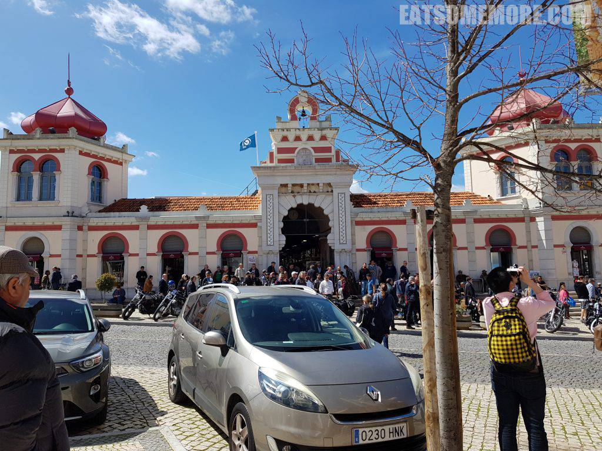

美好的一天从丰盛的早餐开始。

## 早餐 － Hilton Vilamoura

百香果橙汁、香芒酸奶和现切香瓜是最好的叫醒服务。

现煎欧姆雷蛋包裹着火腿、蘑菇和芝士，提供了大大的美味和满足感。

法式吐司配半熟煎蛋、丹麦核桃仁起酥包和葡式蛋挞配上一杯咖啡，早餐因此而完整。

早餐后来到Loule周六市集，在山村当中，教堂对面，集中地贩卖各式小商品。

从市集去镇中心的途中，有许多朴实而有历史感的美景，例如棕色的木门与斑驳的白墙。

无云的透彻蓝天下没有玻璃的窗户框住了几枝新叶。

南欧的教堂或许不多尖顶，它们的白墙橙瓦和复古对称的穹顶与曲线展现着另一种庄严。

巷弄当中的方石路铺得特别漂亮。

街角的牌楼，不知是喷泉还是饮水处。

 

从建于1266年的Loule城堡高墙后，可以俯瞰整个城镇。

城堡现在成了考古博物馆，蓝天白墙、朱门绿植、圆拱方柱，是种无须华丽雕饰的美。

离开城堡后，一路向市政厅走去。浅色的房子使得狭窄的巷子也不显得阴暗。

巷子虽窄，不妨碍小手工艺品设摊。

到了宽敞些的地方，更是招来了熙熙攘攘的人群。

白墙上成队的燕子，好像是对日常的写实，又是对转瞬即去的美景的挽留。

始建于19世纪的市政厅。

不远处的摩尔式建筑，是个繁忙的市场。

市场里的海神像伴着海鱼、海龟、海星和海豚，显得格外和蔼亲切。

市场外一边卖着蔬菜，一边是咖啡厅的室外座位。

## 午餐 － Monte de Eira

下午来到一家乡村餐馆。

餐前小点有酸萝卜和腌橄榄。

前菜胡萝卜姜汤，既辛辣又清甜。

熏肠蚕豆沙拉，咸鲜软糯。

葱烧海鲈鱼饭，食材新鲜，妥妥的家常味。

榛仁长角豆慕斯拌香草冰激凌。长角豆原产于葡萄牙附近的地中海地区，有种微甜的可可味。

你知道这只鸡是做什么用的吗？

