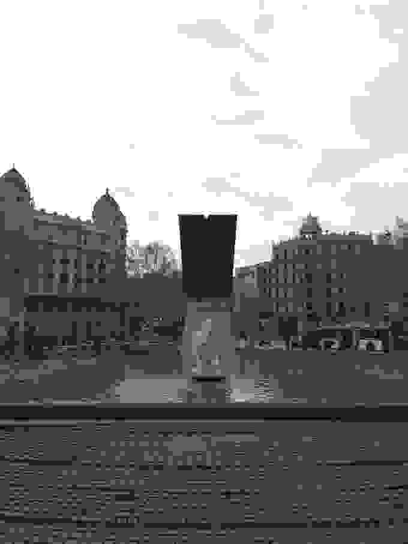
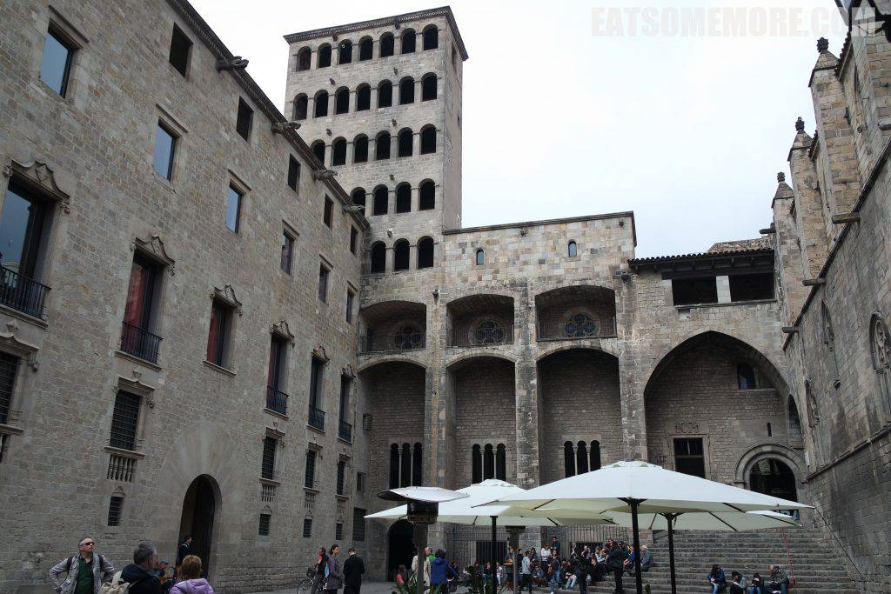
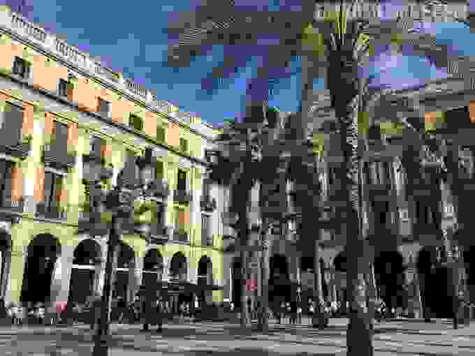

我们听说过西班牙热情、巴塞罗那多彩、马悠卡悠闲，而如果没有亲身走过，又怎能真的体会那种温度和风情呢？和煦早春里的小长假，便要到那里去。

巴塞罗那的第一天安排了兰布拉大道附近和加泰罗尼亚国家艺术博物馆。

## 兰布拉大道

兰布拉大道北起加泰罗尼亚广场，这是市中心旧城区的一个大型广场，面积五万平方米。阴天的广场可能不太惊艳，但是这个城市规划的大气、脚下和空气当中的古典已经弥漫开来。

即使天气一般，兰布拉大道已经是人山人海。大道的中间是行人步行街，两侧是机动车道。哦，多么人性化的设置，步行街是世界上对游客最友好的街道啊，没有车水马龙，只有行走的温度。

太阳出来后的兰布拉大道瞬间就焕然一新。三月尾的天气，大道旁的大树已经冒出了密密麻麻的新芽。阳光洒在建筑上、街道上、游客的脸上和身上。

大道两边的房子，除了寻常的人像、雕花以外，也有别树一帜以伞和扇子装饰的建筑。

兰布拉大道向南右转的小巷里，隐藏着一间古老的、美味的早餐店。

据说Granja M Viader有最好吃的西班牙炸油条（xurros），外酥内软嚼起来还有一点弹性，沾着甘甜浓郁苦中带香的热黑巧克力，实在是太美味了！ 焦糖布鲁蕾有独特的香味，可惜是凉的。

早餐店的地砖也那么美，细节的惊人之处尽显。

早餐后，回到兰布拉大道继续往南，左转到达松树广场（Placa del Pi）。松树圣母圣殿的玫瑰玻璃花窗硕大精致格外显眼。教堂的一侧则是露天集市，卖一些面包、芝士、橄榄油、香料。

集市边是咖啡厅露天坐席，和一颗饱满的橙树。

不远处这个硕大又玲珑的建筑是巴塞罗那主教座堂。

再步行一小段，就到达了海上圣母教堂，火焰式花窗繁复别致。

西班牙国民作家伊德方索法孔内斯曾作《海上教堂》，讲述的是十四世纪时期西班牙底层小百姓的悲欢际遇，恰合了海上教堂的建造过程。

圣殿庭院郁郁葱葱。

锦鲤水中游，白鹅傍地走。

圣殿回廊的哥特式肋拱顶天花板，庄严华美。

从回廊望出去还能看见巴塞罗那主教座堂玲珑的尖顶。

走一走又来到了巴塞罗那市政厅的所在圣若梅广场（Plaça de Sant Jaume）。巴塞罗那随处可见的是加泰罗尼亚区旗，即西班牙国旗左侧红黄相间的旗帜。去访时正是二〇一六年，广场上挂起了欢迎难民的横幅。

在兰布拉大道东侧有很多有历史沉淀的小道。

背街小巷当中有圆拱门，还有架空的民居。

走到圆拱门下，天花板的装饰竟也十分精美。

再隔一条街，又是雕栏石砌的廊桥。

还有的建筑门高窗阔，又满是黑窟窿。

壁画斑驳，却仍栩栩如生。

瓷砖上的卡门有种漫威的画风。

有时真的惊呆于巴塞罗那人的想象力与创新的主意，怪不得会诞生高迪这样的艺术家。

橱窗里头的小玩意张牙舞爪。

午餐在百年老店蜗牛餐厅就餐。

餐厅房顶上悬挂着火腿。

装饰布置特别精致。

下图显示的是半只烤兔和传说中的西班牙海鲜饭。海鲜饭里面有一尾濑尿虾、两只明虾、两个青口、章鱼块和青豆若干。饭粒带有微微一点夹生，有炖饭的感觉，馥郁鲜香。

饭后散散步来到皇家广场（Placa Reial），很有热带风情。

街边邮筒上的小哥哥，头上长着翅膀，胡子蜷曲缠绕，还张着嘴巴好像要说些什么。

来到兰布拉大道的尽头，向右就能看见哥伦布的雕像了。

接下来是一段上山的路。

## 加泰罗尼亚国家艺术博物馆

上山后到达加泰罗尼亚国家艺术博物馆。

可以俯瞰巴塞罗那。

傍晚到达希尔顿巴塞罗那。窗外的景色很美。

墙上挂着酒店附近的地貌画作。

 

酒店还贴心地准备了小礼物，杏仁巧克力和加泰罗尼亚小饼都很美味。

整个套间干净整洁，给人舒适放松的感觉。

欧洲的酒店特别的地方是在马桶旁边总是有一个洗屁屁的设备。

希尔顿的床突出表扬，又大又舒服、软硬适中。

客人还可以选择自己喜欢的枕头。

各位好梦，期待下周更新巴塞罗那下篇。

