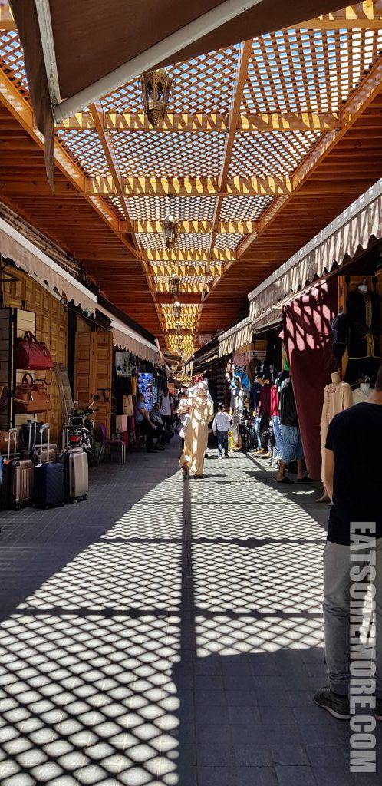
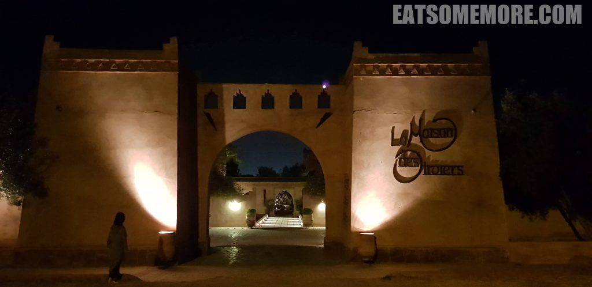

赵忠祥老师的动物世界也许是我对非洲的第一印象了，后来才渐渐了解到非洲其实也包罗万象。其中位于非洲北部的摩洛哥，是曾经伊德里斯王朝的所在，阿拉伯人遇上柏柏尔人的地方，撒哈拉沙漠的门户，一度谍影重重的国度，怎么能不去看看呢？

## 行程总览

## 行前准备

近年来，中国公民可以免签访问摩洛哥，所以在签证方面省心不少。以下是机票、火车票、巴士票和酒店的预订情况。

- 由于行程距离跨度较大，航班为异地往返，即从伦敦斯坦斯特德机场到拉巴特机场，再从菲斯机场返回伦敦斯坦斯特德机场。瑞安航空属于廉价航空，票价不含托运行李，且只能带一件40 x 20 x 25厘米的随身行李。
- 本次在摩洛哥的主要交通方式是搭乘火车和巴士，ONCF火车公司不接受海外​网上订票，所以需要在火车站购买，而CTM巴士则可以直接在网上预订后去车站换票。
- 酒店基本可以在Agoda, Hotels.com和Booking.com上预定。​​
- 这次行程正好撞上了摩洛哥穆斯林的斋月，所以行前也多查了一些备选餐厅并多带了些干粮以备不时之需。

## 预算规划

本次行程的总支出大约是每人£500，其中六晚酒店大约£130，机票大约£50，国内交通大约£90，七天电话卡大约£5，餐饮支出约£55，景点门票约£25，皮鞋、皮包、阿甘油等纪念品大约£30。

## 拉巴特

傍晚到达拉巴特机场，夕阳给航站楼披上了一层金黄色。

在机场对面可以搭乘机场大巴前往市区火车站，票价每人20迪拉姆。

## 卡萨布兰卡火车站

从拉巴特市区火车站乘火车前往卡萨布兰卡港火车站大约一小时左右，票价每人40迪拉姆。

## 卡萨布兰卡市中心宜必思

从火车站步行5分钟就来到了订好的酒店，基础配置尚算齐全，干净程度也算及格。

洗手间虽小，也还整洁。

窗外正是夜幕中世界最高的宣礼塔，以及它朝着麦加方向发射的绿色激光。

天亮后，哈桑二世清真寺身后的大西洋海港也显露出来。作为游客，当然迫不及待就要出发了。

通往海边的大道正大兴土木，街道有些脏乱，但不妨碍一些多彩跳脱的小角落散发魅力。

## 哈桑二世清真寺

由前摩洛哥国王哈桑二世发起并捐资筹建的清真寺，位于卡萨布兰卡的大西洋海岸上，拥有全球最高的宣礼塔，寺内的礼拜殿及广场可以容纳十万人做礼拜。到达这里的时候天空一扫阴霾，晴空万里。建筑整体雄伟壮观，大理石兼有骨白色和绿松石色，既神圣又清新又有摩洛哥特色。清真寺的购票处在外围博物馆的一层，记得买好票再去清真寺，可以避免来回奔波。

清真寺内部每小时限量允许游客进入参观，每次限时45分钟。我赤着脚在里面走了一会，竟然起了泡、疼了两天。不得不承认的是清真寺内部确实又大又华丽。

吊灯和天花板层层叠叠地渐欲迷人眼。

繁复的组合型花窗静谧庄严。

走出礼拜殿后，有通向地下室的楼梯。一抬头可以见到花样繁复的穹顶雕刻以及象征伊斯兰教的八芒星。

在一众具有阿拉伯风格的灯具当中，地下一层的吊灯好像传说中的蜀山，山峰淩空，宛若浮云，灯火通明。

再往里走才发现这里原来是可以容纳约千五百人沐浴的公共浴室。

寺外的博物馆陈列有木雕和石膏浮雕等作品。

然而个人觉得最惊艳的是博物馆的环形楼梯，很有对称的美感。

离开博物馆后，自然是要去看看清真寺在海上的一面。海滩上的人们有的在游泳，有的在钓鱼，有的在洗衣服。

清真寺的另一侧没有那么热闹，却更唯美。

## Cafe La SQALA

午餐时来到有着漂亮颜色和可爱花园的餐厅。

然而，苍蝇实在是有点多，还降落在了美味的摩洛哥烧饼上了。

鸡肉烤串炭香与鸡汁兼具。

青豆羊肉塔吉锅炖得酥酥的，带着淡淡的薄荷味道。

## Habbous集市

饭后来到Habbous老城的集市逛逛。这里商铺林立，品类繁多，价格合理，想购物的小伙伴们不要错过。

其中还有好评如潮的糕点店Patisserie Bennis。

糕点的特色是新鲜香酥。我最喜欢的两个口味是黑巧克力杏仁碎饼和椰蓉软饼干。

## La Maison Des Oliviers

晚上从卡萨布兰卡搭乘火车前往马拉喀什，约需两个半小时，票价121迪拉姆每人。由于位处郊区，酒店提供接车服务，每人50迪拉姆。

昏黄的灯光照亮酒店的小道。

不住市区的好处就是房间比较宽敞。

赠饮矿泉水的容器很特别，没有想到还有这种保温方式。

洗手间也能实现干湿的完全分离。

沐浴露和洗发水的罐子有着鲜明的天方风格。游览的第一天就这样结束了，抓紧洗香香去休息咯。

