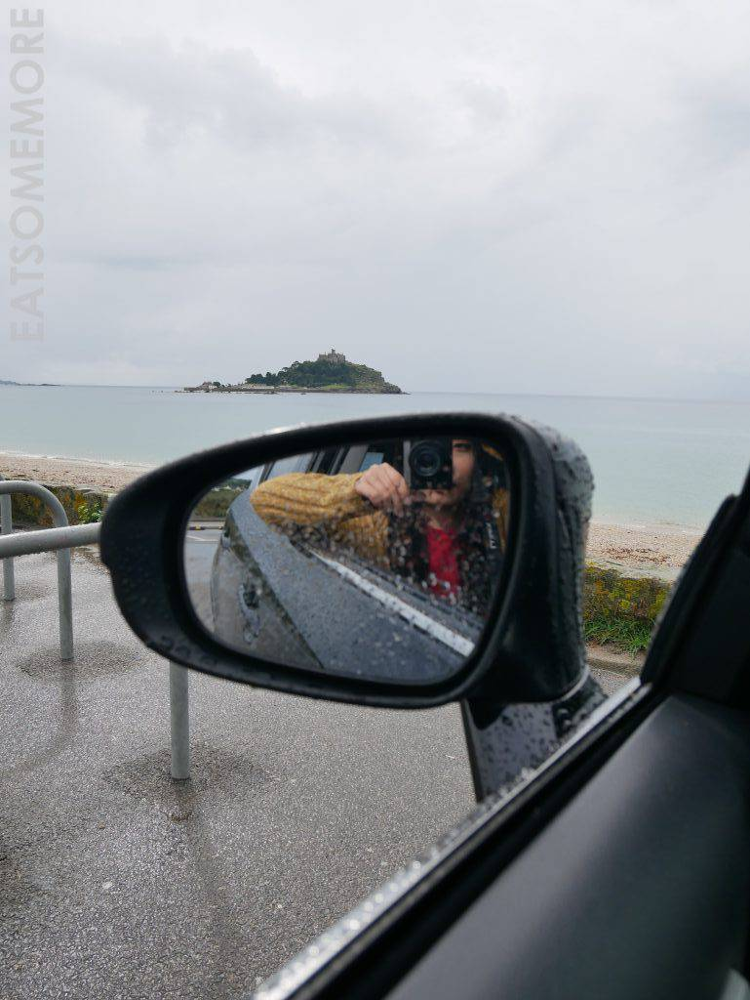

书接上回，接着来说说在康沃的这后两天。

### 行程总览回顾

日期

8月28日（上）

8月29日（上）

8月30日（下）

8月31日（下）

上午

Woolacombe

Towan Beach

St Michael's Mount

午餐

The Coach house

Paul Ainsworth at No 6

Halsetown Inn

Treby Arms

下午

Hartland Quay

Port Gaverne

The Minack Theatre

Dartmoor National Park

晚餐

St Kew Inn

Outlaw's Fish Kitchen

Alba

The Horse

住宿

Longbeach Hotel

Longbeach Hotel

Longbeach hotel

Travelodge

###  康沃之西－8月30日

是日我们要深入康沃腹地去看些更壮美奇妙的地方。

#### St Michael's Mount

城作山时山亦城，潮起为岛落还陆。

然而在这一个下雨的天，又懒惰又散漫的我连车都下不去，只好在车上完成了观光客的拍照活动，草草地撤离去吃饭了。

#### 午餐－Halsetown Inn

到了吃饭的地方，天竟放了晴。

小酒馆是复古的风格，桌上摆了鲜花。玫瑰葡萄酒果味芬芳、冰凉清新。

油炸哈鲁米，外脆内软有嚼头，口感弹牙、滋味咸鲜、奶香四溢，搭配甘甜可口的新鲜无花果，令人食指大动。

韩国辣酱拌牛肉丝沙拉，风格实在另类。

芝士汉堡采用6盎司肉饼、碱水奶油包、烟熏切达干酪、红葱头、西红柿、宝石生菜、腌黄瓜，搭配手工薯条，浓浓乡村风味，好吃得又很接地气。

油炸节瓜丸子搭配咖喱饭，中东风情极盛，在下不懂欣赏，不过印度烤饼外脆内软、焦香弹牙、甚是美味！

焦糖太妃布丁配上凝脂奶油和新鲜草莓，还是有点过甜了。

#### The Minack Theatre

此行最期待的景点就是这海边剧场。Minack在康沃语当中是“多石之地”的意思。它的筹建得益于一名伟大的女性Rowena Cade。二十世纪初，戏剧表演在康沃盛行。1929年在Minack附近上演的仲夏夜之梦取得了重大的成功，剧团随即开始寻找下一场演出——暴风雨的场地。

那时居住在Minack的Rowena觉得自家花园下的峭壁非常适合建一个剧院，就和她的园丁一起通过几年的时间，将这里变成了令人惊叹的海边剧场。这里有舞台、声控室、更衣室、石座、草座甚至包厢，从三十年代初建成时的设备简陋，到如今的一应俱全、远近驰名，令人不禁赞叹人类的想象力、创造力和行动力！

剧场的石座上刻着上演过的剧名和年份。

随处可见肥美可爱的多肉植物。

美得千姿百态，全都憨态可掬。

沿着剧场后面的小路下山就能到达水清沙白的Porthcurno海滩。

海水蓝出了渐层，山腰上开着红花，画一样漂亮。

#### 晚餐－Alba

餐前面包蘸橄榄油吃，味道一般。

嗯……已经想不起来这是什么汤，也想不起来味道怎样，由此应知也很一般吧。

羊奶酪沙拉，又腥又冷又油腻，真心觉得不好吃。

点了一条煎鳕鱼，却被配菜炖墨鱼深深吸引。这炖墨鱼的滋味好像红烧肉，酥糯又弹牙、香甜又咸鲜，搭配酸甜多汁的番茄，更上层楼！

在吃这碗面的时候，我还不知道第二天竟能吃上一碗比这好吃百倍的蟹肉扁意面。差强人意者便不多谈，且看下文。

虽然食物的口味良莠不齐，但餐厅突出的优点在于毗邻圣艾夫斯港口，景色确实不俗。从黄昏到傍晚的过度，简直一刻也不舍得眨眼。

一时是乘风破浪会有时，直挂云帆济沧海。

须臾间又成了过尽千帆皆不是，斜晖脉脉水悠悠。

待天色渐晚，恰是春潮带雨晚来急，野渡无人舟自横。

举杯间，“酒泊康沃”万里船。

更妙的是，黄昏海边的天空竟出现了一抹彩虹。

好像来自大西洋的暖心问候。

远道而来的虹，好看得不真实。

入夜静谧的小镇也好迷人，灯光点点指引着人们回家的路。

### 康沃之南－8月31日

在康沃的最后一天，我们沿南岸返回伦敦，路程约三百英里，所以午餐前就没有安排景点。

#### 午餐－Treby Arms\*

我们去的时候，这间餐厅是米其林一星。2018年新榜公布，名落孙山，我竟不觉得奇怪。

餐前酸种面包和两种黄油。

花菜浓汤搭配印度炸洋葱。

苹果酱培根肉排。

这餐不合口味，只好匆匆白描作罢。餐牌上引用的这句话我倒很喜欢：有人可以远离乡野，而有人却万万不能。即使是叶公好龙，却也听起来很美。

#### Dartmoor National Park

那么，爱乡野的我这就践行起新的人生金句来。

前两日才跟奶牛近距离打了照面，这天又在大路上偶遇了一伙黑脸的羊群。

黑脸黑腿黑屁股还长着角的白羊就这样从面前跑过，我的心情竟有些激动！乡野的可爱之处也许就在于这些未知而又温馨的不期而遇。

林间一潭碧水，清澈透亮。

峰回路转来到河边，绿叶掩映，石桥巍巍，水流潺潺。

而另一边豁然开朗，河面宽阔起来，倒映着岸边的林木。

#### 晚餐－The Horse

蓦地又回到了德文郡，连姜汁汽水都是有机的，并不很辣，但姜味的浓郁程度远超其他同类产品。在德文郡喝这些玻璃瓶汽水，很有童年的感觉。

迷你汉堡的肉饼烤得弹性十足、肉汁四溢，面包也烤得微微有些酥脆焦香，高丽菜沙拉和酸黄瓜清新解腻。

烤蔬菜拼盘，与我的期待稍有不符。

艾克斯河里现捞的青口用德文郡的苹果酒煮了，加少许甜辣、香蒜奶油调味，来自本地的新鲜美味总是出类拔萃。

前文提到过的超群蟹肉扁意面在此。私以为其成功之处有三：酸柑生津汁鲜挤，牛油始融裹蟹酱，蟹肉量足鲜甜浓。

去了一趟康沃，还喜欢上了德文，不虚此行，收获满满。
