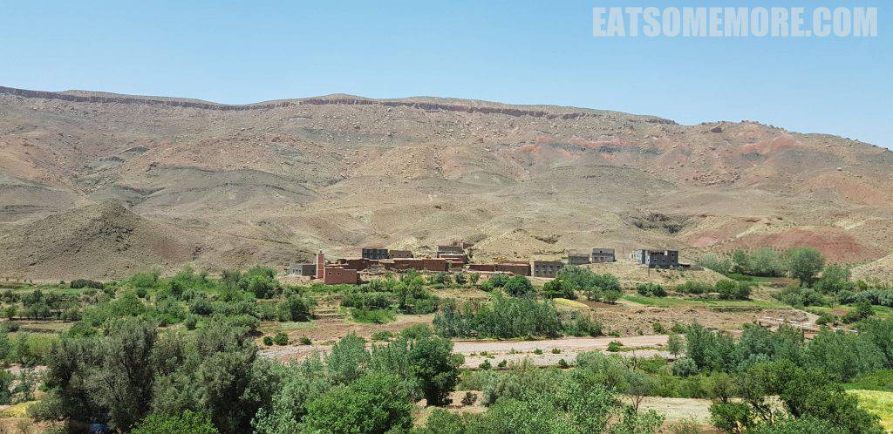
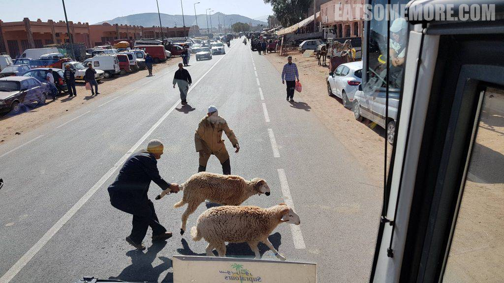
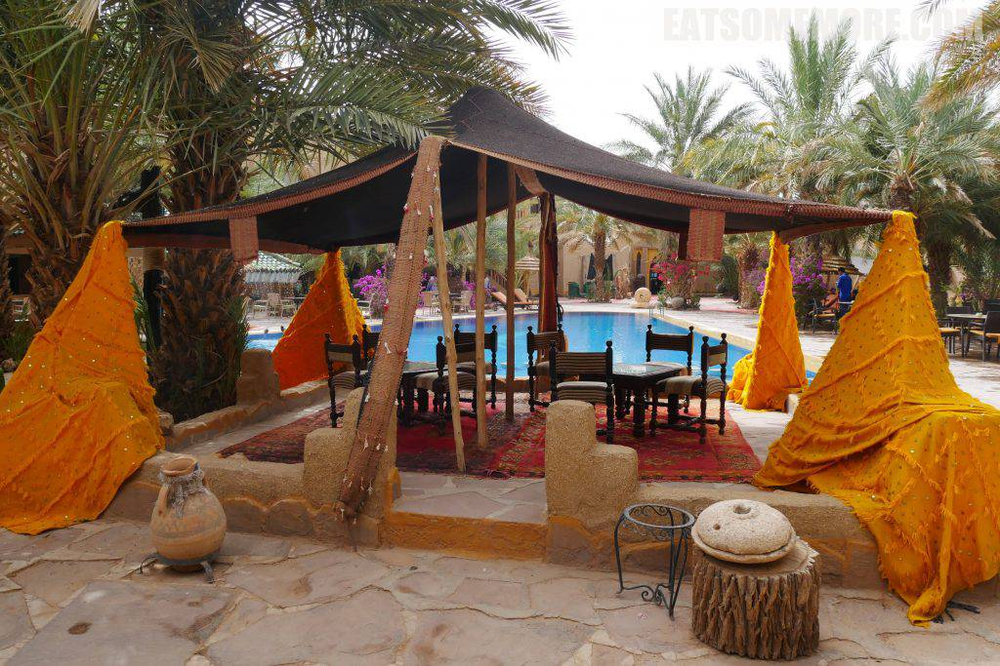

即使是在撒哈拉的门户马拉喀什，前去沙漠也需要坐一整天的车。然而这对从没见过沙漠的人来说却也甘之如饴。

## 行程总览

酒店接驳车一早就把我们送到了马拉喀什巴士站，车资50迪拉姆每人。八点整我们乘上了前往绿洲小镇伊尔福德的大巴。

途中要经过登山爱好者们趋之若鹜的阿特拉斯山脉，长两千四百公里，横跨摩洛哥、阿尔及利亚和突尼斯三国，横亘于地中海与撒哈拉沙漠之间。非洲和北美洲在远古的相撞，形成了美国东部山脉、西班牙内华达山脉和非洲北部的阿特拉斯山脉。

山脉的许多高峰上留存着冰期遗迹，和冰河边缘的地貌特征。

一路上颜色的碰撞，好像未曾在别处见过。

山谷里偶有人烟。

有人烟之处就有宣礼塔。

这里也是许多电影大片的取景地，例如1999年由斯蒂芬索莫斯执导的美国冒险电影《木乃伊》、2010年3.36亿美元票房的《波斯王子：时之刃》、以及2015年的第二十四部詹姆斯邦德电影《007：幽灵党》。

路过村庄的时候还常常有无证上路的绵羊被牧羊人们拽着后退拖走。

## Kasbah Hotel Xaluca Arfoud

傍晚时分终于到达了预定的酒店，好像走进了天方夜谭的世界。

前台门前铺着羊毛地毯，点着镂空灯罩的落地灯。

室内的布置更是美轮美奂。

茶几也被做成了骆驼的样子，十分可爱。

地毯一路铺到室外泳池前。

酒店还设有室内游泳池。

马赛克砖和穹顶无不透露着摩洛哥风情。

房间宽敞，古朴大气，还安装了空调。

房间的另一头是沙发和电视机，茶几上还备了水果。

月洞门的门帘后是洗手池，接着左手边是淋浴，右手边是厕所，干湿完全分离。

转了一圈出门吃饭的时候，天已经黑透了，酒店看起来有些仲夏夜中北非古堡的感觉。

次日清晨又是迫不及待起来玩耍的一天。房间门口的走廊整体呈橙黄色，脚下铺设了橙红与碧绿相间的地砖，左边是沙漠棕榈，右边是传神画作，头顶上是彩绘木楼板，悬挂着有些波斯风情的吊灯。

到了一楼见到石砌的走廊外墙面，又有种不同的美感。

楼梯间挂着一个巨大五彩的摩洛哥风格风箱。

酒店的院子里摆了些各式各样的户外沙发床。

天亮了才看清泳池边还支了一顶帐篷。

远处还有个更大更豪华的帐篷。

再逛逛就见到这个自称“皇家帐篷”的建筑。

从里面看，门上的彩色玻璃格外绚烂。

早餐后，我们便包了车去探索撒哈拉沙漠。

第一个来到的地方是展览沙漠化石的。据闻撒哈拉在史前时期是广阔的河流冲积平原，因此化石当中出现了龟甲。

当地人往一块不起眼的岩石上泼了水，竟显出了珊瑚的纹理。

接下来导游带我们去参观了柏柏尔民居。首先映入眼帘的是几只小羊。

一转眼就见到动物皮毛制成的储水容器。啊，现实……

另一头的厨灶上还有些烟熏火燎的痕迹。

最后来到了这家的“客厅”。

柏柏尔大姐为我们准备了摩洛哥薄荷茶。

离开了柏柏尔民居，来到了当地的一所小学。咱们的导游显然同这里的小学生是好朋友。

前往沙漠的路上遇见了一些正在喝水的小毛驴。

眼看着沙丘越来越近，植被越来越稀疏。

当我们接近沙漠边缘的时候，视野里渐渐地出现了点点的白帐篷。

进入沙漠之前，导游带我们去欣赏了当地的音乐表演。

我们见到了一些当地特别的乐器。

而我觉得更精彩的是到访游人的绘画才华。

他们笔下的沙漠也太有爱了吧！

## Kasbah Hotel Tombouctou

酒店为我们安排了在他们在沙漠边缘的连锁店用午餐。

我们到的时候大约是下午一两点钟，餐厅空无一人。

从餐厅的窗户就可以看见沙漠。

墙上挂着沙漠、椰树与骆驼人的画。

食物方面，鸡肉橄榄塔吉锅稳定发挥，摩洛哥式的番茄炒蛋比中式的多些香料的味道，玛格利塔披萨也不赖。

总体来说这里的塔吉锅里面是此行当中难得的蔬菜比肉多。

饭后甜点是水果酸奶。个人觉得苹果皮太厚了。

饭后在酒店里逛逛，看了些绿树红花和茅草房子。

我仿佛在看是不是把东西吃到了衣服上。

建筑一样是北非古堡的造型，游泳池还带有喷泉，在沙漠里面显得分外奢侈。

泳池边的秋千提供的是晃晃悠悠的一刻悠闲。

## 撒哈拉

 

再次启程时遇上了一群骆驼。

这种感觉就是沙漠之友都成群出现了，沙漠离我还会远吗？ 

此时我们离开了吉普车，并在导游的帮助下“租”了两头骆驼进入沙漠。

在骆驼的一步一摇之间，不知不觉已经置身于世界上最大的沙漠。

坐在沙丘脊上，望着眼前连绵起伏的沙丘，等待着日落的我们还不知道一场风暴正向我们扑来。就在拍下这张照片的5分钟后，骆驼人们纷纷带着他们的骆驼和游客离开，因为狂风正卷着沙尘遮天蔽日、气势汹汹而来。直至今日我仍记得沙砾密密麻麻打在脸上刺痛的感觉，以及看不见沙漠尽头时战栗恐惧的心理。沙漠很大、很美、很神秘，但我想我可能不会再去沙漠了。然而，摩洛哥的精彩旅程还在继续。

