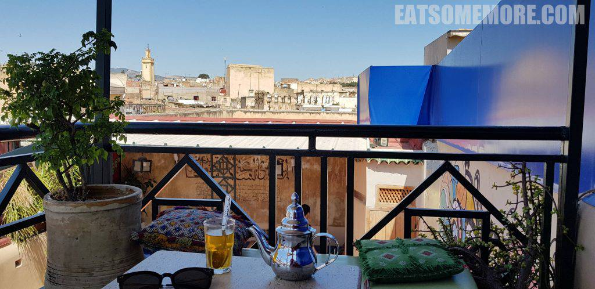

从沙漠幸存的我，开启了摩洛哥旅行的下半程。

## 行程总览

搭了一夜的大巴，从撒哈拉来到了摩洛哥北部的古城菲斯。公元八世纪时，伊德里斯一世以菲斯为中心，在摩洛哥建立了第一个阿拉伯王朝。菲斯因此吸引了大批的阿拉伯移民。

## 蓝门

蓝门建于1913年，是菲斯的地标性建筑，集广场门户、纪念碑、城市供水枢纽和老城入口于一体。

穿过蓝门往回看，它成了绿色的门。在阳光下，精美的蔓藤和结绳图案更加炫目。

老城里有许多猫。

晨曦在斑驳的墙面上投下了猫咪优雅的影子。

色彩鲜明的墙面上挂满了各式花样的陶盘陶锅。

摩洛哥人对色彩的驾驭一定是天赋异禀，各种造型的蒙面女孩挂件、各种颜色的大门挂饰、各种花纹的挂毯都让人眼前一亮。

## Medersa Bou Inania

十四世纪时，卡鲁因清真寺的宗教领袖建议马林王朝的统治者阿布伊南法里斯兴建了这座唯一在菲斯拥有宣礼塔的古兰经学校。

这里既是教育机构，又是大清真寺。

这里也是摩洛哥少有的对非穆斯林游客开放的宗教场所。

## Café Clock

出了古兰经学校，拐进一条不起眼的小巷去寻找一间好评如潮的餐厅吃早午餐。

餐厅在一座摩洛哥传统建筑里，有着通透漂亮的天井。

彩色玻璃的八芒星吊灯也很美。

摩洛哥薄荷茶、鲜榨橙汁和咖啡全员到齐，各个优秀。

摩洛哥式番茄炖蛋竟意外地有一种不同于中式番茄炒蛋的更为丰富鲜明好味道。

这里的杂果松饼是我所见过水果给得最多的，而且全都新鲜多汁、酸甜鲜香。美中不足是松饼本身到后来变得有些湿黏，口感因此有些下降。

店家告诉我们餐厅还有天台，可以上去坐坐。

上去才发现刚才古兰经学校的宣礼塔竟近在咫尺。

## Dar Hafsa

早午餐后差不多到了可以去民宿办理入住的时间。菲斯老城里比猫还多的当属交错纵横的小巷了。

房间在一楼，有些逼仄。

洗手间也比较简陋。

所以还是去民宿的天台来一壶薄荷茶休息一下。

眺望着远山脚下的菲斯老城，吹着夏天的风，心情简直就要起飞。

## 大染坊

稍事休息后，我们去拜访了赫赫有名的大染坊。这看似简单的一张照片可是充满了波谲云诡的故事。在老城里面走一走就会有当地人来问是不是要去大染坊，他们可以带路。一开始我们还想着不着急，逛一逛看到有兴趣的皮具店再进去看看就行。可是越是靠近大染坊，来揽客的人就越是多了起来，不胜其扰之下，我们就跟着其中一人进了他的店铺。店里的人还准备了薄荷叶来中和染坊的气味。弯弯绕绕地上了楼，胆战心惊地拍了下面这张照片后，我们也很识时务地开始浏览店里的皮鞋皮具，并且挑了两双鞋。店员在一番找寻后疲惫地告诉我没有36码了，接着他又说你这双40码穿着不是正好吗？我小小的脑袋里顿时升起了大大的困惑——是我对于我脚的大小有误解，还是他们对他们鞋的尺码有误解？我再试了一遍那40码的鞋后，坚定地说这我真的穿不了。一番折腾之后，店员终于找到了类似款式的38码。我想反正是拖鞋，大就大一点吧，就问了价格。店员给的价格竟然比马拉喀什卖的菲斯拖鞋还要贵一倍。我又想了想，可能是要还一下价吧，就问便宜一点卖吗。斋月期间的店员此时可能已经精疲力竭，他说不能便宜，不如别买了，每人给100迪拉姆的参观费就好了。店员还说来参观是免费的，但是要离开是要交钱的。原来是在这儿等着我们呢！来玩的朋友们千万要小心这些套路哦！

## The Ruined Garden

晚餐时来到了有着一个可爱小花园的餐厅。

塔吉锅自然是必不可少的选择。

除了鸡肉塔吉锅外，这次我们还尝试了牛肉丸塔吉锅。味道无功无过。

柿子味的奶油甜点，略微有些油腻。

晚餐后，就回民宿休息，要做的就是期待第二天的早餐啦。摩洛哥的早餐，饼和包特别多，全部都很饱肚子，根本吃不完。

不得不说这里的水果素质还是十分稳定和过硬的。

## Nejjarine Fondouk

早餐后走走逛逛来到了手工艺博物馆。在二十世纪初，这里曾被用作法国殖民当局的警察局。

博物馆为三层对称式建筑。木刻和石灰雕刻都十分细腻。

博物馆还有一个天台。

在这里可以将菲斯老城尽收眼底。

北非孟夏，阳光正好，是时候给大家介绍这双在马拉喀什以100迪拉姆购入的皮拖鞋了，亲测舒适度满意。

## Nagham Café

午餐时来到一家小餐馆，又点了两份塔吉锅。

蔬菜鸡肉塔吉锅，味道平平。

令人惊喜的是，这里倒是个欣赏蓝门和老城的绝佳地点。

## 沙夫沙万

午餐后从菲斯车站出发，前往沙夫沙万。途中的田园景色怡人。

到达沙夫沙万时天已经黑透了。虽然民宿有点拥挤，但还是期待天亮后与沙夫沙万的会面哦。

