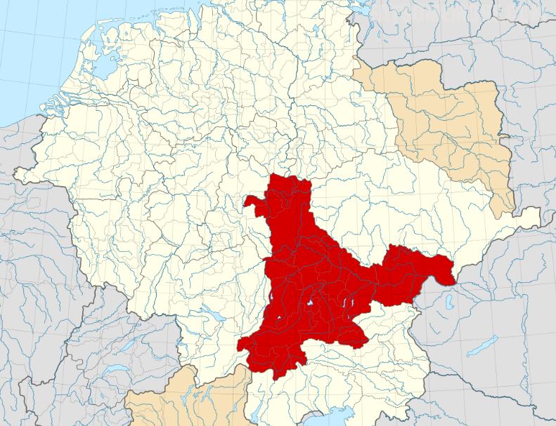
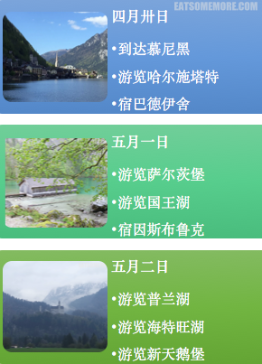
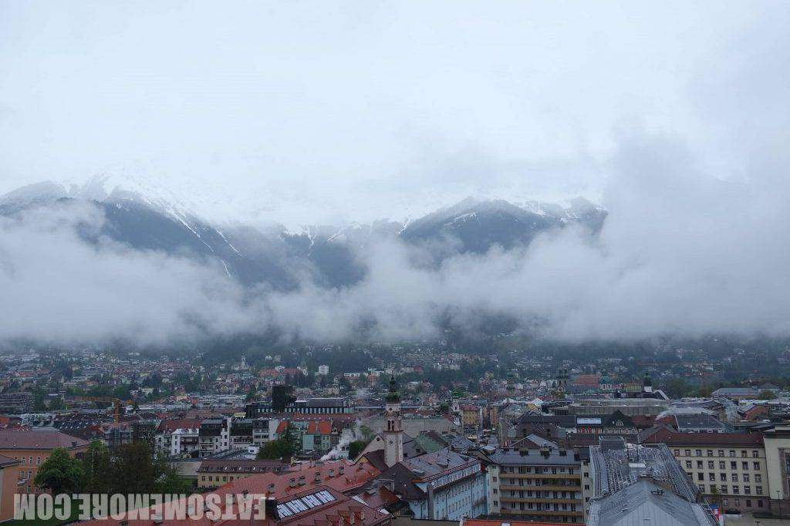
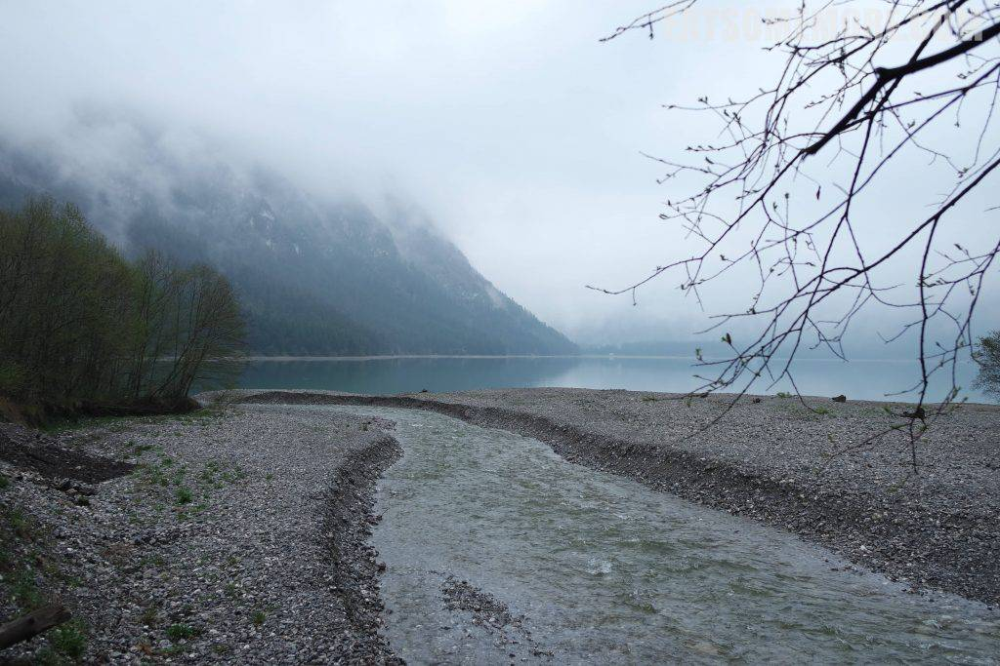
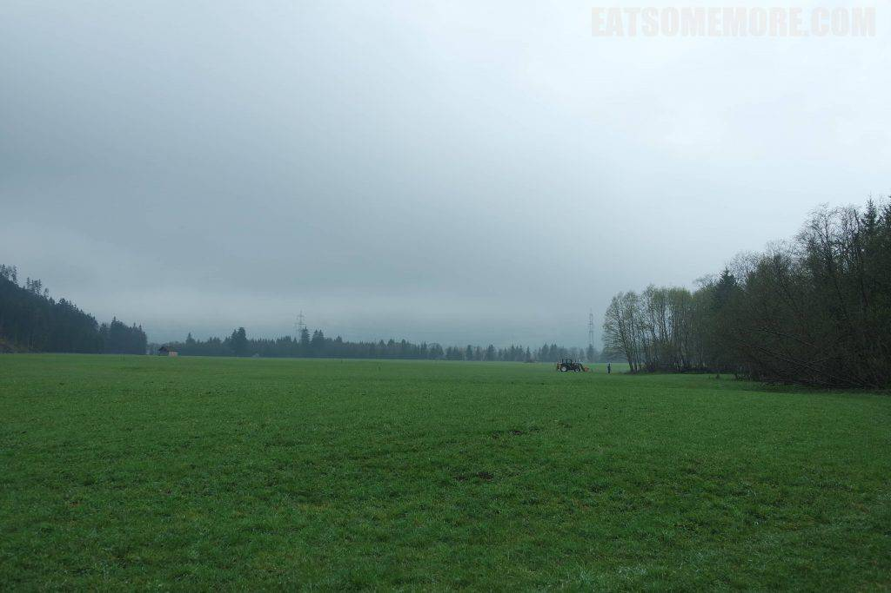
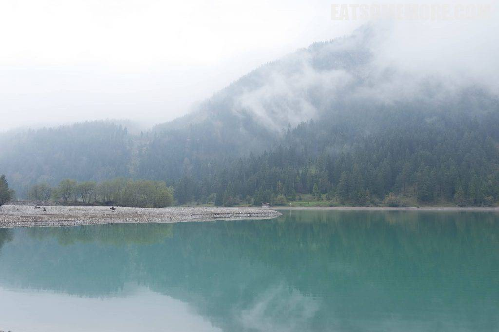
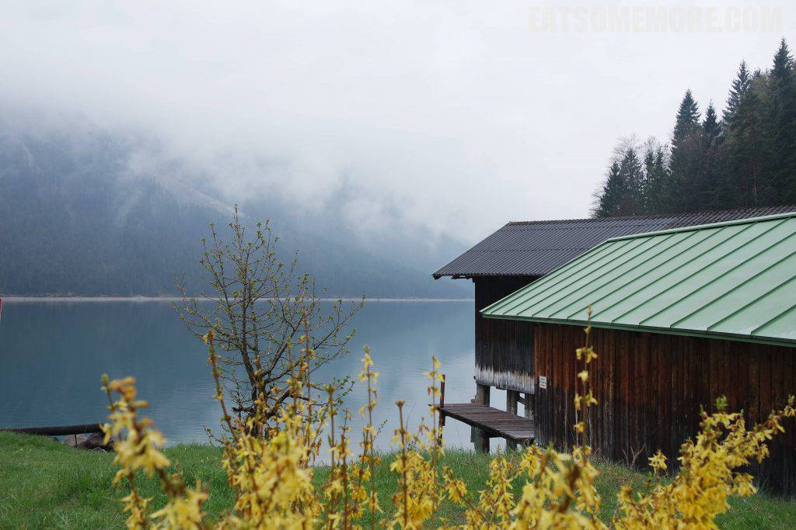
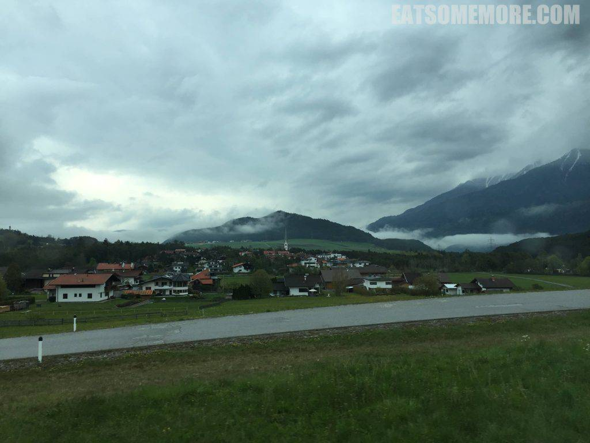
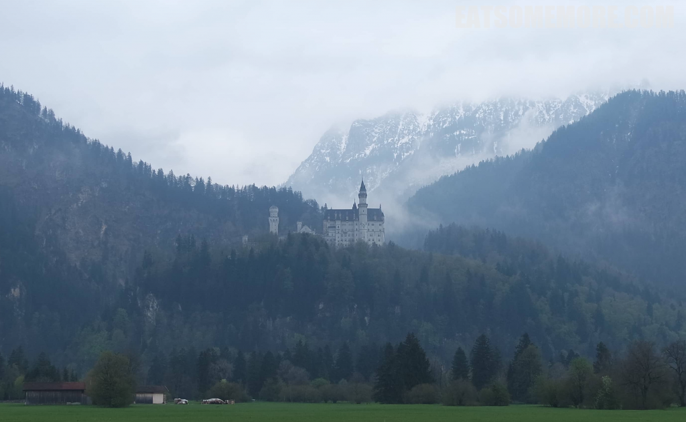

在这组游记的最后一篇，么么终于想起了要谈一谈为什么将这个系列归名于巴伐利亚。如今的巴伐利亚，是德国的一个联邦州；然而早在公元六世纪，巴伐利亚曾是梅罗文王国治下的一个公国。其辖区包括今天的德国东南部及奥地利的大部分区域。尽管这次旅程穿梭在德奥两个国家之间，然而作为游客肉眼可见的文化风貌鲜有相异之处。因此相较“德奥跨境游”来说，“巴伐利亚之旅”倒更为精确地诠释了本次旅程的地域范围。

## 行程总览

## 因斯布鲁克

在因斯布鲁克醒来的清晨，即使在烟笼雾漫之间，也教人不得不为其雪山之巍峨、穹顶之哥特、房舍之多彩而倾倒。

## 普兰湖

因斯布鲁克向西一个半小时左右车程到达的是初春烟雨当中的普兰湖。

## 海特旺湖

穿过一片草原后来到了海特旺湖。

一开始还感叹天公不作美，太可惜了。

直到见到“故事的小黄花”，“花瓣试着掉落”，才觉得有朝一日我可能也会怀念这“消失的下雨天”吧。

## 新天鹅堡

挥别两湖向北，穿越德奥边境。雪山下，云雾中，围绕着尖顶教堂铺展开的小村庄，好像一个童话世界。

说到童话，据闻迪士尼乐园的标志性建筑就是以德国的一座城堡为原型的。

于是我们循迹来到了新天鹅堡，确有几分神似。感谢巴伐利亚赠我一次童话般的旅程，不过……也许等到放晴的那天，我会更加喜欢这里。

