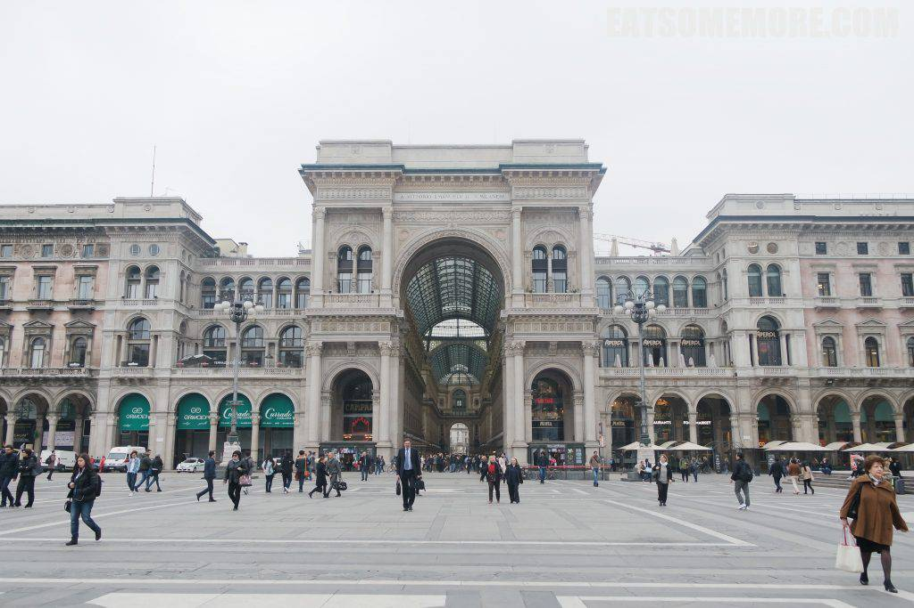

2016年的复活假期，野心勃勃地计划了个环意大利游，对这个地方的喜爱、好奇和憧憬可见一斑。

## 行程总览

## 米兰

刚到达米兰的我们就接收到了来自艺术的惊喜。春天的米兰街头，古木长出了翠绿的新叶，掩映着不知名石灰岩教堂繁复浪漫的玫瑰窗和华丽精致的雕塑装饰。

见到米兰大教堂后更是被它的精美壮观所震撼。它美得好像弱不禁风，又确实巍巍不可撼动。

米兰大教堂正面的广场以北是艾曼纽二世拱廊，大大小小的拱门和对称的建筑风格，典雅好看。

拱廊内是个购物中心，装饰气派华丽，大面积的圆拱天窗是画龙点睛之笔。

橱窗里挂着好多精美的蕾丝画，有一幅描绘的正是米兰大教堂。

然而，想买东西的时候感觉到了来自玻璃穹顶的注视。

离开艾曼纽二世拱廊，前往火车站的途中路过了一个可爱的小公园，里面有一座漂亮的鹅黄色博物馆，不但有橙色的屋瓦、绿色的窗棱，还面对着简单却优雅的喷水池。

博物馆对面的玉兰花开满枝、落遍地，真正地开到荼蘼。

## 午餐 - Trattario da Mario

匆匆离开米兰，在热那亚转车的间歇吃到了至今难忘的、朴素又豪华的海鲜意面，有青口、大虾、蛤蜊、鱿鱼，因为新鲜，所以鲜美；看似寡酱，意面里却有满满的海味，认真推荐。

## 五渔村

一转眼就到了火车出发的时间，为了美景再次启程。

终于功夫不负有心人地拜访了《国家地理》杂志刊登过的五渔村。青天碧水之间，矗立于峭壁的彩色房子，确是绝景！

