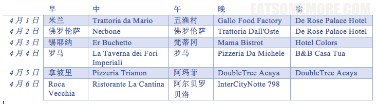
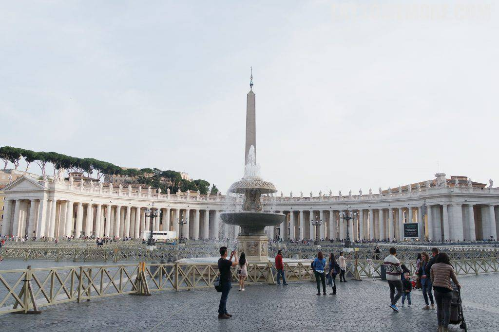
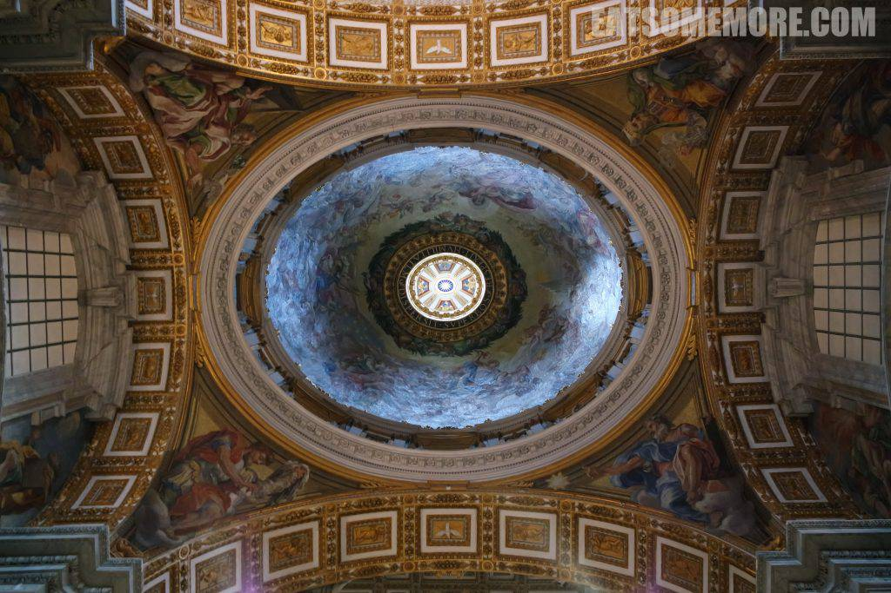

佛罗伦萨附近的锡耶纳古城也是世界文化遗产之一。

## 行程总览

## 锡耶纳

古城位于托斯卡纳山区。

巷弄间充满了历史的积淀，身处其中像是穿越了一般。

在城镇当中也能眺望高耸的市政厅塔楼。

从圣若望洗礼堂的残垣断壁上可以远眺欧洲最大的中世纪广场，市政厅田野广场全景。广场呈贝壳形，是一年两度的赛马和一年一度的自行车赛场地，平时作集市之用。

观景台的另一侧则面对着黑白相间的哥特式锡耶纳主教座堂。

而这个时节里，从赭褐色密密麻麻的楼群当中冒出头来的一树白色樱花，并不比任何人文胜景逊色。

从观景台上下来能望见对面山坡上的圣多明我圣殿，远远地散发着一种超凡脱俗的气质。

依依惜别古城锡耶纳后，搭乘火车前往罗马。一路上田园春色，风光旖旎。

## 午餐 － Er Buchetto

到达罗马后拜访了人气烤乳猪小店。

店面虽小，却颇具风格。

可是，烤乳猪还是中国的好吃啊！

## 梵蒂冈

世界上最小的国家正是位于罗马城西北角的城邦国家梵蒂冈。一反锡耶纳的古朴深沉，这里倒是一片鹅黄樱粉，在初春新叶鲜花的掩映之下格外清丽。

走着走着就跨过了国界。站岗的警卫像是从扑克牌里走出来的。

插腰持矛也很威武。

由贝尔尼尼设计的圣彼得广场是罗马最著名的广场之一，两侧有两重巴洛克式柱廊围绕，正中是方尖碑和喷水池。

梵蒂冈领土面积虽小，圣彼得大殿的内部却金碧辉煌得气场全开，神圣庄严得不可一世。

彩色玻璃拼成的表盘，让时间都闪着光。

描金彩绘的穹顶，仙气袅袅、气质翻倍。

梵蒂冈城正面协和大道的尽头是台伯河畔的圣天使堡。这里是罗马皇帝的陵寝、防御军事要塞、监狱、罗马教皇宫殿、和如今的博物馆。据说是公元六世纪时，教宗在此见到天使显像而得名。

从圣天使堡回望夕阳下的梵蒂冈，此时此刻美不胜收。国家虽小，信仰却很强。流水潺潺，而岁月静好。

## 晚餐 － Mama Bistro

晚餐在酒店附近的小店吃意大利面。真心觉得意大利的美食比例实在是太高了！随便一家餐厅就很好吃。蛤蜊蘑菇意面撒上香芹末，鲜爽弹牙。

海鲜手工意面，青口、虾仁、芝士和手工意面的结合，迸发出十足的油香、鲜香、面香和奶香，天天吃才好呢！

