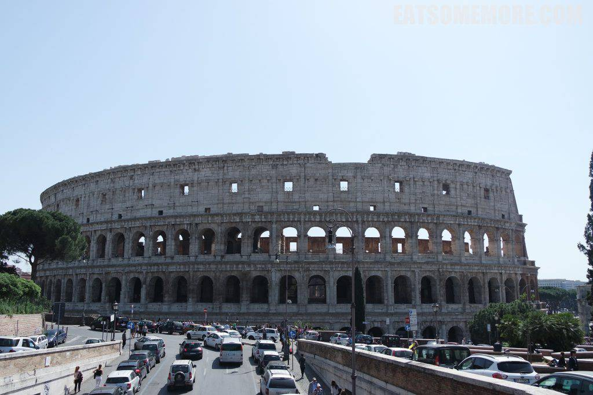
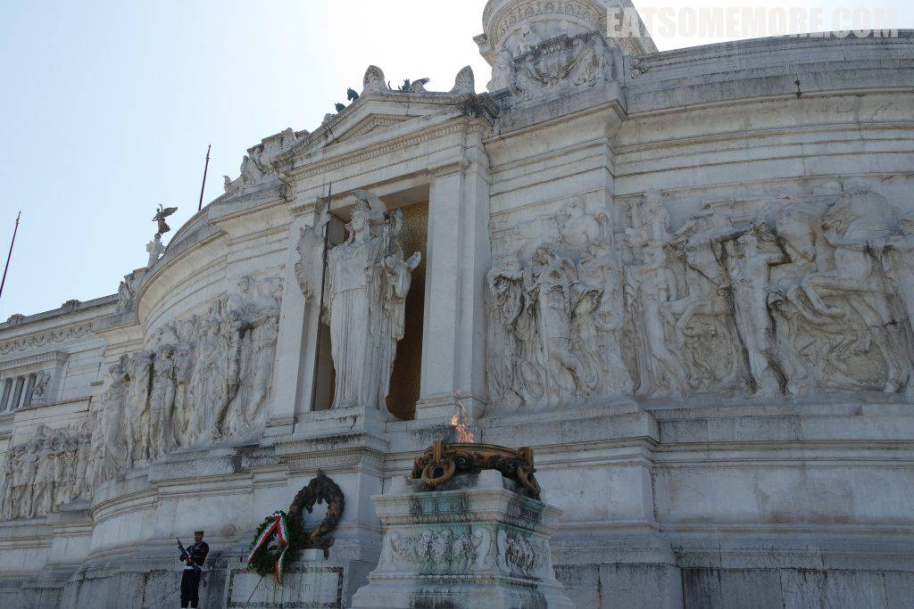
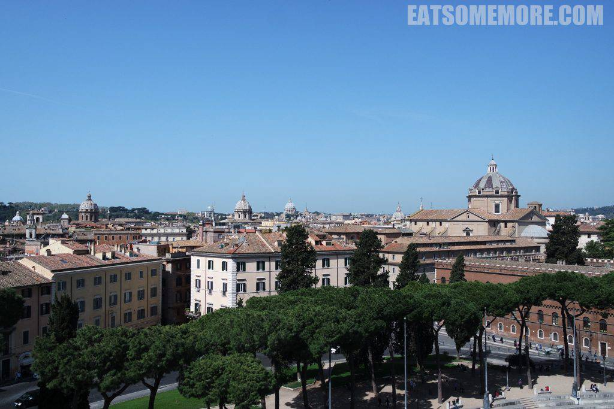

出了梵蒂冈就是罗马。

## 行程总览

提起罗马总不得不想起经典电影《罗马假日》。令人映像最深刻的就是奥黛丽赫本在西班牙阶梯上一手冰激淋，一手玫瑰花的名场面。图片来自谷歌。

西班牙阶梯的底部连通西班牙广场，两者都得名于这里的西班牙大使馆。顶部则是文艺复兴晚期风格的天主圣三教堂。

赫本路过的许愿池。

许愿池本名特雷维喷泉，由贝尼尼设计，是罗马最大的巴洛克风格喷泉。

男女主角骑车经过的斗兽场。

如今是车水马龙，游人如织。罗马斗兽场始建于公元一世纪，是目前最大的卵形竞技场。

街上的单车都好像是从电影里溜出来的。

## 午餐 － La Taverna dei Fori Imperiali

中午来到斗兽场附近的罗马风味餐厅，吃的是黑松露宽面，奇香异鲜，美味非常。

午餐后来到男女主角骑车经过的另一罗马地标，威尼斯广场。

位于卡比托利欧山脚的威尼斯广场，因附近的威尼斯宫而得名。广场上的建筑是维克多二世国家纪念碑。

拾级而上，罗马女神座下的是无名战士墓，旁边点着永恒之火。

纪念碑内部装饰精美，花样繁复、人像生动。

登上纪念碑展望罗马时，才发现罗马不仅活在电影里，更加是活着的博物馆。目之所及，有参天古木，有神庙废墟，有千余年的教堂，更有两千年的竞技场。

第一次见到由大大小小各式穹顶组成的天际线。

认真地说，罗马实在是比想象中更厉害！

## 晚餐 － Pizzeria da Michele

离开罗马后前往拿坡里投宿。入住前还在米歇尔元祖披萨铺品尝了地道的玛格利塔披萨，番茄、芝士和罗勒的天才结合。现做现烤饼皮很薄却很有嚼劲，马苏里拉芝士和罗勒叶的香气相得益彰，番茄的汁水饱满丰盈，披萨吃出了泡馍的感觉，惊艳！

