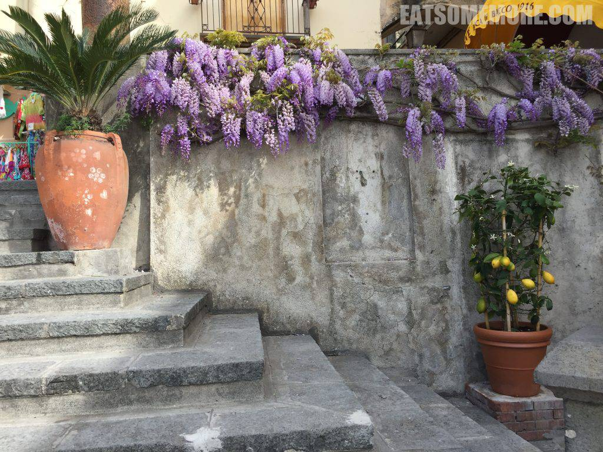
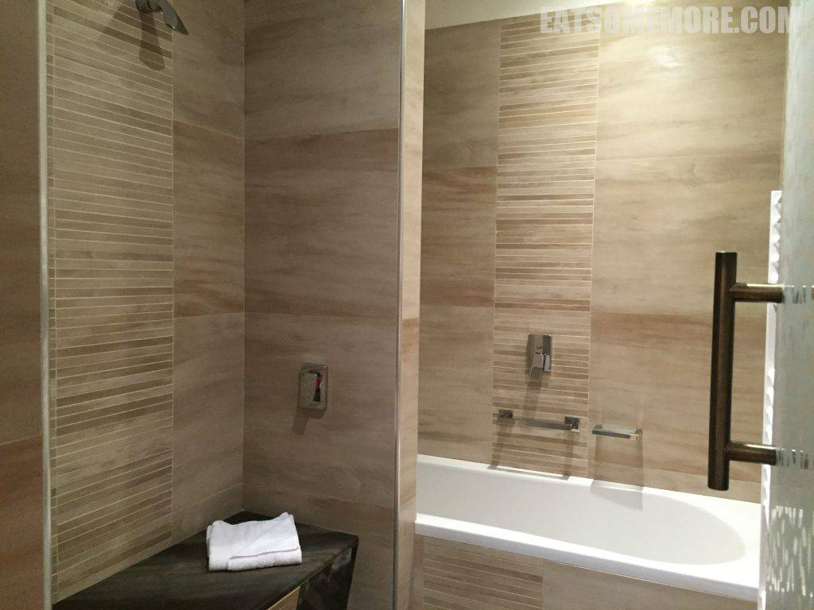

不知怎的，在拿坡里有种回到祖国的感觉。

## 行程总览

一早来到拿坡里有名的糕点店Sfogliatelle Attanasio。

在热情店员语言不通地推荐下，我们购买了以下两样拿坡里名点。左边是Babà，像是泡了朗姆酒的玛芬面包；右边则是扇形千层酥，外层香酥松脆，奶油内馅清甜幼滑，好吃！

## Positano

从拿坡里出发后的第一站是海边的波西塔诺小镇。

小镇的路七拐八弯，有一段正是像冰箱贴上画的一样，架着风铃般的开得正好的紫藤花。

这里的沙滩是灰黑色的粗砂。峭壁上建起了五彩的房子，不同于五渔村的山居外观，这里的房子大都高门阔窗的，更气派些。其中最夺目的当属圣母升天教堂的彩色琉璃穹顶。

海滩边还有一条滨海步道，走出不远回头看时，海上的雾气倒是给这个海湾蒙上了一层神秘的面纱。

再走一阵，前方出现了保垒式的建筑，透过清澈的海水能看见海底大小形状不一的岩石。

过了堡垒又来到一个海滩，海水蓝得深浅不一、层次分明，植被当中出现了一片片的仙人掌，海边的峭壁上也散落着一些房屋。

回去的路上遇见在阳光下更鲜艳的花朵，和开着白色小花正要成熟的柠檬。

花丛中的复活节兔子颜色清清淡淡却活泼得很。

珠宝店的招牌也是生动逗趣。

## Amalfi

从波西塔诺出发，沿第勒尼安海一路向东就到达了欧洲人的度假胜地阿玛菲。

沿途所见当中，最惊人的应该是保龄球那么大的柠檬！

其次才是五花八门、流光溢彩的穹顶。

当时只觉得这里的人面朝蔚蓝大海，背靠翠绿青山，简直过着神仙似的生活。而现在再看这些照片时，却深感凿壁栖身、物资单一的不易。

## 午餐 － Pizzeria Trianon

在离开索伦托半岛后到达的第一个城市萨莱诺，又吃上了玛格利塔披萨。老公不喜芝士，于是愉快地点了不含芝士，而以俄勒冈叶和大蒜调味的玛利那拉披萨。这一家披萨的饼皮虽然不及那不勒斯米歇尔披萨店的薄韧，但是边缘处更脆，番茄同样多汁、芝士同样香浓、罗勒同样清新。

餐厅的室外座位对着一个不知名的小广场，恬静惬意。

## Matera

这天下午，我们要横跨意大利，途中经过了世界遗产马泰拉石窟民居。据说在旧石器时代就有人在这里聚居。这里没有米兰的精致繁复，没有佛罗伦萨的浪漫绚烂，也没有罗马的恢宏壮观，却有着和野花野草一样坚韧不拔的人心。

## DoubleTree Resort Acaya

傍晚时分终于到达了与阿尔及利亚一海之隔的拉察。在希尔顿逸林度假村办理入住时被告知升级了套房。

亲测虽然有分开的起居区域，但并不是真正的套房。好在空间还是很宽敞。

床上很有心地摆了爱心形的“毛巾艺术”。

更宽敞的是洗手间的区域，有独立的洗手池、坐便器和浴室。

除了浴缸之外，还有单独的Spa花洒，感觉在这也能玩上半天。

## 晚餐

简单地参观了房间后，便在酒店的餐厅用晚餐。

四季豆牛肉粒意大利面，不算特别优秀。

苹果和猪肉的搭配一如既往的合拍。

下一篇将揭晓酒店在阳光下的“庐山真容”，敬请期待。
