在意大利的南部，在接近尾声的旅程，两者都叫人依依不舍。

## 行程总览

随着清晨的到来，酒店的清秀模样也渐渐显露出来。

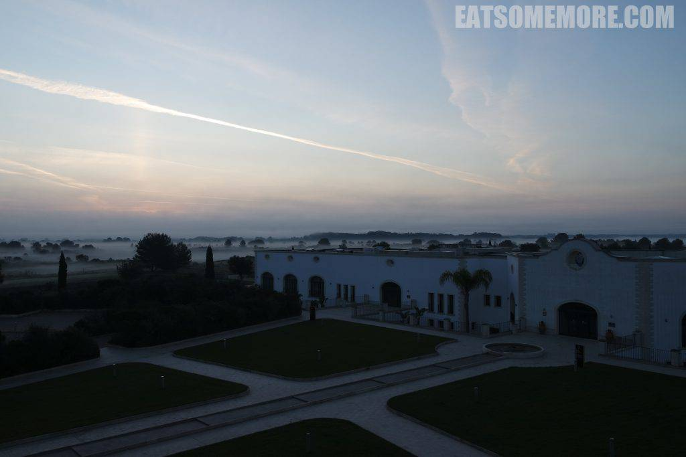

迷雾森林当中的日出，如梦似幻。

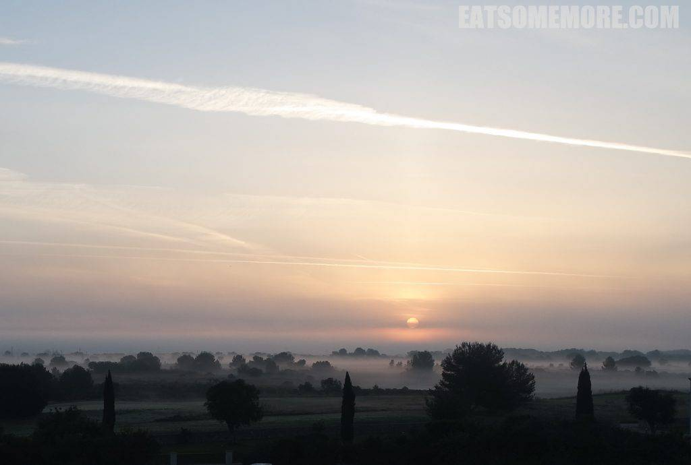

趁着这大好时光去游个泳，发现泳池的景观也像画一样。

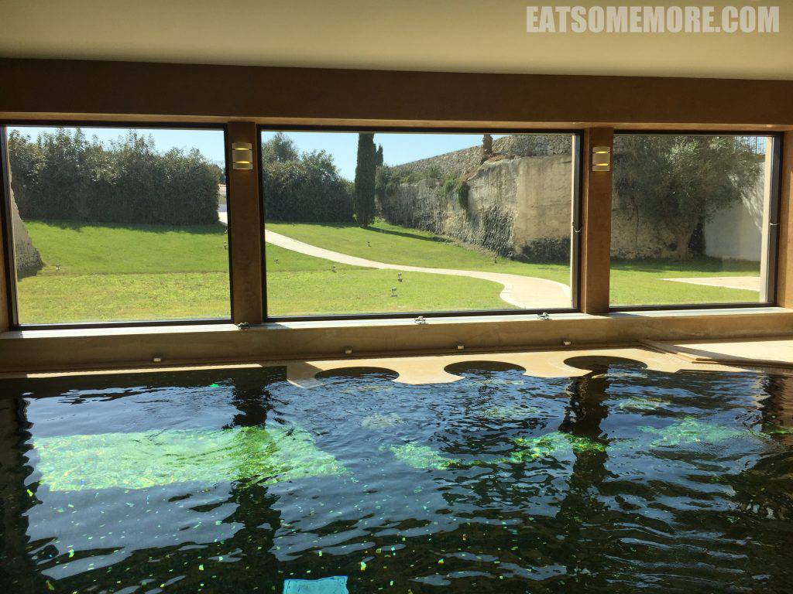

果然是到了南部，开始出现比人还高的仙人掌。

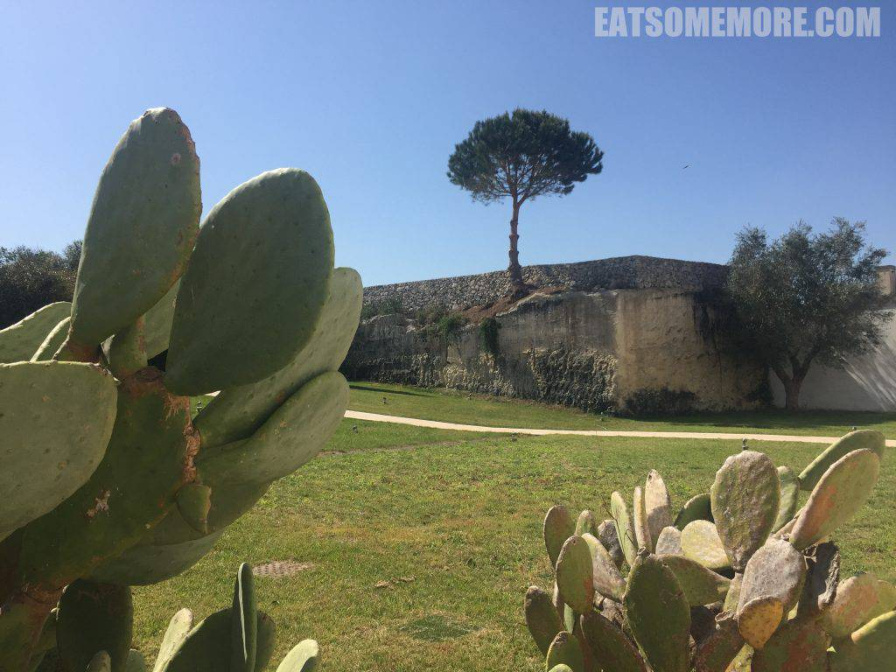

酒店的早餐品类丰富，最叫人难忘的就是生火腿片，咸香甘鲜。

早餐后出门兜兜风，偶遇一片虞美人。

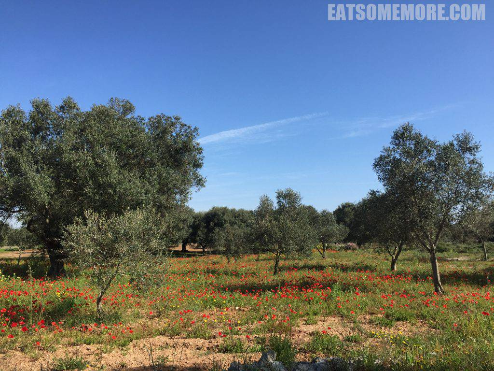

静谧的海湾，海天一色。

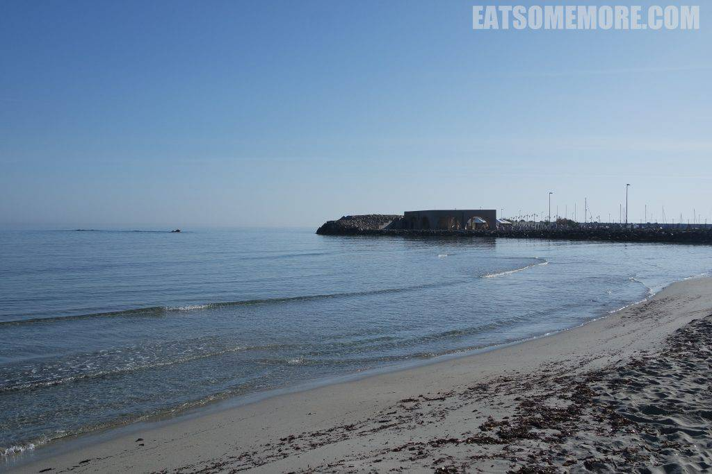

栈道上的变色龙正在变色。

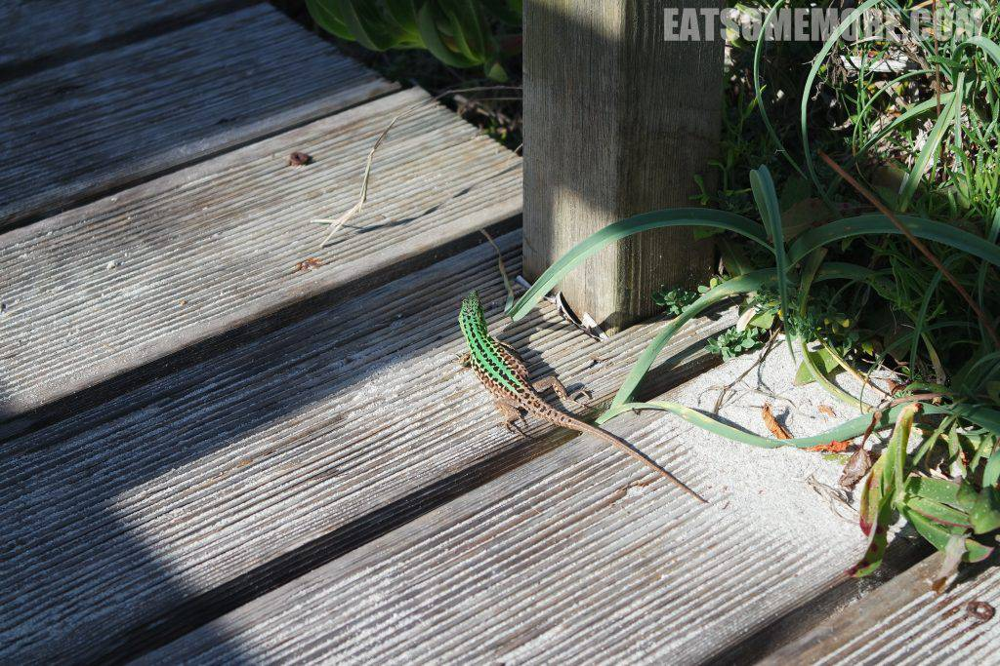

## 午餐 － Ristorante la Cantina

离开酒店后来到了意大利南部颇具特色的阿尔贝罗贝洛小镇，又称“蘑菇村”。

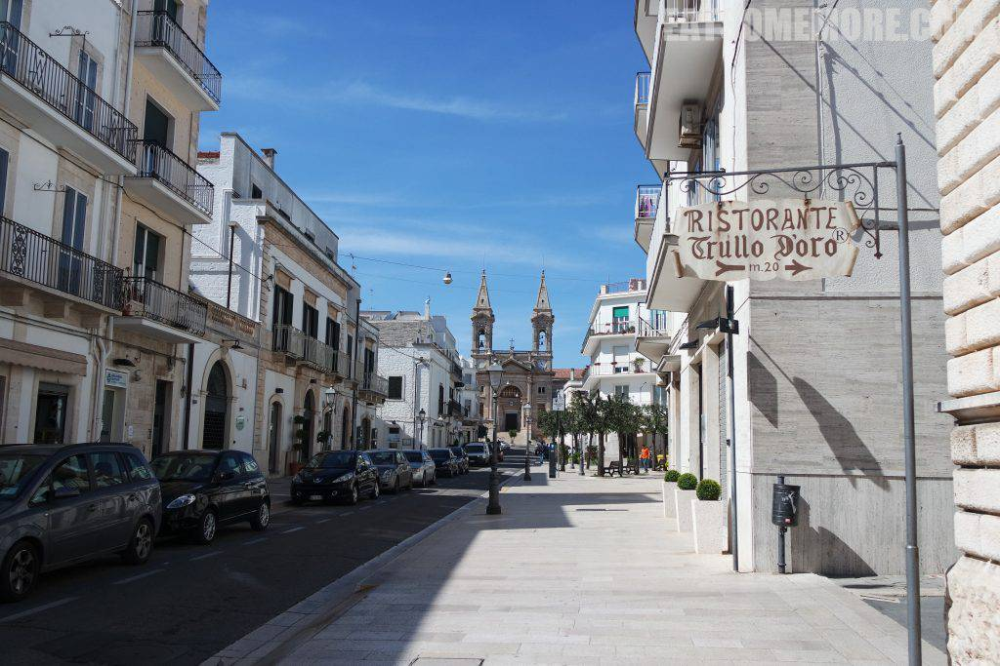

午后的阳光透过门帘晒进餐厅。

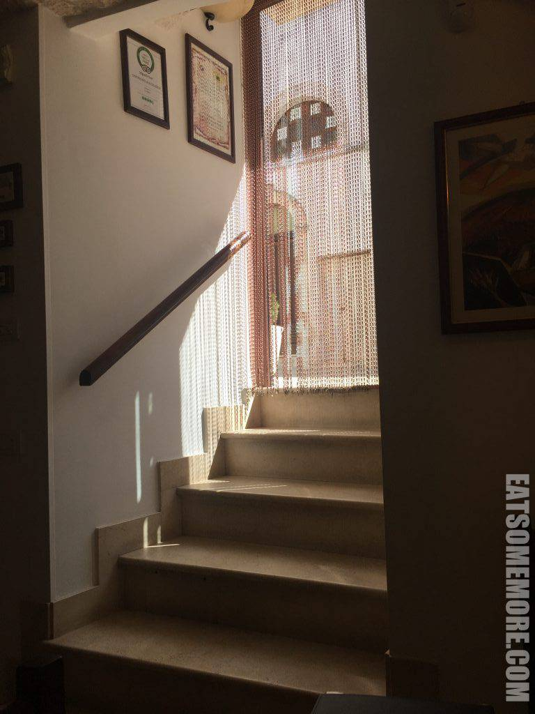

餐厅内部是窑洞样式，提供乡土料理。

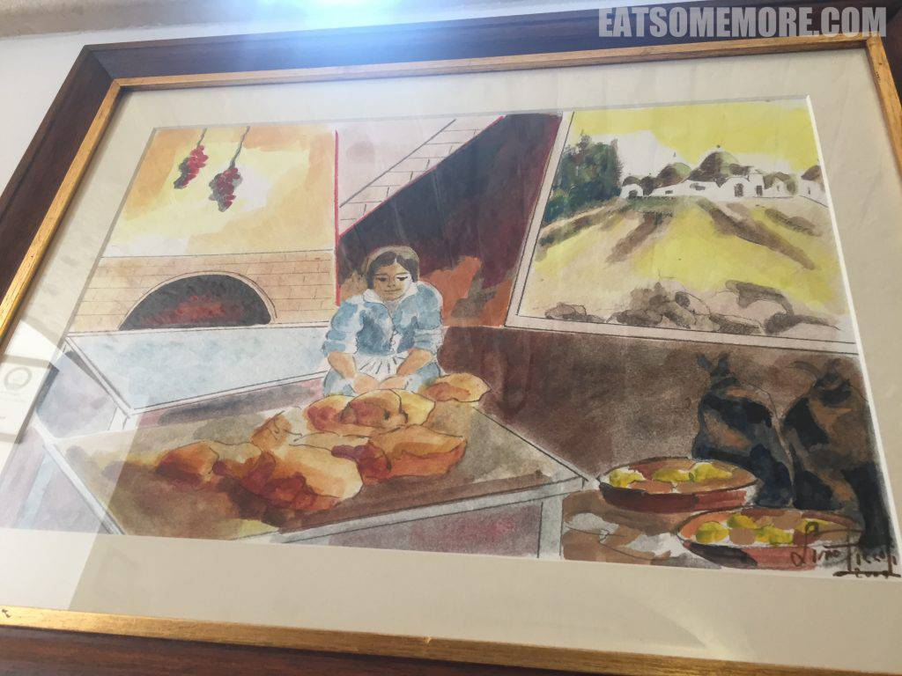

餐具上还有生动的公鸡图案。

蘑菇村得名于村镇里面农居的设计。石灰岩搭建的圆形屋顶加上白色的墙体，好像一颗伞型蘑菇。

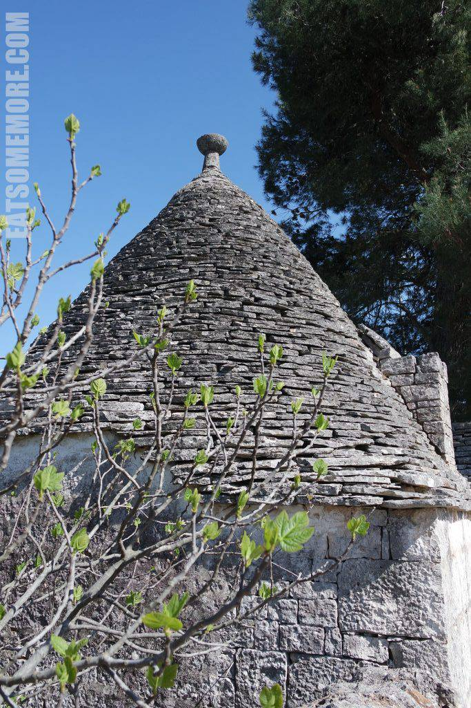

当这样的农舍蔓延整个山坡，简直是蘑菇的丰收！

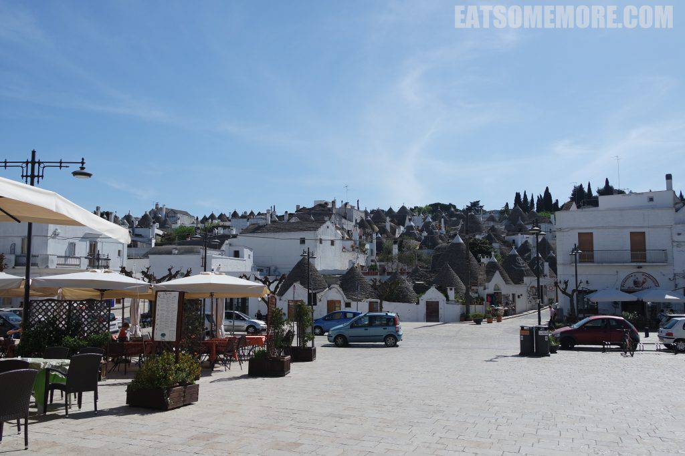

虽然去之前就知道意大利好玩，去了以后才更觉得意大利简直深不可测。艺术作品不甚枚举，尽管风格迥异，尽皆巧夺天工。美食普及程度极高，种类丰富，即使是最普通的意大利面，也可以是最惊艳的美味。去一次怎么够呢？
