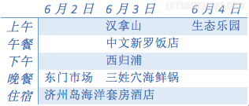

［为了下周的新番，先来个旧文分享］

有人说，美食和风景，可以抵挡全世界所有的悲伤和迷茫。

### 行程总览

### 东门市场雨中觅食－6月2日

国内航班晚点早已是司空见惯的一种现象。国航飞济州岛的这趟航班也不例外地晚点了一个小时。预计是下午一点起飞，三点到达；真实情况四点半左右到达。赶紧就去酒店休整一下。酒店的确就在海边，离机场也不远。可以搭乘巴士500路或者100路到达。打车的话也是不到5000韩币。酒店大堂非常宽敞明亮，有2台客梯。

进门处有一个台阶，贴心的设置了换鞋处。浴室也有专门的浴室拖鞋可以更换。拖鞋上都绑了白色纸条说已经经过消毒，可以放心使用。

房间干净宽敞。到达的这一天下着大雨，第二天起来才发现，房间的落地窗正对着汉拿山的美景，非常震撼。

另外还有一间小房间，我猜测是睡榻榻米用的，有地暖和空调。目测这简直是个套间，可以住好多的人呢！

短暂的休整后，我们开始出门觅食。原先订这个酒店很大的原因是它就在“爱玩客”节目介绍的钱屯子烤贝店对面。谁知道我们去的时候，这家店已经人去楼空，看来是搬了地方。无奈只好前往附近的东门市场继续觅食。几经波折，我们到达东门市场是大约已经是晚上8点，许多摊位都已经打烊，只有几家鱼生的摊位还在揽客，但是传说中的活章鱼等等已经没了踪影。我们最后上到市场二楼的饭店，点了海鲜锅和海鲜丼。总体感觉不是很新鲜，也说不上好吃。饭后悻悻而归，在酒店附近的emart采购了许多零食，包括现烤蛋糕、香蕉牛奶等等。蛋糕的确十分松软，好评。

### 登汉拿山游西归浦－6月3日

济州岛的汉拿山和日出成山峰都是我很想去的地方，可惜时间有限，我们就选择了离酒店较近的汉拿山。从市外巴士站搭巴士直达入口，大约一小时车程。爬山有不同的路径。我们上山选择的是御里木线路，下山是比较陡峭的灵室线路。

刚开始上山的时候，路不太好走，都是一些乱石当道，但也是在茂林修竹之间，绿意盎然，空气清新的感觉。大概3公里后，就开始豁然开朗，开始看见大片的蓝天和映山红。

途中有两处可饮用的泉水，非常的冰凉甘冽。

到达山顶的休息室时已近中午1点，于是我们义无反顾在山顶吃了碗韩国方便面。这是我此生吃过最好吃的方便面！可能是因为爬山消耗了太多的体力，太饿了；也有可能是高山泉水冲泡的方便面就是比较好吃。

吃完人生当中最难忘的方便面后，挥别山顶的美景开始沿着灵室路线下山。

在汉拿山顶可以远眺许多大大小小的火山口，非常壮观。

下山的灵室路线确实比较陡。下山后的很长一段时间我的脚都还很抖，一下台阶就酸痛。

灵室下山的出口到公车站还有很长一段距离。我们正好错过了去西归浦的巴士，就叫了的士。司机没有打表，收了我们15000韩币。经过后来的多次打车经历，我们总感觉这一次是被坑了。由于不甘心中午只吃了碗方便面，我们一到西归浦就直奔传说中米其林推荐的中文新罗饭店。环境比较一般，提供中文菜单。鲍鱼参鸡汤粥的鸡肉比较柴，粥和鲍鱼一般。不推荐。

到了新济州在吃饭之前，我们先去了名噪一时的新罗免税店。街边停了好多旅游大巴，人行道上都是脖子上挂着牌牌拎着大包小包的游客，门口就是手上拿着名单在写写划划的导游大人了。进到商场熙熙攘攘，化妆品柜台人山人海，完全不能体会购物的开心感觉，甚至一些柜姐态度极差简直不能忍，于是只是为了完成任务帮朋友买了一个包，其他什么都没买就出来了。

晚上八点我们到达了三姓穴饭店。此时的饭店仍然是门庭若市。进门处需要脱鞋。吃饭是在需要盘腿的矮桌上。我们两人点了一个小锅。在等待的间隙，四顾周围，每桌都是一个锅，每人一个酒盅。伴着食物的香味，刚才没买到东西的小惆怅渐渐地烟消云散啦。终于等到上菜，好激动。即使是小锅也很丰富，感觉3-4人食都没问题。锅里有章鱼、鲍鱼、各种大小贝、蚌、螺、蟹，应有尽有，而且新鲜到还在扭动蠕动着。大大推荐。

### 探访悠游生态乐园－6月4日

从济州市到生态乐园大约也是一个小时左右的车程。从停车场开始就是一片姹紫嫣红。

售票处的小花园里长着奇异的紫色花朵。

园内可以乘坐小火车进行游览。第一站水上九曲桥。远处的绿色拱桥，好像莫奈笔下的莲池。

一叶扁舟不经意地停泊在湖上。

沿着桥可以走到生态公园的第二站，是个具有欧陆风情的观光区。

第三站花园站。小火车下车的地方有一棵大树，树下有一大片七彩的小花，如梦似幻。

再向前走则可以徒步穿梭在树林当中。据说这里的路都是由火山灰铺成的。

第四站是玫瑰园、茶园及薰衣草花园。

生态乐园是一个很美的地方。但是所有的美都局限于一块一块的园区，有些美中不足，也不能尽兴的感觉。

来的时候感觉济州岛弹丸之地三天怕是足够了，没想到走的时候却还因为匆忙而略有遗憾。

- 遗憾一是没能到日出成山峰看日出；
- 遗憾二是在emart还没采购尽兴；
- 遗憾三是没吃到好吃的炸鸡。

看看会不会还有缘再访吧。
