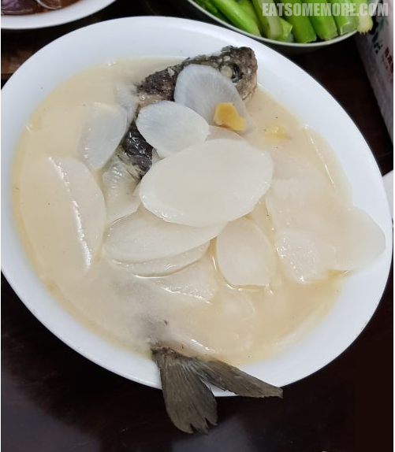

“吃”这件事，包罗万象、横贯古今。它是逃不开的眼耳鼻舌身意，也是舍不下的色声香味触法。它的从来和所去，我想要从妈妈的白萝卜鲫鱼汤开始说起。

有一年回家，妈妈做了白萝卜鲫鱼汤。汤上桌那一刻，我突然好感动，觉得那是久违的家乡美味，差点失散的至亲好友，作为首篇当之无愧，既是首当其冲，也能抛砖引玉。

冬天的鲫鱼肉肥籽多，两面煎过后加水，并加入姜片去腥散寒，圆白萝卜甜糯可口，吊出的汤头鲜白浓醇，我最爱的家常菜无疑。

**\>以下是来自2019年春天的更新<**

百吃不厌的美味，必须再安利一遍。

