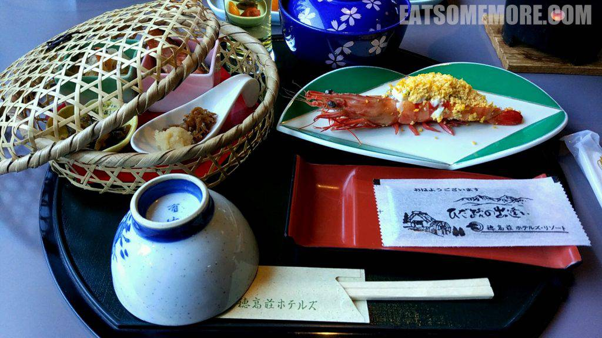
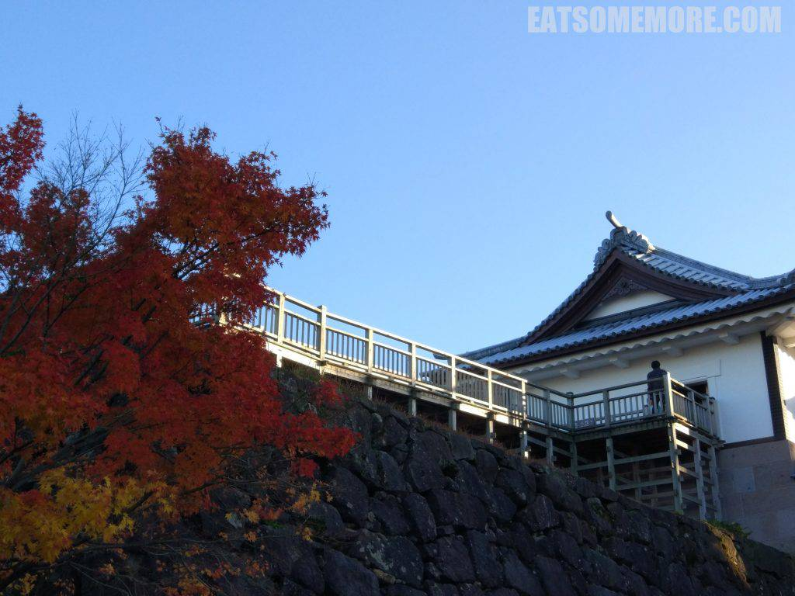
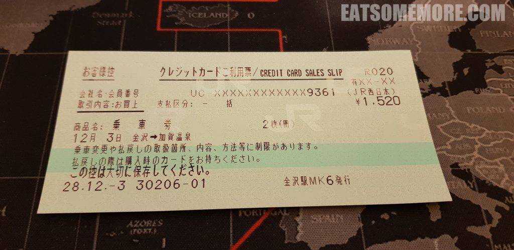
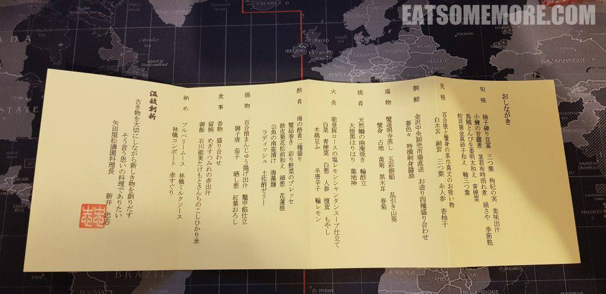
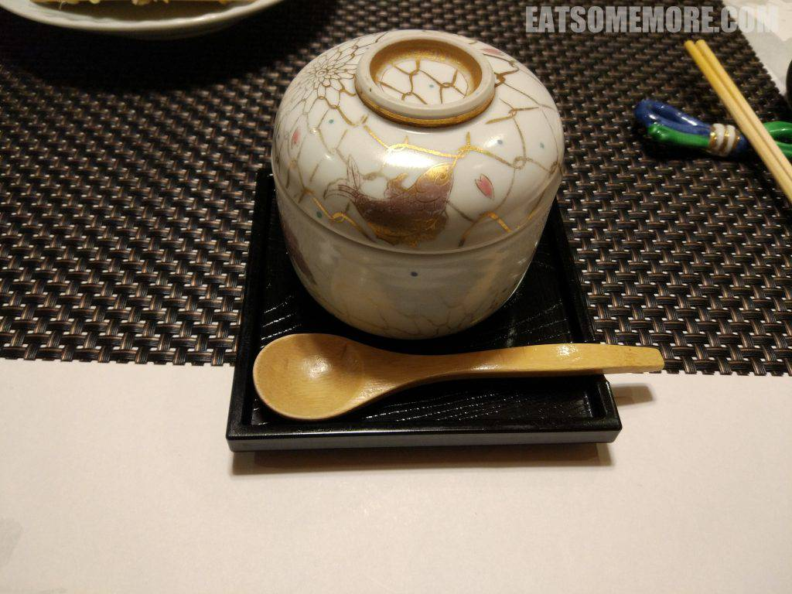
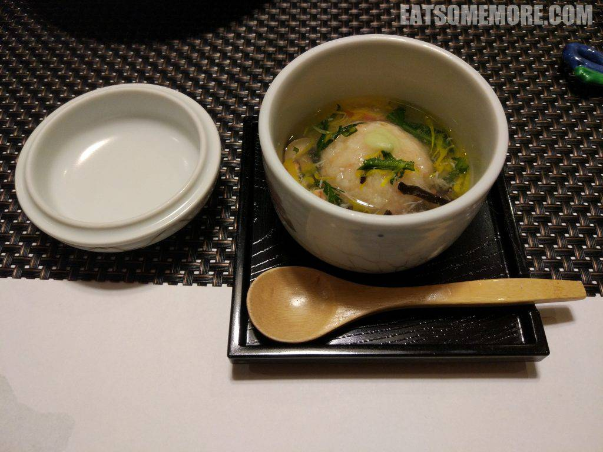
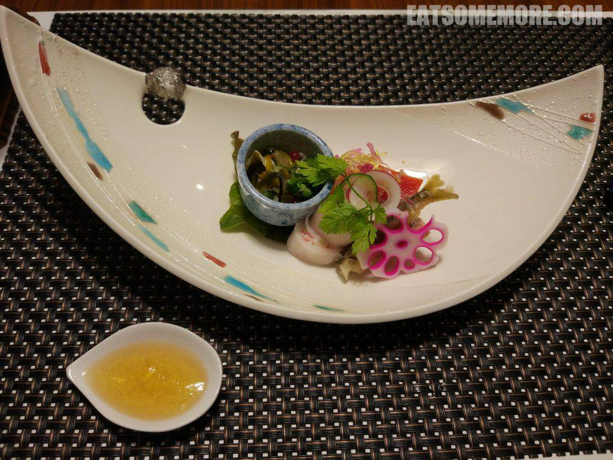
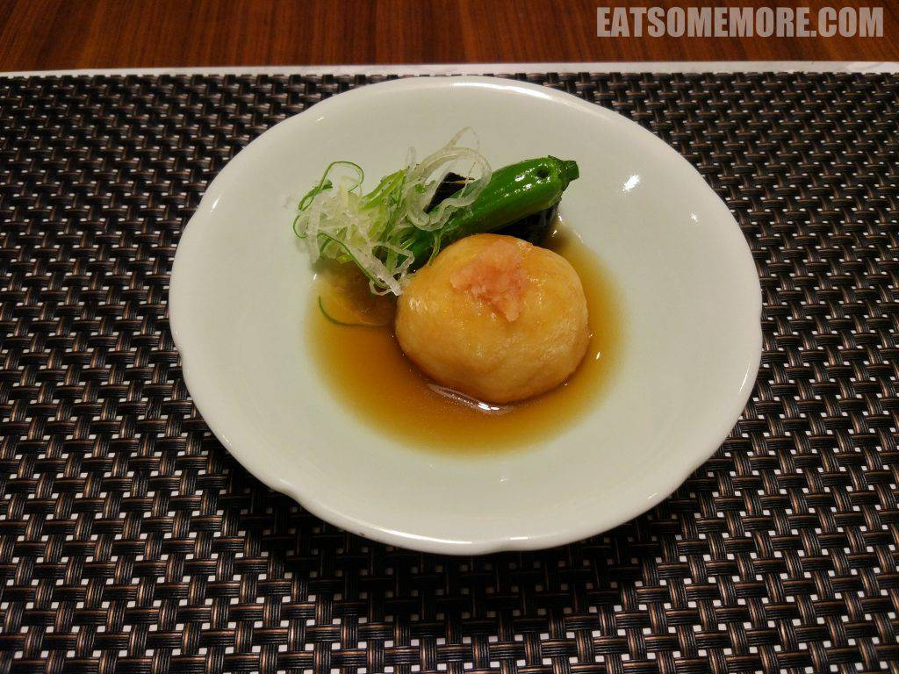
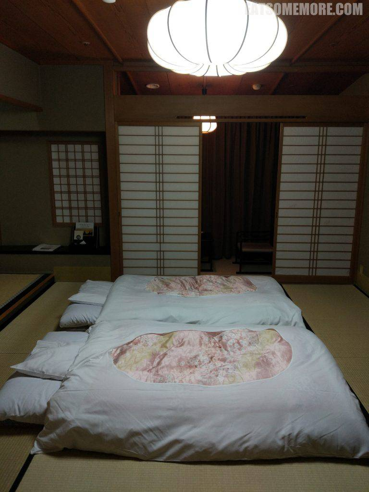

晨曦当中的奥飞驒温泉又美又仙，不能跟大家分享实在是太可惜了！

## 行程总览

## 早餐 － 新穗高温泉旅馆

泡完温泉还有美美的早餐等候，还有更好的开启一天的方式吗？

## 白川乡

早餐后按计划搭乘大巴前往北部沿海的石川县北陆地区。沿途经过了名列联合国教科文组织世界文化遗产的白川乡合掌村。那时看起来只是人字形茅草屋顶的木质农居。然而据说每年冬季，当合掌屋盖上皑皑白雪时，白川乡会举办点灯活动，景色就大不一般了。由于去的季节不对，图片只好来自白川乡观光协会官网，暂无评测。

## 午餐 － いきいき亭近江町店

下车后在近江町海鲜市场品尝带金箔的海鲜刺身丼饭。店铺非常迷你，但是海鲜却极为澎湃，除了平常的三文鱼、金枪鱼腹、白身鱼、青鱼、鱿鱼、扇贝之外，牡丹虾简直是人生至味，口感有滑、弹、和乳化后的绵密，味道甘、香、鲜极一时。虽然小店不允许拍照，但是认识和喜欢上牡丹虾便是这一餐的最大收获。

## 金泽

石川县县厅金泽市，是北陆地区的第二大城市。传说在一千两百年前，有个农民在当地洗土豆的时候，水井里面冒出了金子来，这里因此得名金泽。这口水井在今天日本三大名园之一的兼六园内，亭内挂着“金城麗澤”的匾额。

## 加贺

在金泽城公园稍作散步后，搭乘火车前往加贺温泉乡。旅馆专门派车到火车站来接我们，开启了一段充满omotenashi的体验。日本在申办2020年奥运会的时候，新闻主播瀧川雅美向世界科普了omotenashi这个日本人的款待哲學。其中Omote指的是面对公众时的面貌，而nashi则是毫无保留的意思，连在一起就道出了日本服务业的精髓——用心服务。

例如有专门的人员在约好的晚餐时间，去房间门口等候，接着带客人前去用餐的包厢。日本旅馆的套餐一向品类繁多，看似什么都一点点，一道一道下来也很满足。

在应季小菜、百合菌菇蟹肉汤和金泽中央市场直送的四样海鲜刺身后，就是这一道装在精美瓷盅里的……

木耳菊花蟹肉丸子汤！

随之而来的是烤野生鰤鱼和白菜人参能登猪汤。大菜过后登场的是颜值极高、下饭一流的海鲜海藻小菜。

茄子辣椒鱼肉丸，也是清淡的美味。

晚餐结束后，女将已经贴心的准备好了床铺。泡个温泉，暖暖地入睡吧！

