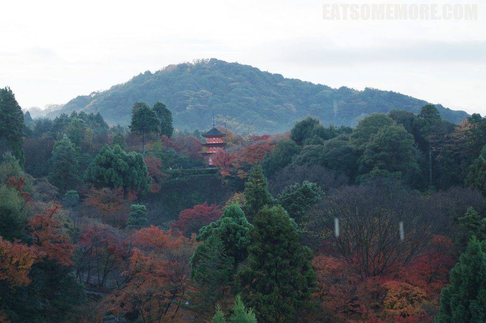
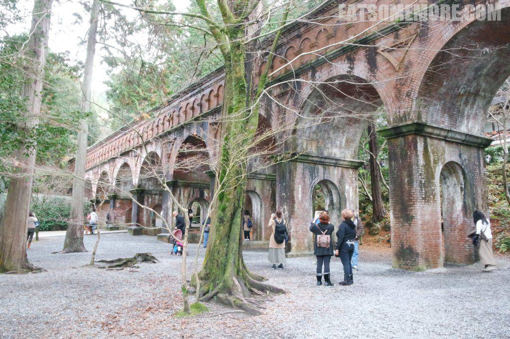

充满期待地展开了游览京都的第二天。

## 行程总览

由于这一天都在京都市内游览，京都巴士一日游通票就很好用。

为了避开人潮，我们的第一站就是大名鼎鼎的伏见稻荷大社。神社境内延绵不断的红色鸟居，又称“千本鸟居”，是一种神社建筑。在维基百科提供的传说当中，这是连接神域与俗世的通道，属于“结界”的一种。据说一座鸟居就是信众所许的一个愿望，一眼望去，满满的全是愿望呢！

稻荷大社的鸟居不仅有两根支柱、两根横梁，还有悬在横梁中央的牌匾。迎面而来穿着校服的女孩子们带来一阵青春的气息。

趁着好时光再去拜访同样名满天下的清水寺。早晨的东山山谷蒙着一层薄雾，红叶青松环抱着古塔，又神秘又迷人。

古朴的木结构柱廊连接着寺庙的殿宇。

清水寺依山而建，从殿宇侧面可以俯瞰京都。那赫然漂浮于绿叶红枫之上的，正是摩登世界里的京都塔。

十二月初的京都，红叶已经渐渐凋落。

但这丝毫无法影响由一百三十九根圆木支撑的“清水舞台”的震撼和壮观，据说该建筑结构完全没有使用钉子。

枫叶下的台阶又更美些。

太阳一出来，整个画面都亮了起来。令人吃惊的是，即使是深秋落叶季，街道还是干净得很。

阳光下金红相间的子安塔隐藏在红金相间的秋叶当中。

换一个角度又成了红叶掩映着红塔。

回过头来，是平静的水面倒映着红叶和仙鹤。怎么看都是美。

从清水寺离开，沿着三年坂和祇園街道，逛着逛着就来到了有着米其林三星认证的菊乃井本店。穿过日式前院进到饭店，一位老先生早已迎了上来，确认预约，并放好客人换下的鞋子。在一楼和洋融合风格的会客室里稍等一会，就有女将来领我们去楼上日式布置的餐厅。

午市套餐非常丰盛。除了各式小菜外，还有香菇鱼豆腐汤和味增萝卜。最惊艳的要属生鱼片山药泥拌饭，又香又鲜又滑好厉害！

午餐后来到了日本禅宗最高寺院临济宗南禅寺。在这千年古刹当中和参天大树之间，有一座红砖孔桥充满了西洋文艺复兴极致对称的风格。

在寺外的哲学之路上，还邂逅了一只黄澄澄的小蝴蝶。

京都古寺云集，各具特色。这天的最后一站是天台宗寺院真如堂。这里不愧是网红赏枫名所，才到山门前就是满眼的红叶红门红柱子。

进到寺院里更是清雅幽静。

枫树在精心的修剪之下，也更加婀娜多姿。

笔挺参天的古木好像加了一层红黄滤镜，美轮美奂。

在在处处遍红叶。

院后这棵大树也挂满了红叶。此刻的我好像才体会到秋季日本的美不胜收。

再恋恋不舍地回望一次红叶下的北门。

晚餐时我们来到了米其林推荐的人气手打乌冬面馆山元麵藏。十二月的京都室外有些冷，店家亲切地给排队的客人递上热茶和餐牌。以前我总不理解乌冬面哪里好吃，然而这家面馆让我对这样食物大大地改观，由汤到面直至浇头都给了我巨大的惊喜。面条筋道弹韧，吸汤的同时富有面香；汤头清爽又不失鲜甜；天妇罗的浇头分开摆放，又酥脆又新鲜。这样一碗热气腾腾的面条下肚后，再来一份柔嫩极了的杏仁豆腐，真是个完美的夜晚！

