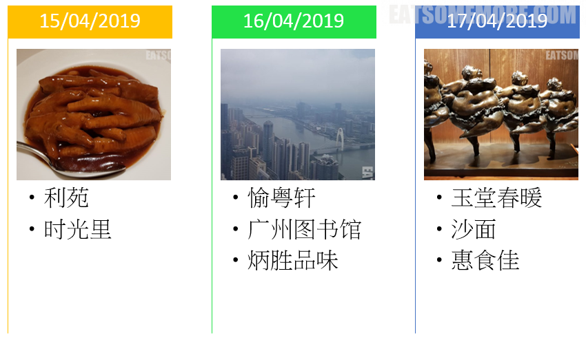

日本文学大师三岛由纪夫写过一本名为《金阁寺》的小说，改编自昭和二十五年的金阁寺纵火事件，讲述的是一名患有口吃的僧人对于美的渴望和恐惧，想靠近而最后却只能毁掉的哀伤故事。这次日本游的最后一天，就要去看看这美得让人自惭形秽的金阁寺。

## 行程总览

出门时惊喜地发现秋天的京都不仅有红叶，银杏树也披上了金灿灿的颜色。起风时扇形的叶子铺天盖地地飘散开来，有种侘寂式的易逝之美。

书归正传，金阁寺，临济宗相国寺派寺院，又名鹿苑寺，得名于创立者室町幕府三代将军足利义满的戒名鹿苑院天山道义。寺院当中最灿烂夺目的就是金箔覆盖下的三层楼阁建筑，舍利殿，也是室町时代前期北山文化的代表建筑。湖面上的金阁倒影，仿佛吟诵着“所谓伊人，在水一方”。现在我们所看见的舍利殿，重建于昭和三十年，如今被收录在联合国教科文组织的世界文化遗产名录。

离金阁寺不远处，有一座拥有千年历史的神社，北野天满宫。据说这里是日本天神信仰的中心，也是日本历史上第一个供奉实际存在的人物的神社。这位被奉为“农耕之神”、“诚实与至诚之神”、“洗刷冤屈之神”、“技艺之神”和“学问之神”的菅原道真公，是平安时代杰出的学者和政治家。神社建筑富有桃山时代灿烂华丽的设计风格。

午餐时回到了河原町，拜访Tabelog评分3.72的面屋猪一。店门口的长队正是对于高分评价的事实认证。这家位于背街小巷的拉面店，吧台座位大约只能容纳不足十人，特色是蔬菜汤底的叉烧面，很有个性。

## 神户

因为第二天一早要从关西机场离境，午餐后我们便启程前往神户湾喜来登酒店。酒店离车站非常近，配套设施也很齐全，比如餐厅、超市、商场等等。这么早去酒店，主要是因为酒店有提供室内和露天的天然六甲温泉。根据惯例，温泉不允许拍照，特此附上官网的图片，亲测可信。

温泉外的休息室是和洋结合的风格，烤着火小憩片刻，十分惬意。

回到房间的时候，天都黑透了。窗外璀璨的神户夜景，是此行最后的馈赠。

## 后记

2016年的旅行拖了两年才写下来，究其原因有二。其一自然是本人的惰性使然；其二是我大意，把手机落在了日本航空的飞机上，痛失了这次旅程的所有照片和录像。我一度不愿谈起这次旅行，但转念一想，如果连游记也不写的话，过不了多久，我丢失的就不仅是手机、照片和视频，更是关于这次旅行的所有回忆。因此我尽量收集了在手机丢失前上传到社交软件的零星照片，尽己所能地记录下了这次旅程，希望我的文字和仅剩的一些图片不至于令读者太过失望。
