吃货上广州，自然是一天也不肯浪费的。这就跟大家分享如何在羊城三天拜访四家米其林一星餐厅。

## 行程总览

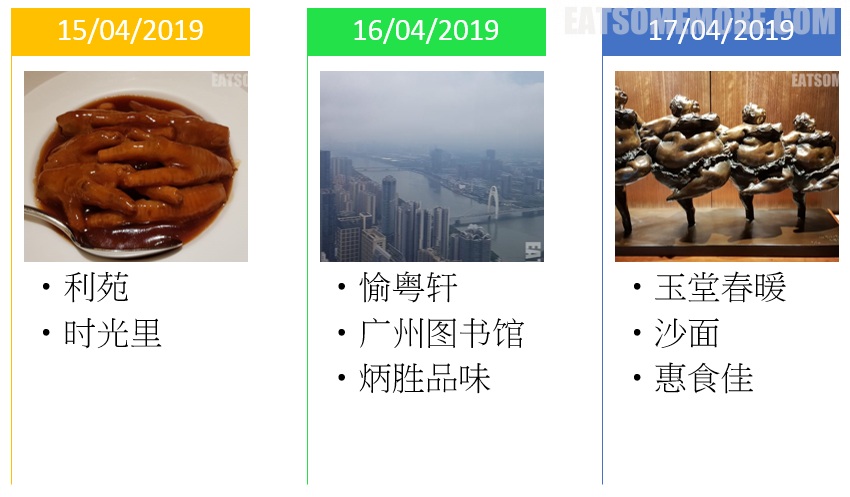

## 利苑

利苑始于1973年，由一间传统粤菜酒家发展成为如今的国际餐饮集团。位于广州越秀区的这间分店更有米其林一星的加持。

服务员热情亲切地带我们来到了预定的位置，并推荐了特色点心。其中人气最高的要数冰烧三层肉。一咬肉皮满口香脆，肥中有瘦瘦里带肥，又嫩又弹，油香四溢。

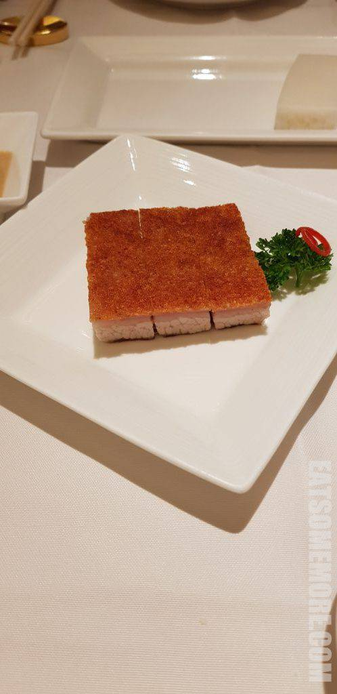

接下来是一些经典的广式早茶点心。利苑的叉烧酥是条状的，因此每一口里面叉烧和酥皮的比例更为稳定。

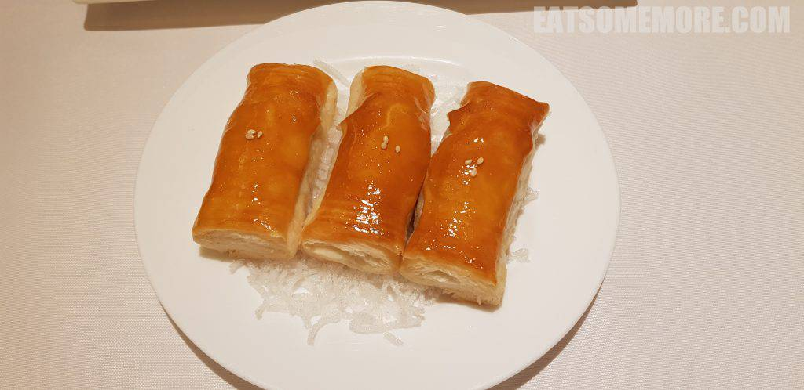

原只蒸虾饺诚不我欺。弹薄的水晶饺皮饱满地包裹着蒸得脆生生弹啵啵鲜滋滋甜咪咪的整只虾仁。

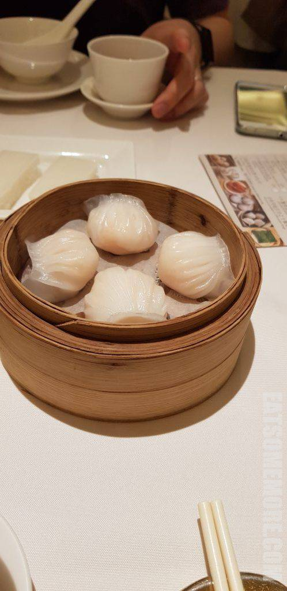

北菇滑烧卖也是嫩滑鲜甜全具备。

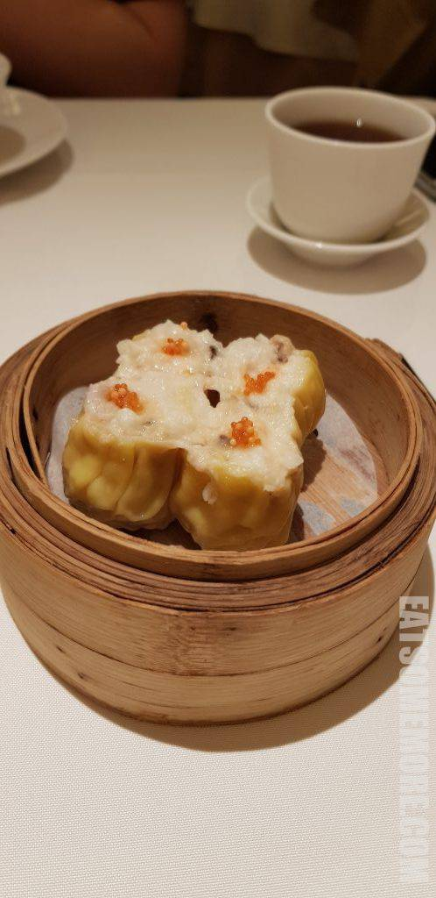

鲍汁凤爪大小均匀、去了指甲、焖得软烂，吸满了鲍汁的鲜香。

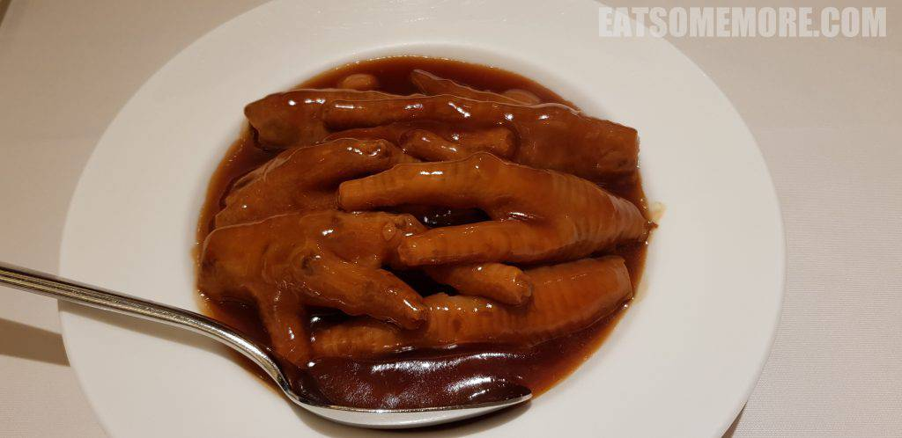

黑松露小笼包是当属全场最佳。黑松露、鲜肉和汤汁组成了令人惊艳的鲜的三次方，回味悠长。

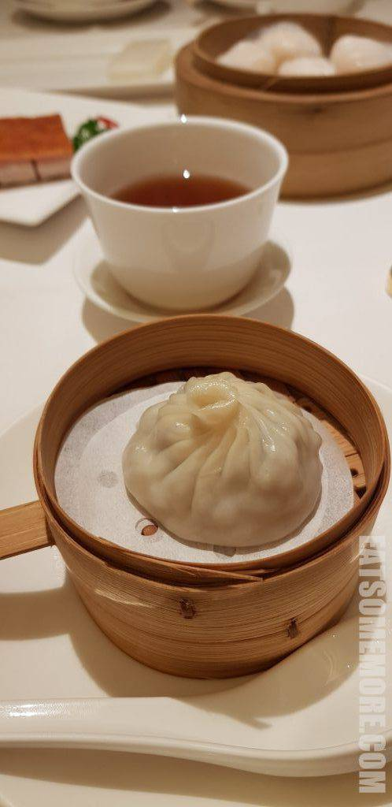

白糖糕像是朴素版的黄金糕，然而香甜弹糯依然。

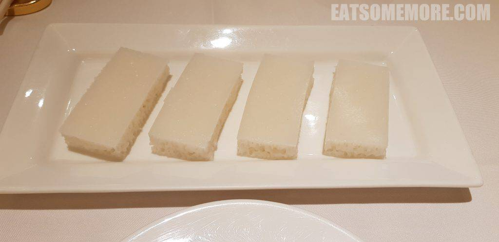

杨枝甘露和核桃仁拿破仑进行了中西合璧的组合。拿破仑薄脆的酥皮夹着鲜甜的奶油，诠释着甜品的美妙真谛；而另一边，果汁的浓郁、芒果的香糯和柚子的酸甜，伴随着点点西米全都开了挂地滑进了我的肚皮里，得再来一碗才能继续进行美食的学术性探讨啦。

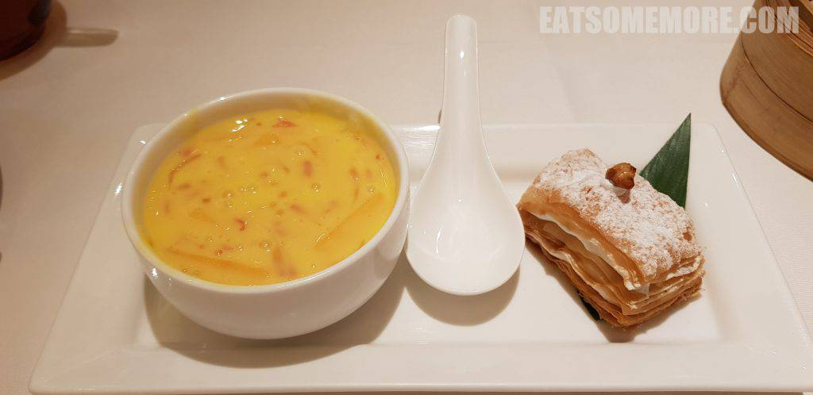

## 时光里

饱餐后的消食活动也不能少，可惜正值这清明时节雨纷纷，只好转战室内，去时光里看看海绵宝宝主题展览。

你的笑容我的笑容好像都一样。

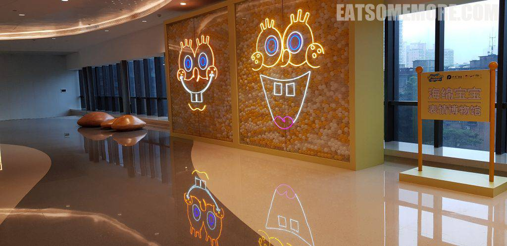

果然是动画世界，连花都开得好整齐，美美地期待明天更多美味吧！

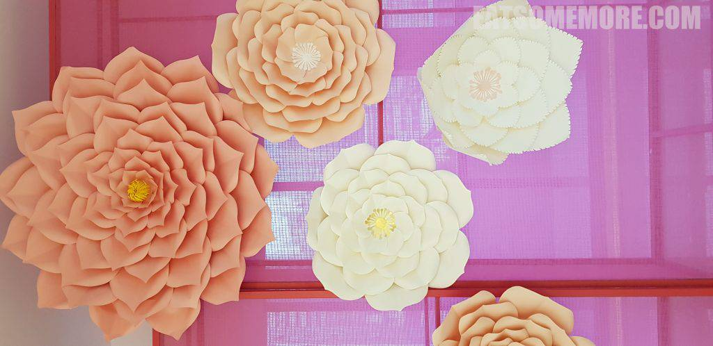
