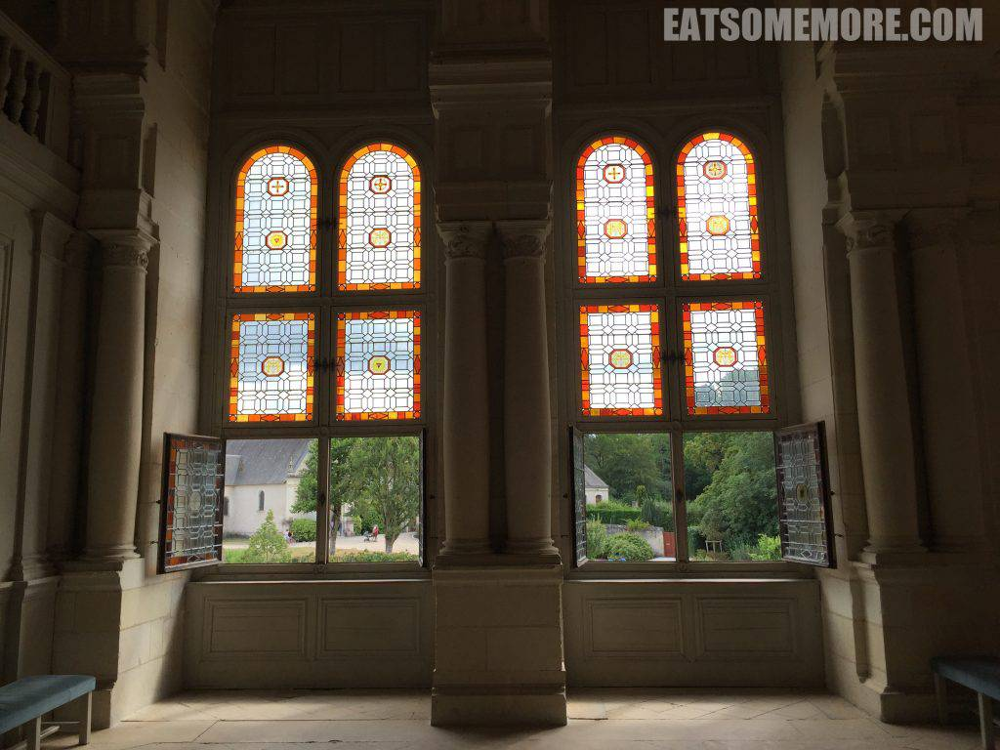

说起法国，我们大多想到的是优雅华丽的巴黎、海滨胜地的尼斯。这次我将启程前去探访法国的花园——卢瓦河谷。卢瓦河是法国境内最长的河流，更以其流域附近的大量壮丽城堡群而闻名，被联合国教科文组织列入了世界遗产名录，是现实世界里的迪士尼，辛德瑞拉真正的家。

### 行程总览

### 7月30日－布尔日大教堂

从伦敦搭乘欧洲之星，两个半小时就能到达巴黎北站。出站不多时，竟偶遇密云下的圣心堂。

#### Pho Tai－午餐

自巴黎一路向南才能到达卢瓦河谷。出巴黎前，我们在十三区的越南餐馆先吃个午餐。河粉量大料足，宽粉筋道入味，汤清而味浓，熟牛肉肥瘦相间、炖得酥烂，生牛肉过了滚汤鲜嫩可口。如果有机会，一定要尝尝比普通汤河粉多了脆弹牛丸的“特别粉”。

#### Best Western Hotel D'Angleterre

下午到达了宁静小镇Bourges，在最佳西方酒店办理完入住手续后便到镇上去逛逛。

#### Cathédrale Saint-Étienne de Bourges

傍晚时分的布尔日大教堂，壮美非常、比例匀称、花窗密布、哥特风盛。

#### La Gargouille－晚餐

第一次吃到鸭肉汉堡，但腥味有些大。

餐后甜点是蛋糕搭配腌渍过的杂果和利口酒，有些甜腻。

晚餐后徜徉在都铎风小镇的巷弄当中，昏黄的灯光仿佛千百年如一日地照亮着同样的路，不同的人。

### 7月31日－香波堡&舍农索

沿着卢瓦河一路向西，沿途有大片太阳花田，心情都明亮起来！

#### Château de Chambord

大名鼎鼎的香波堡是卢瓦河流域最大的城堡。数量庞大又鳞次栉比的塔尖、烟囱、屋顶，使得这个城堡看起来好像托起了一整个小镇。

城堡的花窗使用了暖色调的彩色玻璃。

 

建于16－17世纪的城堡，既有意大利文艺复兴的对称，又有法国巴洛克式的繁复。

城堡当中的双螺旋梯据说是达芬奇所设计。两人同时进入楼梯当中，可能永远也不会相遇。

城堡顶部的风景简直美得超了纲。果然是国王的视野，须得格外辽阔！

#### Château de Chenonceau

舍农索城堡横跨谢尔河，经过几毁几建，成就了如今揉合文艺复兴和哥特风格的建筑样式。

城堡的窗户设计简约，然而窗外的树林河景却成了最美的装饰画。

餐厅朴素而又鲜活。

离开的时候，城堡边升起了热气球，太梦幻了！

#### Hôtel du Bon Laboureur＊－晚餐

在舍农索城堡不远处有间米其林一星餐馆。后院里繁花似锦，十分可爱。卢瓦河谷不愧是有名的葡萄酒产区，餐餐必点，永不落坑。

餐前小点是鱼肉块和时蔬粒，清新鲜香。

鳕鱼沙拉不仅食材新鲜，且搭配新奇、口感清甜。

慢炖羊肉，酥软甘鲜。

大虾火候恰好、脆弹鲜甜，松露土豆泥异香扑鼻、香甜可口。

巧克力果仁蛋糕搭配咖啡冰淇淋，香醇浓郁。

#### Best Western Hotel d'Anjou

晚餐后前去酒店办理入住，走廊复古而有质感。

### 8月1日－城堡的三次方

来到卢瓦河谷的第三天，收集的城堡又再添三枚。

#### Château d'Angers

从酒店出发，步行可到达昂热堡。这是典型的中世纪城堡，具有战略防御功能，罗马人也曾居住于此。

#### Château de Saumur

沿着卢瓦河逆流而上，索米尔城堡及市政厅是很难错过的美景！靠岸边的单尖顶建筑是市政厅，而依山而建有四个尖顶的则是城堡，充满中世纪哥特风格。

#### L’Escargot－午餐

索米尔镇上有间好评如潮的小餐馆。后院的石墙上爬满了绿色的藤蔓，清新又惬意。

餐前小点十分别致，是蜜瓜搭配蔬菜慕斯。

店名在法文当中的意思是蜗牛，那么前菜当然要点个招牌的蜗牛尝尝啦。香蒜酱焗烤后的蜗牛，原本的风味多少被掩盖了一些，但是弹牙的口感仍在。

猪肉搭配蘑菇和千层土豆，是实实在在的好味道。

鳕鱼和时蔬的鲜甜滋味相得益彰。

#### Château d'Ussé

这一天的最后，我们来到了传说中睡美人的城堡原型。

#### Best Western Hotel d'Arc

晚上入住的酒店有一个特别酷的电梯，像电视里放的那样要先叫电梯，电梯到了之后需要自己开、关门，到了指定楼层后再次自行开、关门，真是很复古的体验。不得不说这次住的三间最佳西方酒店都极具风格，只是岁月的痕迹无疑是把双刃剑，在复古优雅的同时，设施陈旧和清洁问题还是会带来一些困扰。

这一趟充满葡萄酒和城堡的旅途非常法国非常棒，但是下次应该不会再选择最佳西方入住咯。
