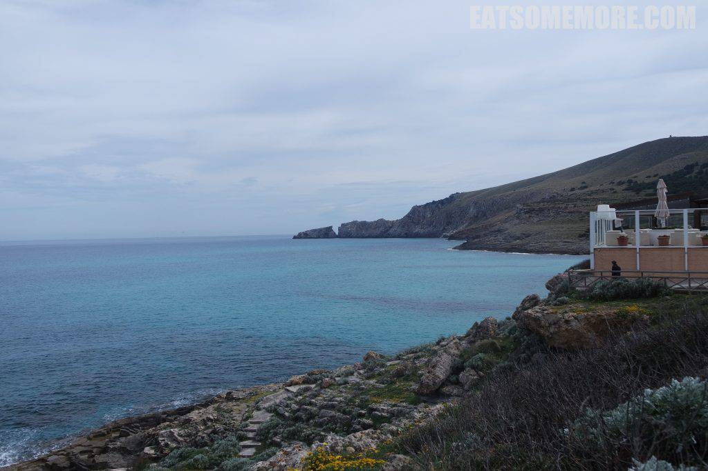

马悠卡是西班牙东部海域的小岛，也是这次西班牙之旅的番外篇。

从巴塞罗那飞往马悠卡的飞机上就能看见这崇山峻岭、村落成群。

马悠卡中部的村庄都充满了质朴的风格。

石墙木门好像更能体现出南欧阳光的温度。

民居主人老奶奶和蔼可亲，向我们说起从父辈手上继承下这房子的故事。

钟楼前屹立着热带棕榈树。

门窗也有着明亮的色彩。

这样的色彩在群山当中的村落里显得格外跳脱亮眼。

这个村庄在这个季节里，春花烂漫。

树上挂满了柠檬。

到了小岛东端，遇上了我迄今在欧洲见过最美的沙滩，Cala Agulla。

草垛沙丘小黄花，深蓝浅绿翠靛青。

海潮何年初归岸，黄花何时再簇团。

海湾边的小山丘上还盘踞着三两民居。

海浪像水晶一样晶莹剔透

远看又有着青蓝色的渐层。

十五分钟车程开外是另一个海滩，Cala Mesquida。

这里虽然没有沙滩，但是海水颜色的层次更加丰富。

大陆延伸到海洋里，托起了这一片广阔山海当中的露天餐厅座位。

陆地上草翠花黄，海洋里靛紫蓝青。

马悠卡东部内陆地区的小镇阿勒泰很有生活气息。

市政厅的投影浮在门前的喷水池里。

巷弄蜿蜒，墙壁斑驳。

午餐在市政厅附近的Sa Gripia用餐。入口的庭院里有一棵柠檬树，温馨惬意。

伙计向我们一一地介绍了菜单。餐厅并不提供西班牙名产sangria，但是有加泰罗尼亚地区很受欢迎的夏日酒（tinto verano）。根据我对酒类的浅薄知识，目测是在sangria里面加了很多新鲜苹果。好喝！

焗猪肉饭不知道为什么吃起来有一种榴莲的异香。神奇！

香烤檬鲽，外皮烤得酥脆，鱼肉鲜嫩。沙拉上淋了橄榄油和巴萨米香醋，清新香甜。

午餐后驱车来到本次环岛游的第三个海滩，cala figuera。

虽然天公不作美，但还是能够看到海水清澈、层次分明的蓝绿色。

接着就沿着盘山公路向北部村镇进发。

春花点点，群山抱海。

途中经过的Valldemossa小镇非常具有整体和谐的美感。

著名音乐家肖邦和女作家乔治桑也曾在此居住。

快日落时，我们到达了海边小镇Deia。

沿路有个花园博物馆，工作人员只有一位老爷爷和一位老奶奶。

博物馆里的陈设很有家的感觉，从里面出来的时候，屋子里点起了壁炉。这样的家也太令人羡慕了吧！

博物馆的院子里，有一座纪念亭。

小道边的烛台也是亭子的形状。

在海天山水之间，有种遗世独立的感觉。

日落后回到马悠卡首府帕尔马。

夜幕中的大教堂倒映在水中，有特别的美感。

宿希尔顿萨托里酒店。

房间很大，陈设古朴大气，细节也做得很好。

贴心地准备了女孩儿们最喜欢的花、水果和加泰罗尼亚气泡酒Cava。

床非常的宽敞，布置得很好看。

在马悠卡的第二天，阳光照进了我们的小花园。

起床后，可以选择在室内或者室外用早餐。

这种乡村里晨光下鸟鸣中橙花香处的早餐太棒了。火腿片得很薄，搭配蜜瓜简直是美极了。

早餐后散步来到酒店入口处的天井，开阔敞亮。

充满岁月痕迹的墙面上，爬山虎发了新芽。

出了天井有三景。其一是风车。

风车柏树顶着一缕白云倒映在水里。

其二是教堂。这里也可以作为结婚场地，供住客使用。

酒店内也可以望见这个教堂。

万里无云的蓝天下，教堂参差的尖顶漂亮极了。

其三是歪脖树，让人既感叹生命力的坚韧，又好奇它经历了怎样的故事。

酒店的花园里四处种着柠檬树、橙子树。其中的一个小院子里还种着供酒店餐厅使用的时蔬。据说酒店还有自己的酒庄，这次来不及参观，真是太可惜了。希望下次还有机会再去。

在去机场的路上，经过了帕尔马的城市港口。再见了马悠卡，再见了西班牙，希望不久再见。

