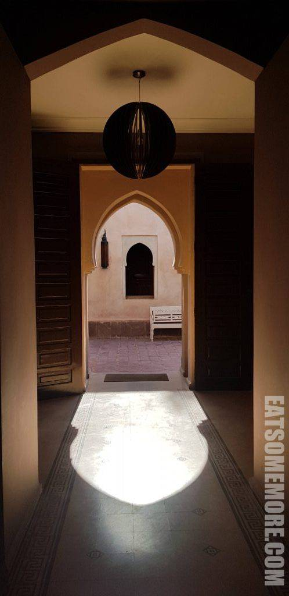

马拉喀什在柏柏尔语中是上帝故乡的意思，坐落在雄伟的阿特拉斯山南麓，也是通往撒哈拉沙漠的门户，被誉为“南方的珍珠”，教人迫不及待地想去看个究竟。

## 行程总览

## La Maison Des Oliviers

通过酒店房间的彩色窗户遇见了马拉喀什的第一缕晨光，催促着我们该赶紧开始新一天的游览。

酒店基本都是一层的摩洛哥风格建筑，被簇拥在玫瑰花和仙人掌当中。

总觉得在非洲见到喷泉挺惊人的。

走不多会就来到了酒店的餐厅，非洲热烈的阳光在瓷砖上描摹出阿拉伯风格的门框形状。

早餐十分丰盛，提供各色摩洛哥面点、水果和蜜饯。

当然也不缺果汁、咖啡和茶。不喜欢闷在室内的住客也可以选择在院子里用早餐。

摩洛哥证明了同样的水果是可以有不同的呈现的，例如洒上了肉桂粉的橙子更香甜，加入了薄荷叶的西柚更清新。糕点包括布满小孔的Baghrir，在当地非常常见的M'semen，酥脆的干菜馅饼，和我在其中最喜欢的带着浓浓蜂蜜味的蜜饼。

## 马洛雷勒花园

早餐后，乘酒店接驳车来到了位于马拉喀什西北部的马洛雷勒花园，单程120迪拉姆。这是由法国东方主义艺术家雅克马洛雷勒在二十世纪初花了将近40年创建起来的景观花园，占地2.5英亩。著名服装设计师伊夫圣罗兰在80年代买下了这里，并和他的伴侣皮埃尔贝尔杰一起开展重修。他过世后，将骨灰留在了这个花园，对这里的青睐可见一斑。

如今，花园和别墅向公众开放，别墅里面还有马拉喀什伊斯兰艺术博物馆和柏柏尔博物馆。学生套票票价100迪拉姆。

从早上开门起，售票处就排起了长队，花园里也游人如织。

马洛雷勒从马拉喀什多彩的马赛克砖和柏柏尔民居中获得灵感，在花园和建筑当中大量地应用了明亮大胆的钴蓝色——又被称为“马洛雷勒蓝”。

明黄与钴蓝相映成趣。

这一抹蓝在夏日的青翠当中也显得沉静清凉。

莲池当中婀娜的锦鲤活泼可爱生机勃勃。

园中的仙人掌千姿百态争奇斗艳。

没有想到的是在北非也能遇见一片翠绿竹林，果然是不可居无竹。

## 圣罗兰博物馆

从花园出来向北100米就到达了于2017年开放的伊夫圣罗兰博物馆。

玄关处雕像背后马赛克瓷砖的颜色好看得沁人心脾。

展馆内收集了伊夫圣罗兰设计的、带有摩洛哥风格的服装。

其中一个展厅的一片漆黑当中，一位模特正负重前行。

## BlackChich Cafe Restaurant

博物馆游览结束之际正值午餐时间，打车来到马拉喀什主城区附近的人气餐馆BlackChich Cafe。

除了摩洛哥国民饮品柳橙汁外，牛油果奶昔也是清甜绵密细腻幼滑。

牛油果三明治搭配圣女果和鹌鹑蛋清新可口。

番茄豆瓣炖牛肉酥软入味，下饭一流。

美餐后玩起了餐馆里的小绵羊，却莫名有种越南即视感。

## 巴伊亚宫

餐馆附近就是大名鼎鼎的巴伊亚宫，门票70迪拉姆。宫殿内部雕梁画栋富丽堂皇。

穿堂过室之间都是精致的木雕和多彩的马赛克拼图。

蓦然举头又被多姿多彩花窗吸引了视线。

美观的同时，采光充足。

阳光透过窗户，在地砖上绘出了彩色的涂鸦。

不得不感叹摩洛哥人对于色彩的天赋异禀。

宫殿当中的小广场完美对称，一砖一瓦一拱一柱在万里碧空和拔群椰林的印衬下都显得特别灿烂夺目。

## BlackChich Cafe Restaurant

走累了回到BlackChich Cafe喝点摩洛哥薄荷茶，解渴消暑。

更怕热的朋友可以试试薄荷青柠汁，冰爽清凉。

## 集市

稍事休息后又来到集市逛逛，被摩洛哥的美艳灯具迷了眼。

## Cafe Chez Zaza

晚餐时来到了一家有露台的餐厅。

从露台望出去的马拉喀什是粉红色的。

柳橙汁一如既往地酸甜可口，香蕉奶昔也毫不逊色。

杏脯羊肉塔吉锅融合了果香与肉香。

鸡肉烤串外焦里嫩。

迎着夕阳的三角梅和粉色的马拉喀什十分合衬。

## 夕阳广场

餐厅外便是名噪一时的夕阳广场，商铺摊贩云集。

广场这头好多马车夫在等着生意，那头的宣礼塔庄严静谧。

在广场附近走走逛逛，还购入了一双手工皮拖鞋。

在这粉色的城市，遇上了粉色的宣礼塔。

转眼华灯初上，到了当地人结束一天的节食的时候。作为游客的我也度过了充实的一天，更精彩的明天又离我更近了一些。

