有汤泡的一天又是美好的一天。

## 行程总览

从温泉出来骤然了解到窗户是最好的装饰画的意思。

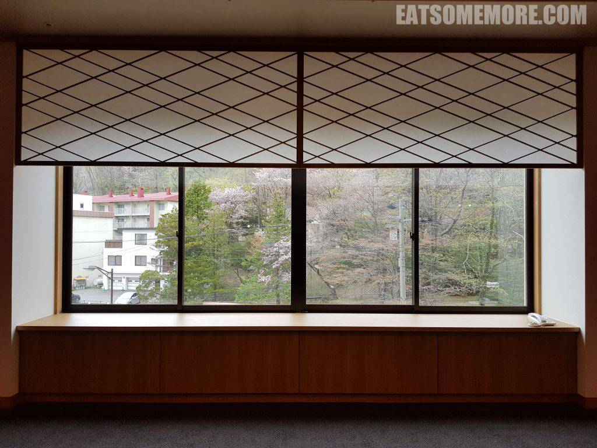

早餐也是自助。烤章鱼、渍豆腐泡和烧芋头最好吃！

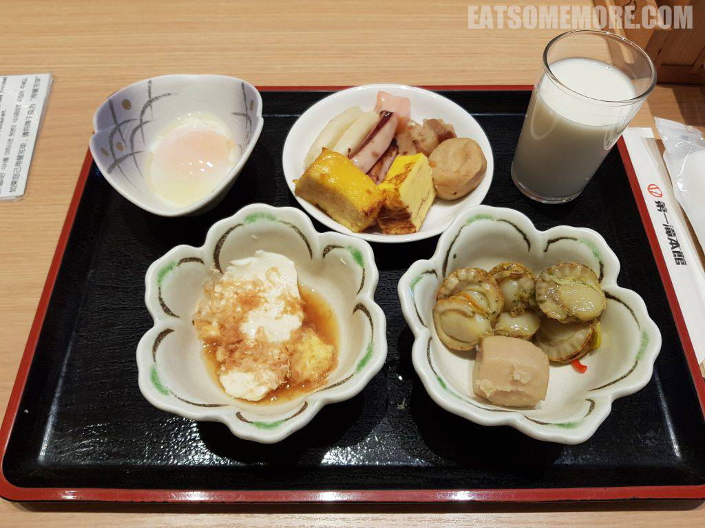

早餐后便得长途跋涉地赶赴小樽。被称为“虾夷富士”的羊蹄山还积着雪，对称规矩的形状近在咫尺。

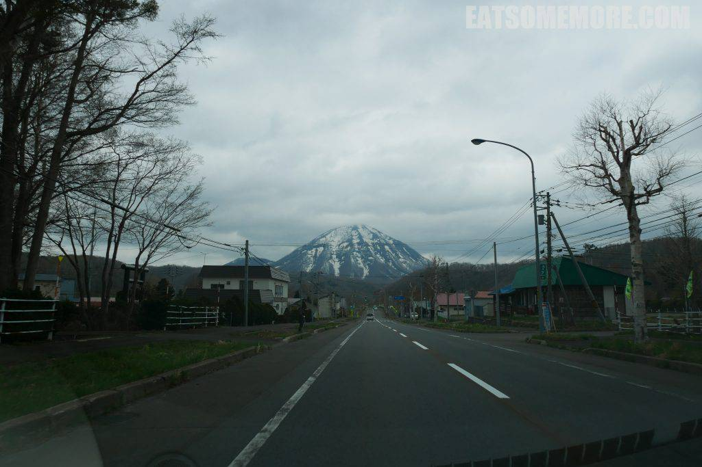

手宫公园正位于小樽港北面的山坡上。在盛开的染井吉野衬托下，繁忙的码头都清新了起来。

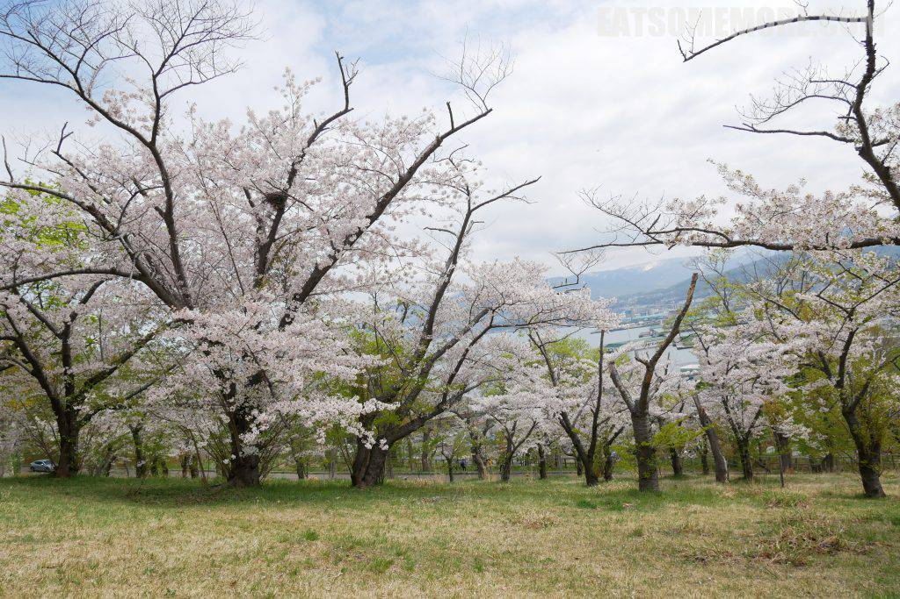

樱花与石狩湾相映成趣，一个是过期不候的美景，另一个提供着不容错过的美食。

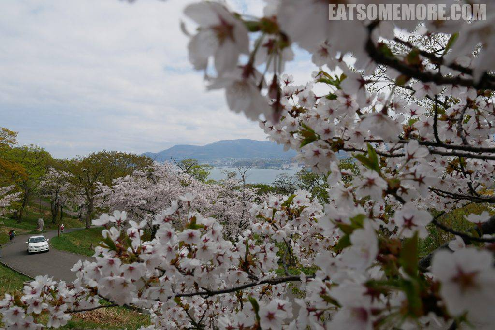

下山后不久就来到了北运河。穿过运河公园的喷泉可以看到重要文化遗产，颇具欧式文艺复兴风格的日本邮船公司旧址。

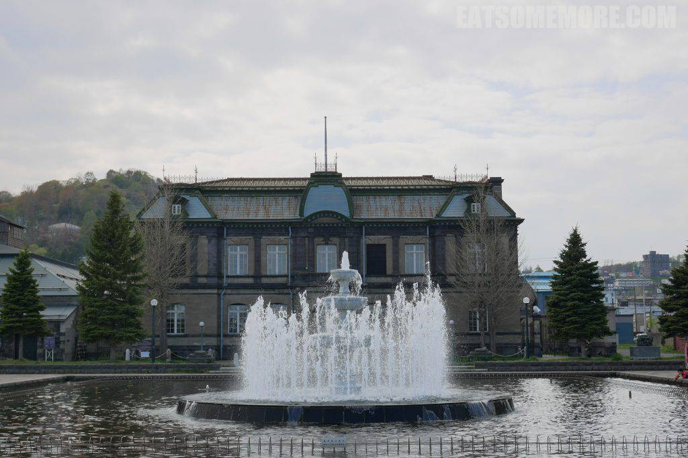

继续顺着运河向前走，来到了中央桥。桥上有一座优雅纤细的少女铜像，在影影绰绰的樱花和新绿的衬托下，显得格外漂亮。

到了镇上，就开始出现虾夷特产皮革工房。

雪山脚下的小镇特别讨喜，有种东亚瑞士之景。

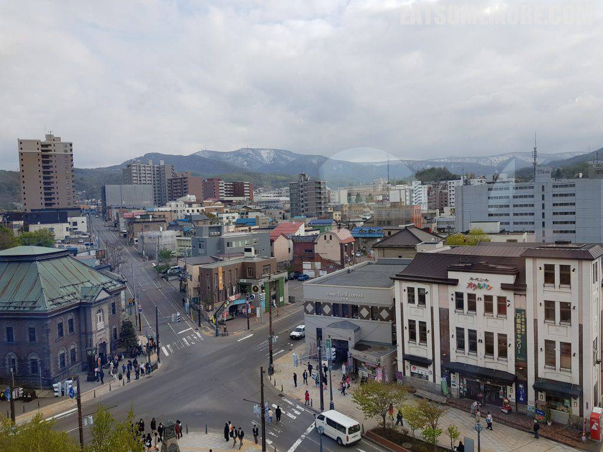

上图左手边门庭若市的便是大名鼎鼎的八音盒商店。

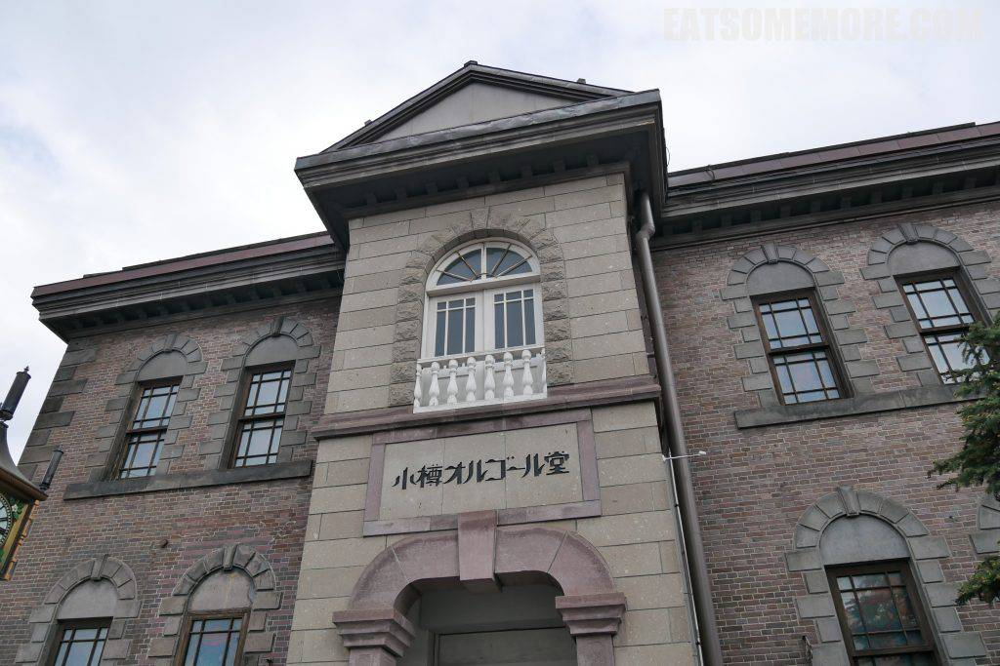

这个季节里，商店的走廊里都是应景的樱花装饰。

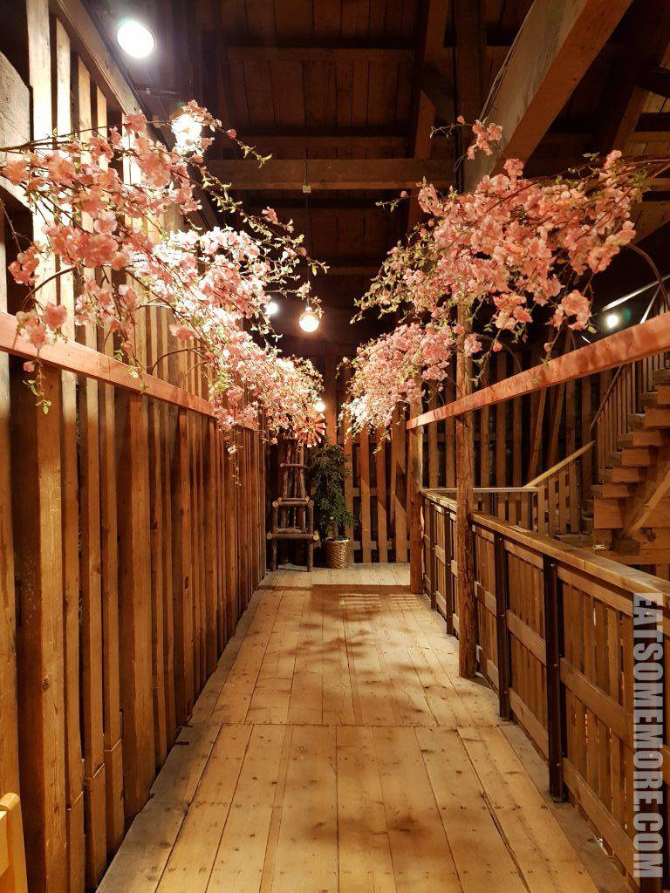

各式八音盒玲琅满目。

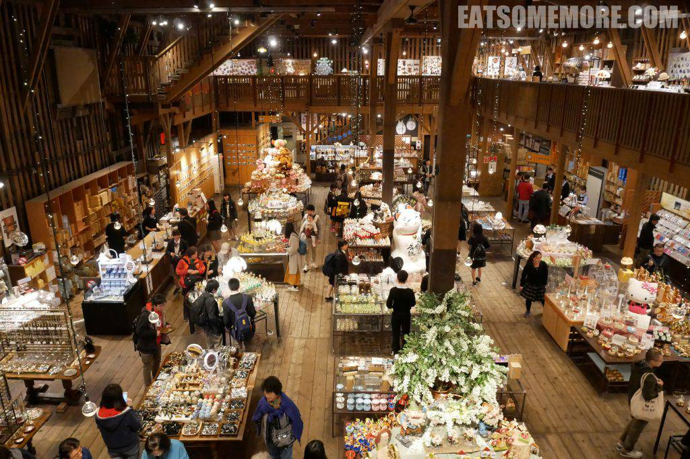

古色古香的石砌建筑是小樽特产果子店，六花亭。

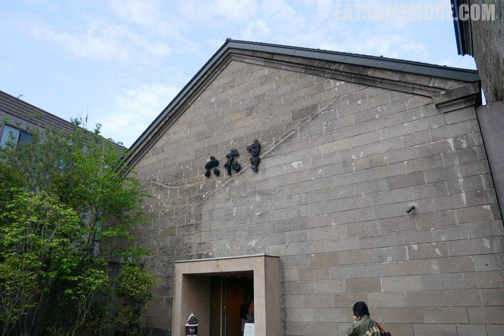

北海道的牛奶出类拔萃，奶制甜点也特别醇香。

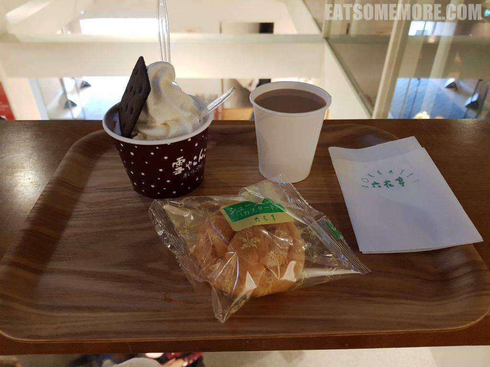

耍尽兴了就赶紧回酒店泡温泉咯！
