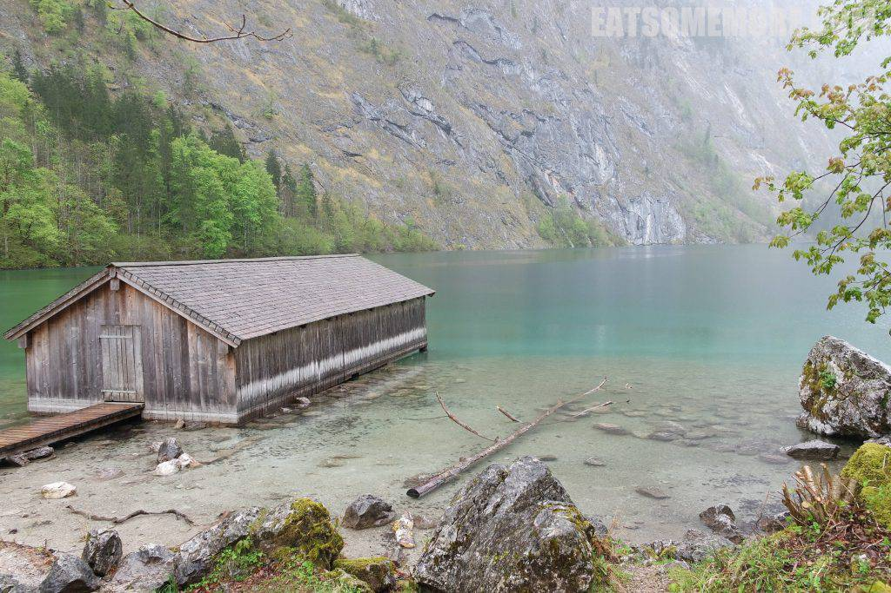

前一天从德国玩到奥地利，这一天又从奥地利玩到德国，最后回到奥地利。

## 行程总览

## 萨尔茨堡

我心目当中的萨尔茨堡是音乐的城市，是作曲家莫扎特的出生地、指挥家卡拉扬的故乡，也是拍摄《音乐之声》的地方，其老城更是联合国教科文组织评选出的世界遗产之一。

现实当中的米拉贝尔堡比电影里拍得还要美，花园呈几何对称，正对着萨尔察赫河对岸有着绿色穹顶的萨尔茨堡大教堂和矗立山巅的萨尔茨堡要塞。

## 国王湖

从萨尔茨堡出发，向西南一小时车程左右便到达了德奥边境、阿尔卑斯环抱当中的国王湖。

据说国王湖形成于第四纪冰河时期，被认为是德国最深、最美、最干净的湖泊。

为了保护这样清澈的湖泊，从一百多年前起这里就只允许电动船、手划船和脚踏船在湖中航行。当我们搭乘的电动船行驶到湖中央时，船长停船吹起了长号，悠扬的曲调回荡在群山之间，美妙得好有深度。

虽然天公不作美，看不到雪山映碧水，但是缭绕的雾气倒给国王湖增添了几分仙气。

仙境里的船坞特别的与世无争。

木船坞漂在翡翠色的湖水上。

湖底的巨石和沉木清晰可见。

不消一会，天下起了雨，湖里的两只绿头鸭倒是兴致不减。

像我这样的人类只好灰溜溜地撤退去吃饭。

纯净的国王湖盛产鳟鱼，然而烹调后的味道并不理想，好可惜。

## 因斯布鲁克

离开国王湖后，向着阿尔卑斯山区更深处的因斯布鲁克小镇出发。傍晚时到达希尔顿酒店，大堂的小鸟一家简直要将我萌化。

套房的客厅可以说是“窗含西岭千秋雪”。

酒店贴心地准备了气泡酒、水果和焦糖布蕾。

卧室同样是明亮整洁。

卫生间宽敞干净。

借这天遇到的第二对小鸭，向大家道晚安咯。

