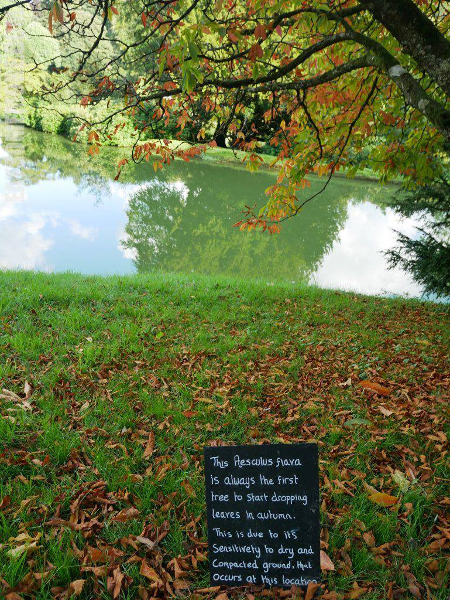
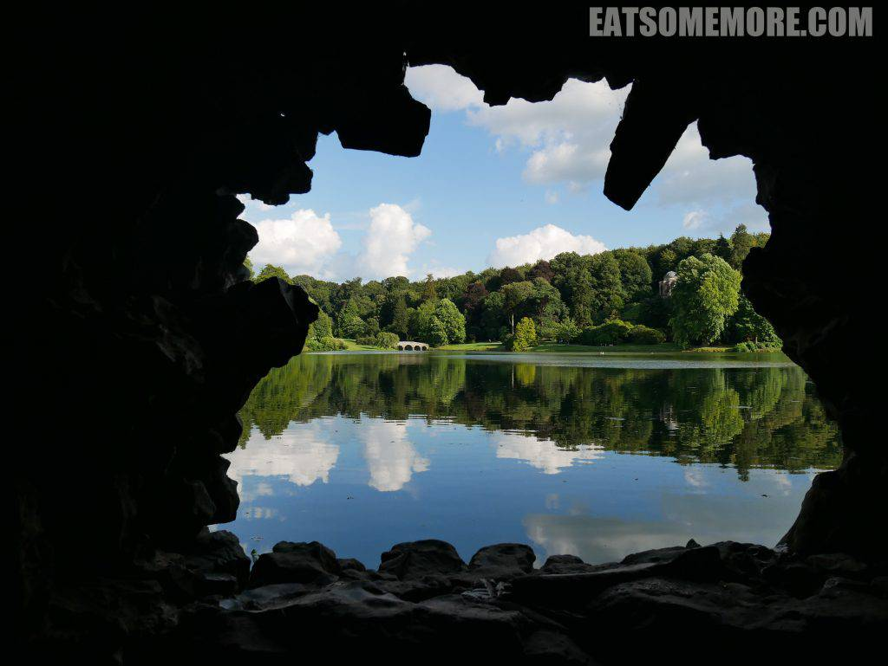

英格兰西南的苏陌塞郡附近，还有几个值得分享的好去处。

### 总览

- 斯陶头庄园 (Stourhead)
- 巴罗山 (Burrow Mump)
- 小马与陷阱 (Pony & Trap)＊

### 斯陶头庄园 (Stourhead)

偶然之间在网上见到斯陶头庄园中阿波罗神殿的照片，觉得好漂亮，这才一路找到斯陶头去。小镇坐落于斯陶河谷，庄园外的小水车和小瀑布有种与众不同的静谧感觉。

#### 布里斯托碑 (The Bristol Cross)

花园入口处的纪念碑原本在布里斯托，庄园主人用了六辆牛车才将其运回花园。石碑上精妙地雕刻着中世纪的英国国王们。

八月尾的时节，庄园湖畔七叶树的叶子已经开始转红凋落。据说这是由于七叶树对于土壤的干燥和密度特别敏感的原因。

#### 花之神殿 (The Temple of Flora)

透过七叶树可以望见湖对岸的花之神殿。

这是花园里的第一座建筑，为罗马的春天与花卉女神所建。临湖处的托斯卡多立克石柱，尽显古典设计风格。

门厅上方写着“粗人勿入”。然而那时的庄园主人可能没有想过在将近三百年后的社会当中，粗人是不具备拉丁文技能的。

#### 岩穴 (The Grotto)

岩穴多见于意大利文艺复兴时期的花园，作为夏日避暑的场所。

透过岩穴引入眼帘的湖光园景，同中国园林当中的借景手法有异曲同工之妙。

#### 万神殿 (The Pantheon)

这是花园当中最大的建筑，灵感来自于罗马的万神殿。殿内有多座雕像，包括一尊大理石雕的海格力斯像，希腊神话中最伟大的英雄。

#### 五孔桥 (The Palladian Bridge)

花园里的另一菲林杀手就是这座五孔石桥，灵感源于十六世纪文艺复兴建筑大师Palladio的设计风格，让人工湖看起来有了动感，更加自然，堪称点睛之笔。

#### 阿波罗神殿 (The Temple of Apollo)

英国建筑师威廉钱伯 (William Chamber) 在著名的邱园建有圆形的太阳神殿。斯陶头庄园的建筑师亨利费列克罗夫 (Henry Flitcroft) 是汉普顿行宫一名园丁的儿子，他在建筑方面很有天赋，希望建一座比邱园更好的太阳神殿，于是就有了这座背山面水、几乎美得不真实的阿波罗太阳神殿。

从古典的神殿、中世纪的纪念碑、温馨的茅屋直到具有现代技术的冰块储藏室，这座花园无疑令人大开眼界。用庄园主人自己的话来说，这是工业发展的成果。

### 巴罗山 (Burrow Mump)

巴罗山位于苏陌塞乡村的中心地区，并不巍峨险峻，却很恬静宜人。

山坡上绵羊成群，安静地用着餐。

山顶上有一座教堂遗骸，用于纪念在第二次世界大战中丧生的人们，在蓝天的映衬下有种悲凉的美感。

### 小马与陷阱 (Pony & Trap)＊

乡村山野间的又一间米其林餐馆，结合了梁柱外露的爱德华风格和现代的大落地窗，门外良田千亩，屋里美食飘香。

英国夏季调酒的标志——皮姆酒，以杜松子酒为基底，混上柠檬汽水，加入黄瓜、草莓、橙、柚、柠、柑及薄荷叶，清爽的果味与烈酒的醇香碰撞出了这独数英伦的夏天味道。

米其林餐厅的猪下水口味还是很重，但是一起炖煮后的黄菇和蚕豆却异常鲜美。

淡菜之美在新鲜也，肉质之嫩在火候也，海味之得宜，假欧当归草本清新及苹果酒芬芳香醇，汤浓味鲜之盛，亦可沉鱼落雁。

烤猪排搭配洋葱和苹果泥，这种蔬果与油脂的结合，突出了食材的香甜滋味。

我的主菜是干式熟成生烤牛里脊。根据维基百科，干式熟成的牛肉是吊挂且经过几个礼拜接近〇摄氏度温度风干后的牛肉。干式熟化主要是以两种方式来改变牛肉肉质——第一，水分从牛肉的肌肉组织内蒸发出来，使得牛肉的风味更加集中；第二，牛肉本身的天然酵素会打破肌肉内的结缔组织，软化肉质。一试之下确实如此，肉质软嫩、滋味丰富。科技使人进步，使花园进步，也使美味更进一步呢！

