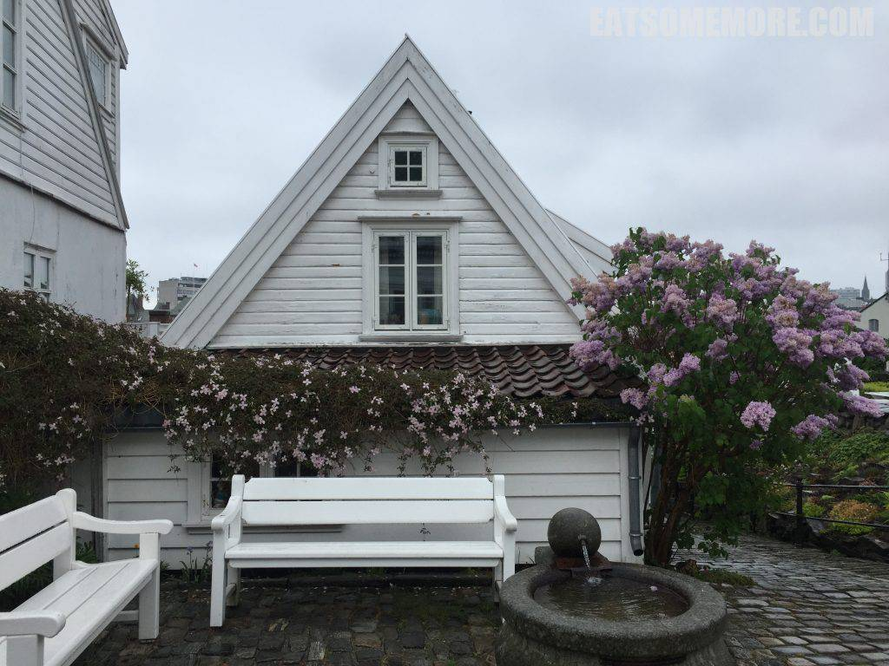
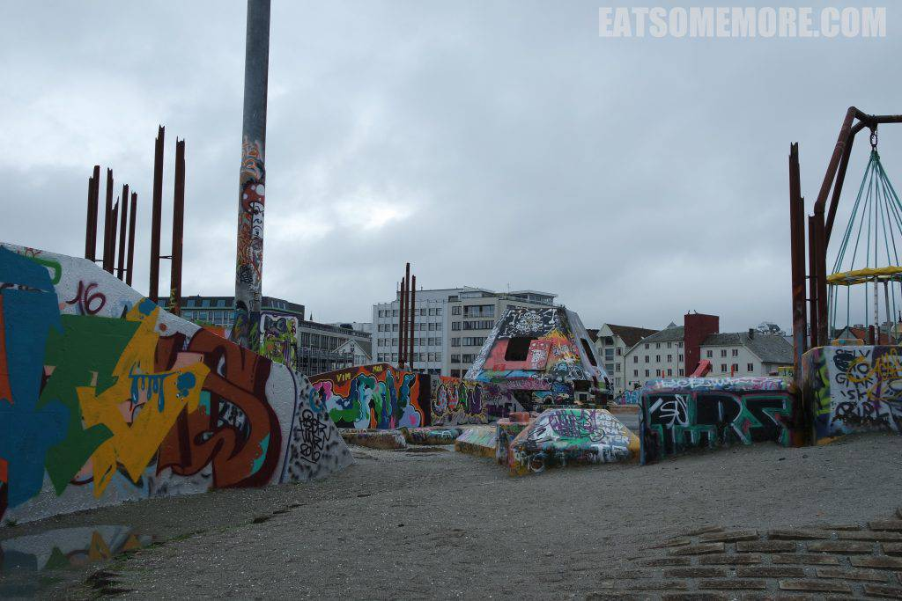
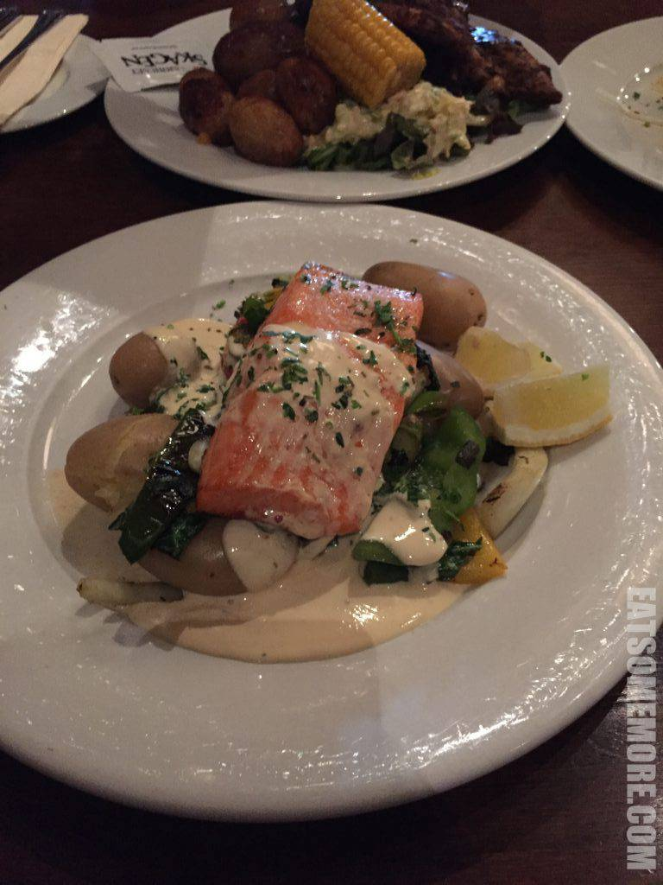
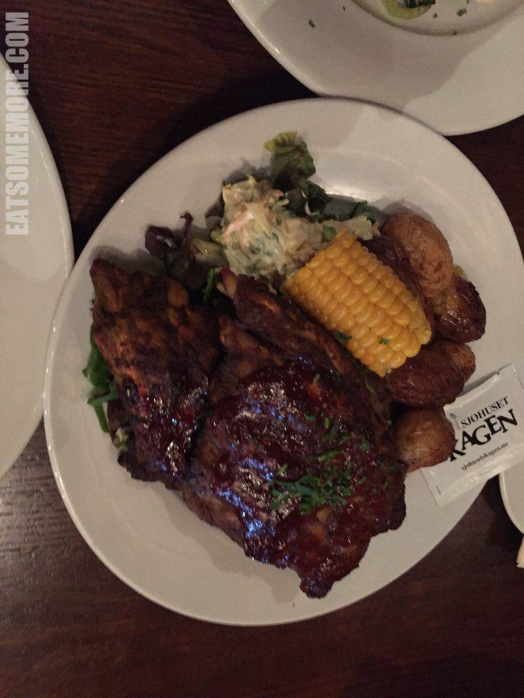

北欧对于现代世界的平凡人来说，输出了诺基亚和宜家，也在潜移默化当中影响着人们的生活方式。二〇一六年的初夏，三五好友相约造访挪威第三大都会斯塔万格，去看看这传说中的北欧。

斯塔万格的老城中盘绕交错着许多巷弄。巷弄里点缀着多彩艳丽的小房子。

方石路边的小店和咖啡馆子也都活泼可爱。

走过明艳的彩色街区，又来到了一片十八、十九世纪的白色木房子。

夕阳下，蜿蜒的街巷好像闪着光。

房屋造型质朴简洁，在初夏繁花的映衬下，生机勃勃又恬静可爱。

顺着静谧的街巷来到古城的高处，可以眺望斯塔万格海港。

到了海港边，这城市又是另一番光景。

规划得非常有个性。

涂鸦的内容可谓十分国际化。

斯塔万格城市大桥联结着市区和附近的小岛。

海港边的Sjohuset Skagen，是网上好评如潮的斯堪的纳维亚风味餐馆。

餐厅的装修复古而粗旷，让人有种在古时候的大船上用餐的感觉。

从一盏灯，到一幅画，都很有格调。

奶油酱鳟鱼非常好吃，并搭配有炒杂蔬。

烤鲸鱼肉不太咬得动，味道上接近牛肉。

南美烧烤酱风味烤肋排也很好吃。

北欧位于高纬度地区，到了夏天，白天就变得很长。吃完晚餐也没有要天黑的样子。回酒店的途中路过Breiavatnet湖，虽说看起来很迷你，但在绿树的环抱和鸽群的陪伴下，又显得有点迷人。

快到酒店的时候，遇见了一个充满童年记忆的抱枕，让我回想起了那些没有电视看的周二午后。

斯塔万格丽笙皇家酒店的房间虽然不大，但是十分干净整洁。

酒店还贴心地准备了水果和饮料。

卫生间也是极简的风格。

走入式的淋浴方便又实用。

