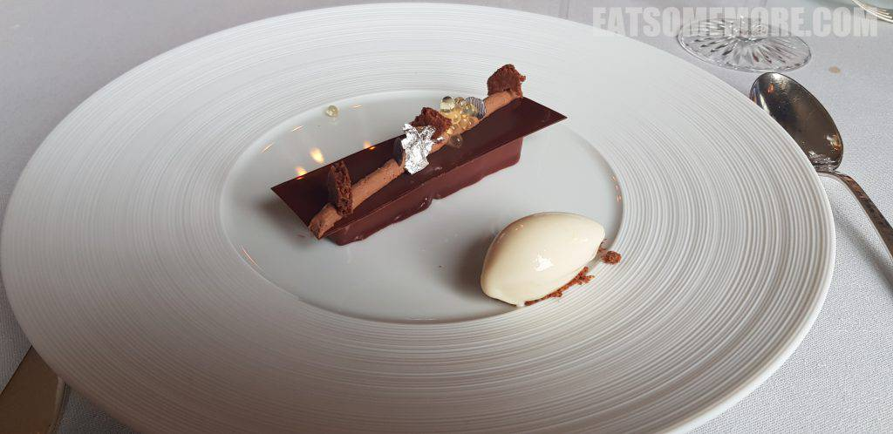
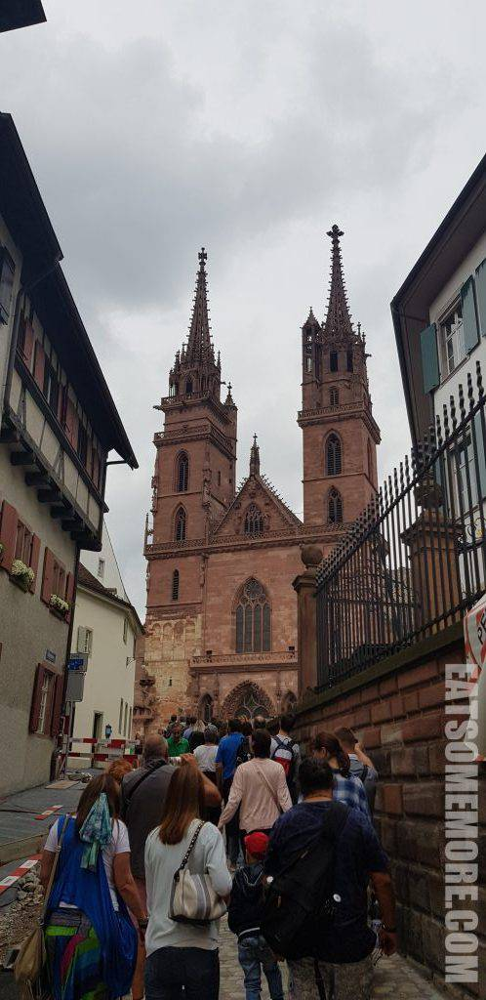

在欧洲的腹地，有个世代中立且胸怀高山大湖的国家，瑞士。

## 行程总览

## BADEN

瑞士利马河畔有个温泉小镇巴登。街上三五百米就有一座喷水池。

彩色屋瓦的尖顶教堂、廊桥、牌楼、青山和碧绿的利马特河水，组成了如画的小镇风光。

穿过一些色彩斑斓的小镇巷弄。

路过一个神气活现的市集。

经过一条时空隧道似的大桥。

就近距离地来到了利马特河边。碧水翠木间的一道红桥，视线延伸处的一座尖顶教堂，美得像幅画。

一直往前走就到了架在温泉水上的长板凳，面对着河水和河对岸巴洛克式的建筑，感觉美得很。可惜水温大概只在20-30度左右，并不是想象当中那种热气腾腾的温泉。

## 午餐 － Cheval Blanc by Peter Knol

这次瑞士行最期待的河边午餐，不仅风景优美，味道更是受到米其林的三星肯定。

内饰有种巴洛克式的富丽堂皇。

番茄餐包能吃得到番茄果肉，是很特别的面包。

餐前小点首先是隐藏在生蚝泡沫下的青口，鲜极、嫩极、滑极。远处餐巾上脆薄虾片垫的是蟹肉、柚子酱、牛油果泥和一小棵羊莴苣，丝丝滑滑、清新鲜甜。

熏鱼豌豆冷汤，当下不觉得起眼，回想起来是最巴塞尔的味道——豌豆清甜的田园风味好像这里的山野趣味，河鲜烟熏后微微闷熟的咸鲜滋味正如穿过城市的河川，汤料汤头的生冷温度恰似常多愁善感的天气。

第一次吃到咸的马卡龙是鹅肝味的，酥酥松松的一入口就化了开来，还有一抹橘子酱解腻提鲜增甘。

鱼生透薄洒满了萝卜碎，以酸奶酪、牛油果泥和日式渍物酱调味，带出了食材的果味和鲜味，酸甜甘鲜、回味悠长。

鳕鱼一面煎得焦香，一面浸在藏红花和百里香的汤汁中，搭配新鲜番茄籽和蔬菜天妇罗，鱼肉肉质弹牙，味道层次丰富。

小牛菲力和嫩韭葱白稍经炙烧，点上洋蓟酱，肉汁丰盈、肉质软嫩、肉香饱满。

奶油莫西托沙冰，朗姆香、薄荷香和奶油香竟能集于一口当中，过瘾！

巧克力慕斯搭配饼干碎、银箔和柚子凝珠，甜苦酸香，更惊艳的是看似平平的雪糕，竟是清新的柚子味道，好吃得停不了勺子。

万没想到，此后还有一大波甜点袭来，所向披靡。粉色的是树莓棉花糖卷，酸甜绵软；绿色的是草本果冻，清香爽口；黄色的是柚子芝士蛋糕，柚香与奶香交融，香甜共绵密齐飞；棕色的是巧克力榛仁千层，香脆浓郁。

接下来还有巧克力集锦，除了又回味了一下柚子味的巧克力，服务生还特别推荐了盐味焦糖巧克力，既甜且咸，是一缕咸香化在口中。

这才来到最后最惊喜的柚子马卡龙，口味新奇、香酥酸甜、入口即融。一波糖摄入的凯旋！

## BASEL

林河上的巴塞尔，融汇了古典与现代，哥特式的教堂和文艺复兴样式的大桥。

这座游人趋之若鹜的红色砂岩建筑便是瑞士国家遗产之一的巴塞尔大教堂。哥特式的镂空尖顶繁复华丽。

教堂内部哥特式的肋骨穹顶简洁庄严。

教堂更是文艺复兴时期尼德兰著名的人文主义思想家和神学家，伊拉斯谟之墓的所在。

教堂回廊的屋顶由彩色的鱼鳞状瓦片铺成。

回廊当中还有花果摊的铜像。

回廊还是一个很妙的观赏教堂双塔和彩色屋顶的角度。

另一座很有特色的建筑则是巴塞尔市政厅，同样是红色砂岩造和彩色屋顶，色彩在视觉体验上显得更加艳丽。

市政厅内部满是壁画。

## Zurich

由于晚餐和住宿都在苏黎世附近，我们傍晚时便回到了苏黎世。在望湖狮子像边停了车，再步行去老城。

利马特河面到了苏黎世河面宽阔了起来，河边的建筑各具特色，拜占庭、哥特、文艺复兴比比皆是。

## 晚餐 － Ban Song Thai

晚餐选择了人气极高的泰国菜。蜂蜜青柠茶清爽甘甜、消暑解渴。

陶锅鸡肉咖喱饭，少辣多甜。

猪肉蛋炒饭，米饭粒粒分明，锅气十足，咸中带甜，只是猪肉略硬。

## 宿 － Sorell Hotel Sonnental

酒店房间虽小，但干净整洁。

