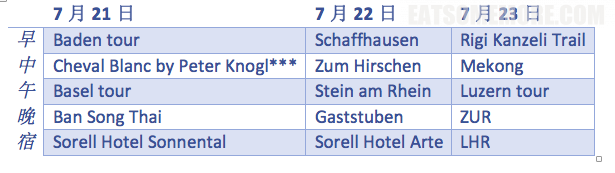
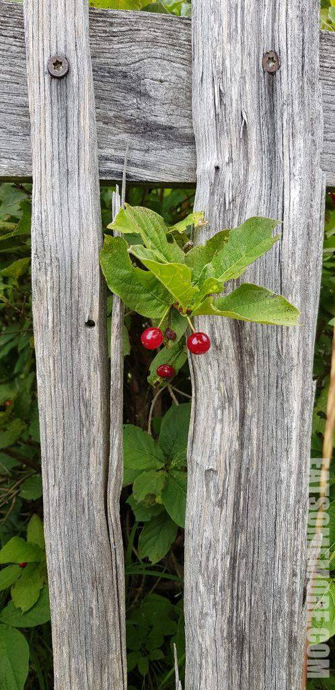
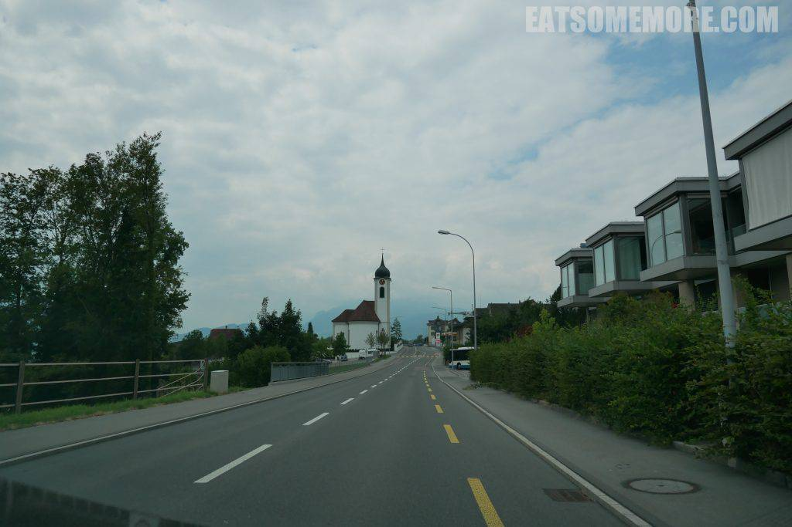

三天当中最期待的行程就是登里吉山。

## 行程总览

## Rigi Kanzeli Trail

这一天的上午正好是阴阴的天气。山上缠绕着雾气，好像仙境似的。

山麓上有个大鸡圈。依山傍水，人亦生羡。

青山绿水间养的鸡都神气些。

考虑到时间，我们选择了较短的步行路径。

步道虽然平坦，然而沙石混合不算好走。

路边紫色的铃铛花探头探脑。

远黛苍茫碧波皱，青草翠木红瓦屋。

若是天气好的时候还能眺望到远处的阿尔卑斯雪山。

山上的樱桃灵气逼人。

下山的路依傍着琉森湖，山水间的教堂不输圣托里尼的胜景。

为了让大家更好地感受这绝妙美景，我从谷歌地图借用了下面这张晴天时的照片——城镇当中的红顶教堂在蓝天、碧水和雪山的映衬下格外秀丽。

## 午餐 - Mekong

下山后在琉森市区的越南餐厅午餐。

第一次见酱油汤底的越南河粉，我还是更喜欢传统的牛肉清汤粉。

午市便当非常丰盛，有朝鲜蓟浓汤、芝士豆芽沙拉，现在回想起来瑞士的芝士确实香浓拔群，还有糖醋口味的蘑菇鸡柳搭配泰国香米饭。

## Luzern

饭后来到城市北部登城墙。从停车场还能望见远处半山上城堡一般的Château Gütsch酒店。

城墙附近有一座钟楼，可以参观整个计时的装置。

还可以眺望琉森湖光山色的美景。

在高处俯瞰欧洲的房顶，有的像松柏，有的像榆桐，还有一片片的灌木丛似的矮房子，与这个城市的山水甚是融洽。

回到琉森市区，罗伊斯河畔，风景灵秀得很。

移步易景，钟灵毓秀。

琉森水系丰富，有许多建在河道上的廊桥，功能各异。

再向前就见到了大名鼎鼎的水塔花桥。

桥梁两侧花丛锦簇，不愧“花桥”之称。

廊桥内部的壁画大都已经损毁，好在桥上视野独到，别有风韵。

土耳其蓝的河水和姹紫嫣红的花拼在一起，美得像幅画。

## Zurich

袖珍小长假转眼就过去了。准时抵达苏黎世机场，再尝一口当地葡萄和葡萄酒，就要和瑞士说再见咯。

