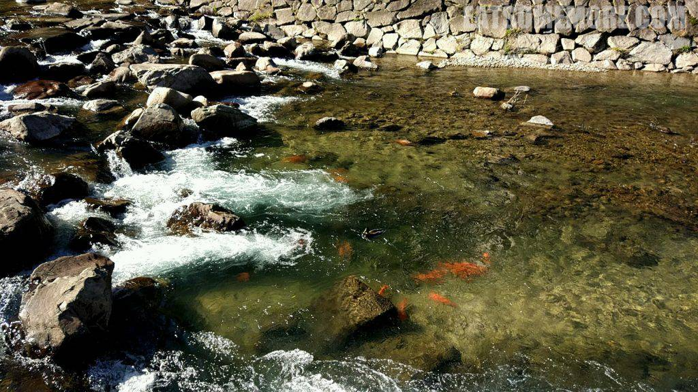

二〇一五年偶然看到网络上一张岚山红叶的照片，心中便升起了对日本红叶季的向往。经过大半年的计划，我的第一次日本之旅终于成行。

## 行程总览

## 飞驒高山

本次日本之行的第一站，不是东京、不是京都、也不是大阪，而是名列日本温泉百选第十一名的岐阜县高山市。

高山市位于岐阜县北部，在古代飞驒国的版图当中。高山城下町是四百年前，金森长近奉丰臣秀吉之命平定飞驒时建造的。如今的高山市是日本面积最大的市町村，更有“飞驒的小京都”之称。

和缓的宫川静静地穿过市镇。

成群的红色鲤鱼在清澈的河水当中清晰可见。

街道旁的店铺保留了室町时代的风格。

城下町里面有许多酒造，类似我们所说的酿酒作坊，简直是日本的茅台镇。

这些酒造大多提供或免费或付费的品尝服务。于是我们就展开了对于日本酒认知的更新之旅。常见的日本酒种类有烧酎和清酒。烧酎主要通过麦子、荞麦、红薯或者稻米的发酵来制成，而清酒的主要原料则是米。根据精米比例和是否添加酿造酒精，清酒又分为本酿造酒、纯米酒、吟酿、纯米吟酿、大吟酿、和纯米大吟酿等。另外根据口味的差异，清酒也分为辛口和甘口，顾名思义，一个更辛辣，而另一个更甘醇。

本来想着到了酒乡要品一品清酒味的雪糕，可惜它们早早地就售罄了。转而尝试了酱油味的雪糕，咸甜咸甜的，比起酱油更像是麦片的味道。

飛騨高山历史美术博物館将江户时代富商遗留下来的“土仓”作为展馆，展示高山的历史以及文化。

从城下町去城山的路上会经过建于十六世纪的照莲寺，是当地最古老的建筑之一。从鸟居的数量来看，这里也曾盛极一时。

## 午餐 － 丸明

午餐时来到了留日好友大力推荐的烤肉店，品尝A5等级的黑毛和牛。“飞驒牛”油脂丰富均匀、入口甘香、细呡即溶，确实不一般！图片来自http://www.hida.jp。

## 新穂高温泉・山のホテル

午饭后，我们就向着山的更深处去，入住新穗高温泉旅馆。这里不仅有室内温泉，还有在群山环抱当中氤氲着热气的露天温泉。个人觉得户外温泉没有室内的那么闷，体验更优。搭乘轨道车下到山谷当中，空气凉丝丝，泉水热腾腾，举头群星灿，低头云雾中。当然，温泉内部无法拍照，图片来自酒店官网，亲测可信。

很多日本的温泉旅馆还提供早晚餐，也就是传说当中的“一泊二食”。

飞驒地区的旅馆晚餐自然少不了清酒。菜的种类也很多，下酒小菜就有腌渍鱿鱼丝、三文鱼刺身和味增豆腐。日式晚餐自然也少不了一碗热乎乎的味增汤。

盐烧河鱼主要是保留了食材的原味。要说味道的话，这二位自然是不敌咱们祖国的清蒸红烧醋溜水煮等等啦。

压轴的国产和牛烧烤，虽然油脂不如午餐时的A5和牛丰富，但是这样的肥瘦比例反而增加了肉的弹性，好吃极了！

饱餐后，抱着明早再泡靓汤的期待沉沉睡去。晚安。
