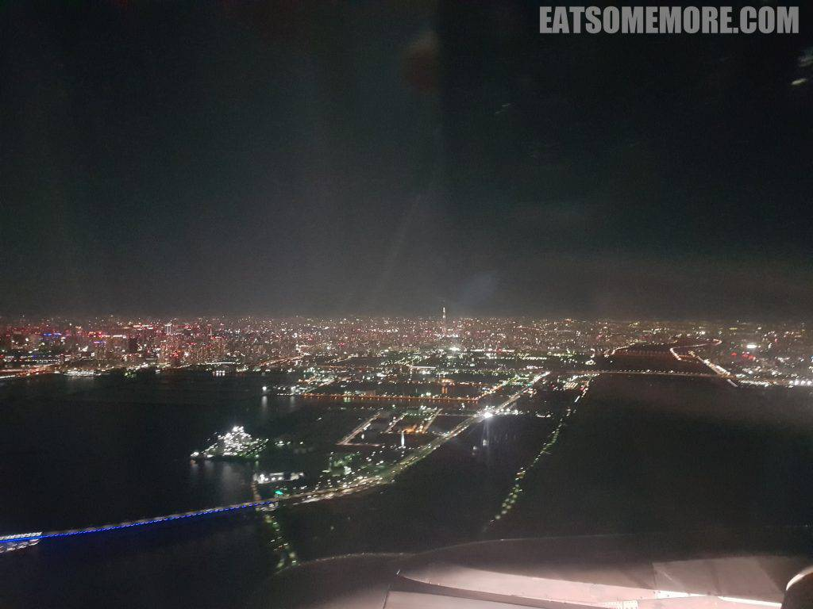
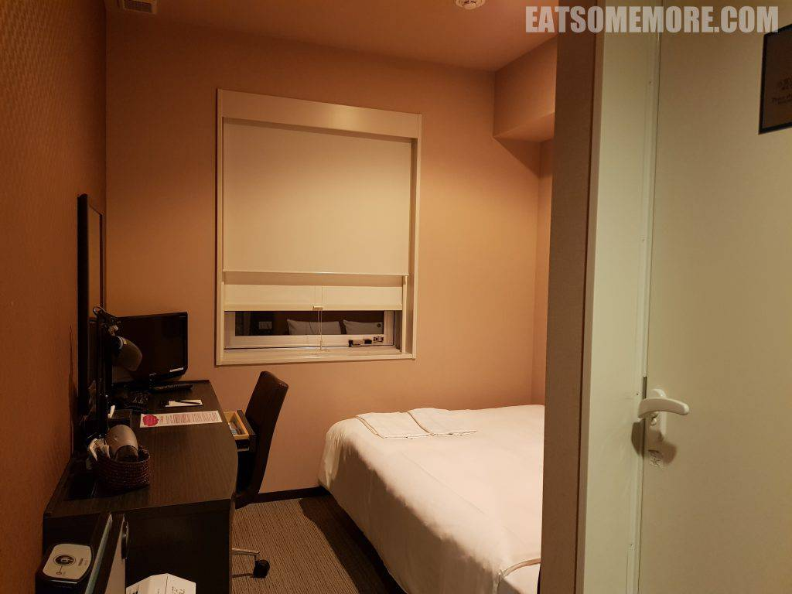
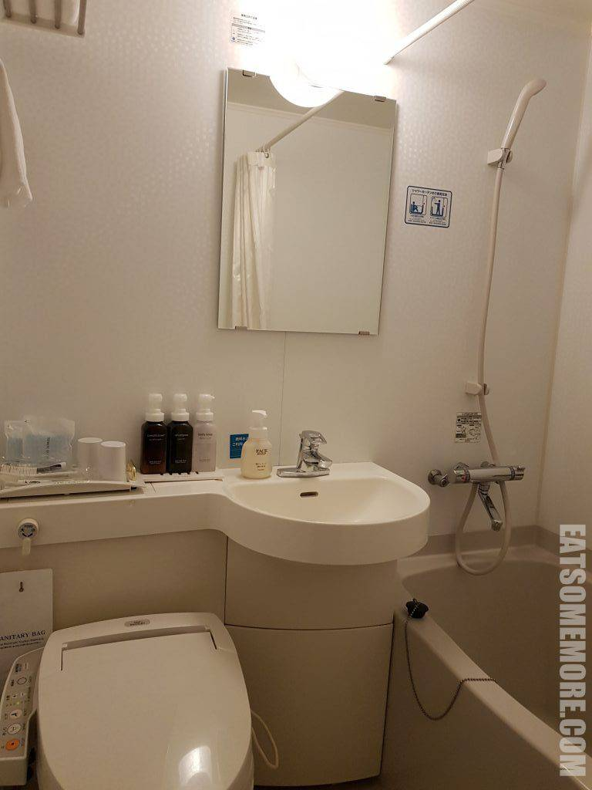

在欧洲时总是垂涎日本山野间冒着热气的温泉和精益求精的料理。自从在漫山红枫的季节拜访了一次关西和高山，便想着下次定要在樱花盛开的时候再来一次。

## 行程总览

飞机尚未抵达，璀璨的夜东京早已先声夺人。耸立的东京铁塔、耀眼的邮轮和如虹的东京湾大桥争相印入眼帘。

订酒店时，错将Keikyu Ex Inn Haneda订成了Keikyu Ex Inn Kamata -Tokyo Haneda，结果用不了机场接驳车，万幸地铁也能方便到达错订的酒店。房间虽小，干净整洁。

浴室虽然拥挤，然而一应用品俱全。

这就洗漱歇下，明天还要赶早班机。
