伦敦以西两小时车程是皇家伯克郡，是在繁忙的一周后休闲觅食、陶冶情操的好去处。

## 行程总览

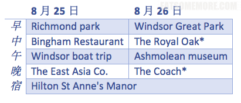

## Richmond Park

住在伦敦久了，总也听闻里士满公园的大名。周末西出伦敦之前，便特地到这个伦敦最大的皇家园林看一看。

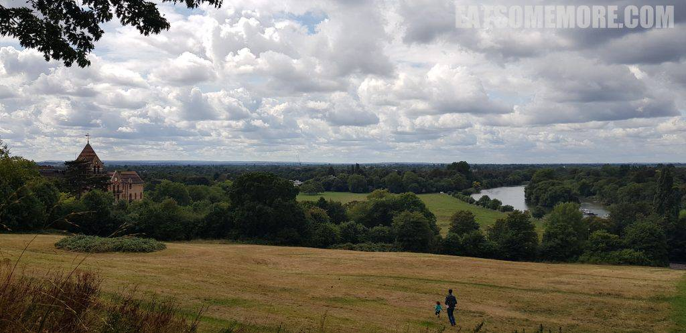

## 午餐 － Bingham Restaurant

沿着公园附近的一条静谧小道到达了事先约好的午餐地点。窗外杨柳青青，泰晤士河流水潺潺，没有想到在这个地段还有这样恬静的餐馆。

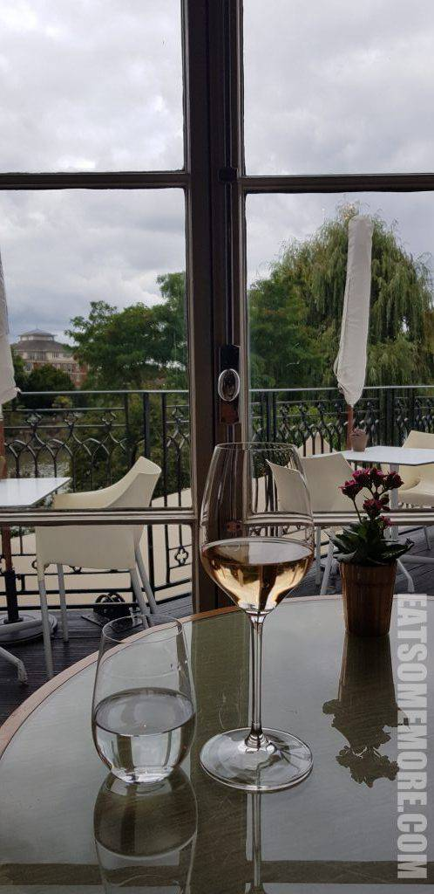

更没有想到第一道菜就非常令人惊艳。第一次吃到那么滑嫩多汁的马鲛鱼，用苹果腌渍过，肉鲜皮脆，搭配海藻油和渍甜菜，有种鲜得上头的滋味。

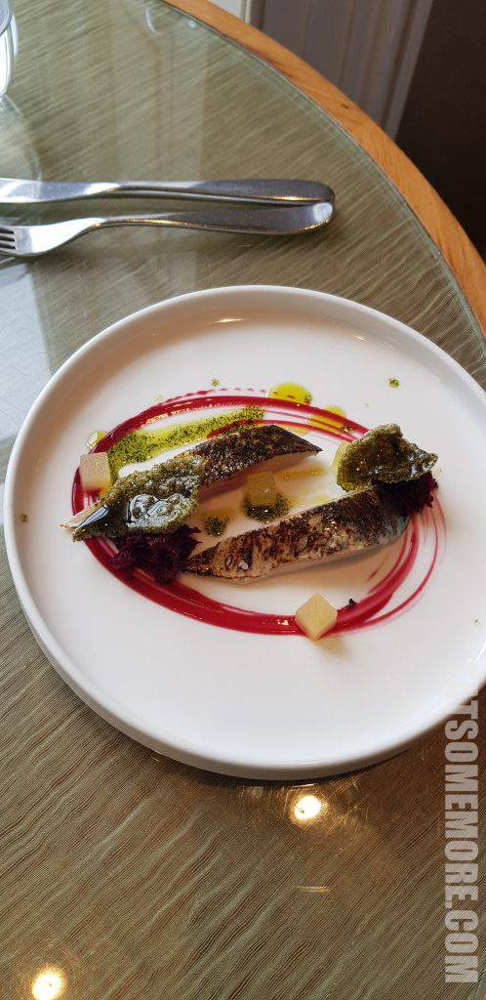

炸咸肉“酥”类拔“脆”，点上焦糖苹果酱和芝麻菜，香而不腻，更上层楼！

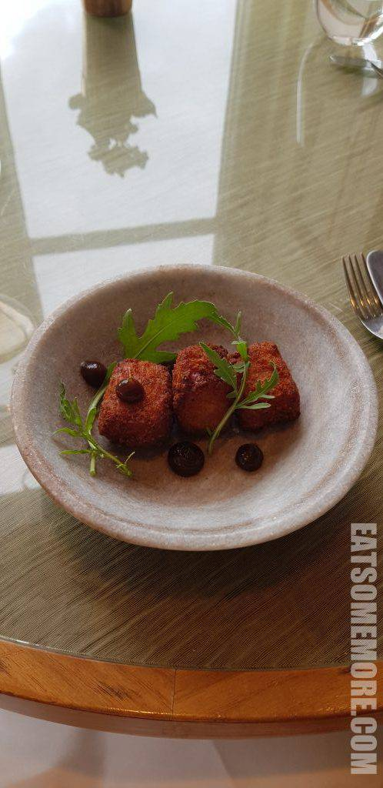

香煎猪里脊和蜂蜜焗猪颊。一个表现的是猪肉原本香甜的肉汁和柔软而筋道的肉质，另一个则是酱香浓郁、肥瘦相间、软糯酥烂。

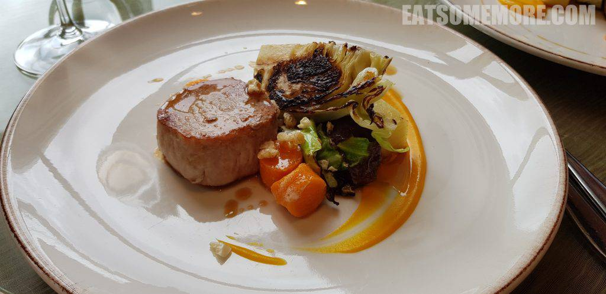

黑莓三层乳脂松糕，混合了黑莓酱、巧克力酱、奶油和脱水海绵蛋糕。

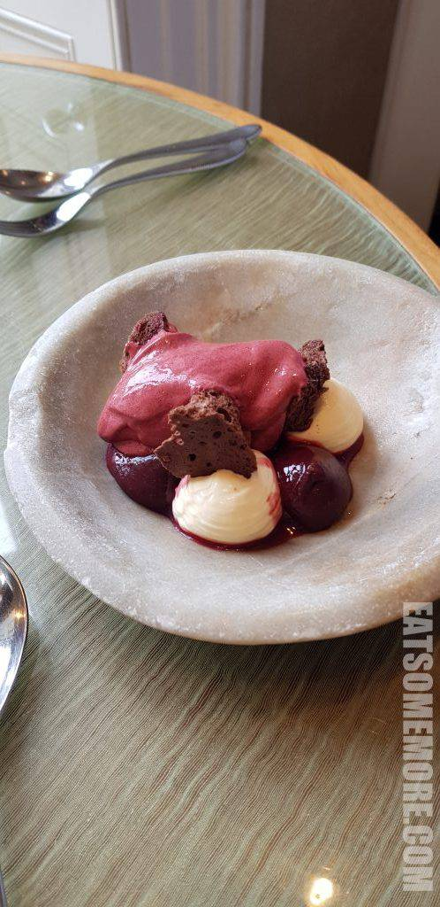

热带水果泡芙，外皮烤得酥脆，内馅酸中带甜，搭配酸奶冰淇淋，是很清爽的夏日甜点。

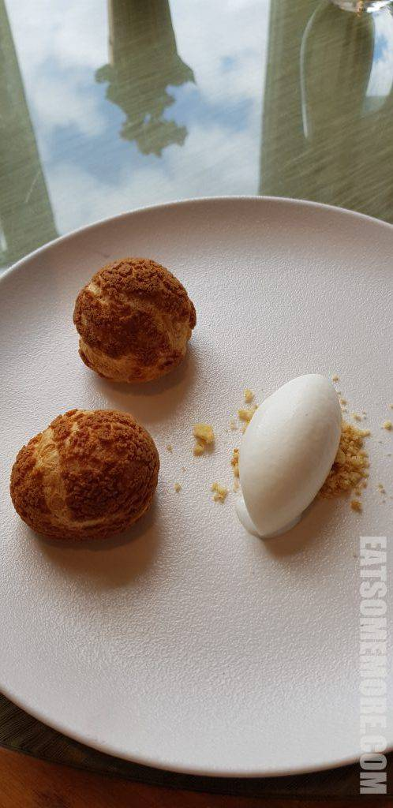

## Windsor

午餐后来到了温莎轮渡码头，参与缓慢悠闲的游船活动。伦敦以西水系丰富，是日天朗气清，泰晤士河蜿蜒曲折穿梭在绿树青草之间。

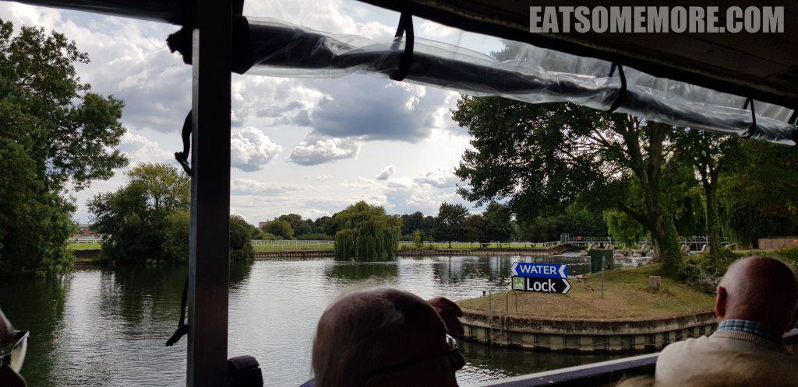

由于河道水面有高有低，还体验了过船闸——确实非常耗时！

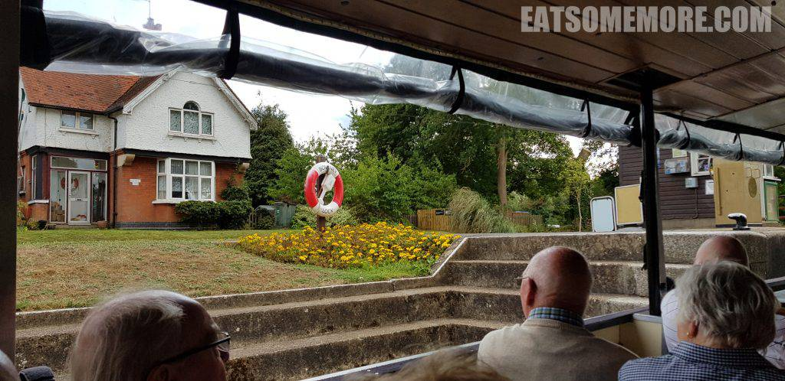

最后在回程的途中，见到了泰晤士河上的温莎堡，是我所见过的最美的观温莎的角度。

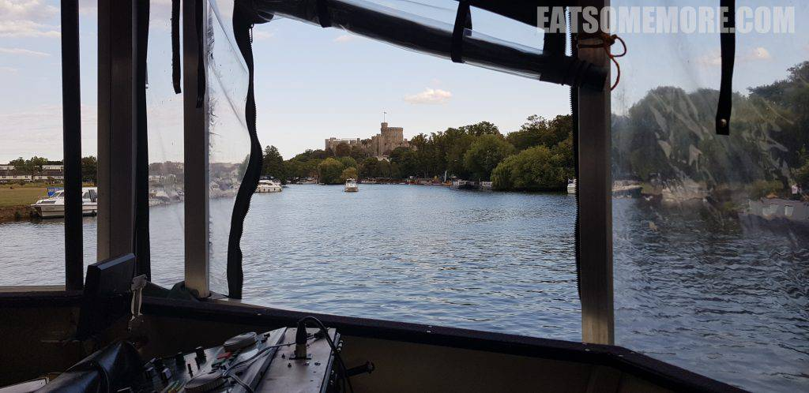

## 晚餐 － The East Asia Co.

晚餐尝试了泰国咖喱和泰国炒面。虾肉素质过硬，鲜甜弹牙。泰式调味深得我心，浅甜小酸微辣，香气殊胜。

## 宿 － Hilton St Anne's Manor

希尔顿圣安庄园风格古典，走道又整齐又漂亮。

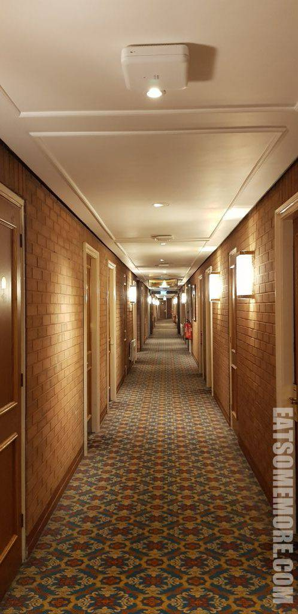

房间宽敞整洁舒适。

洗手间的设计具有未来感，纸巾和手巾很用心地叠出了花样。

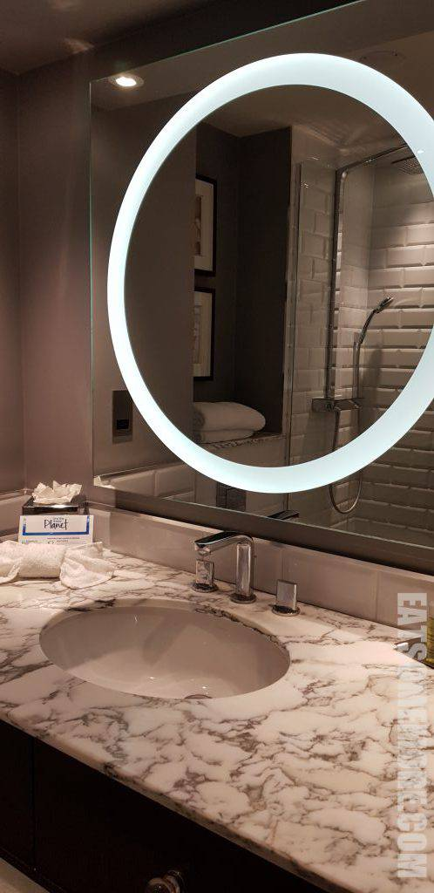

淋浴设备简洁实用，真想自己家里也来上一套。

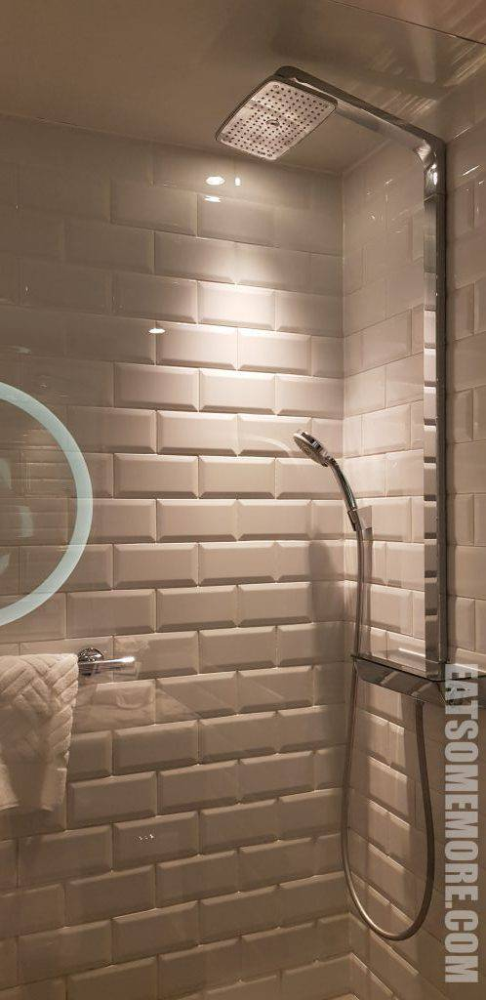
