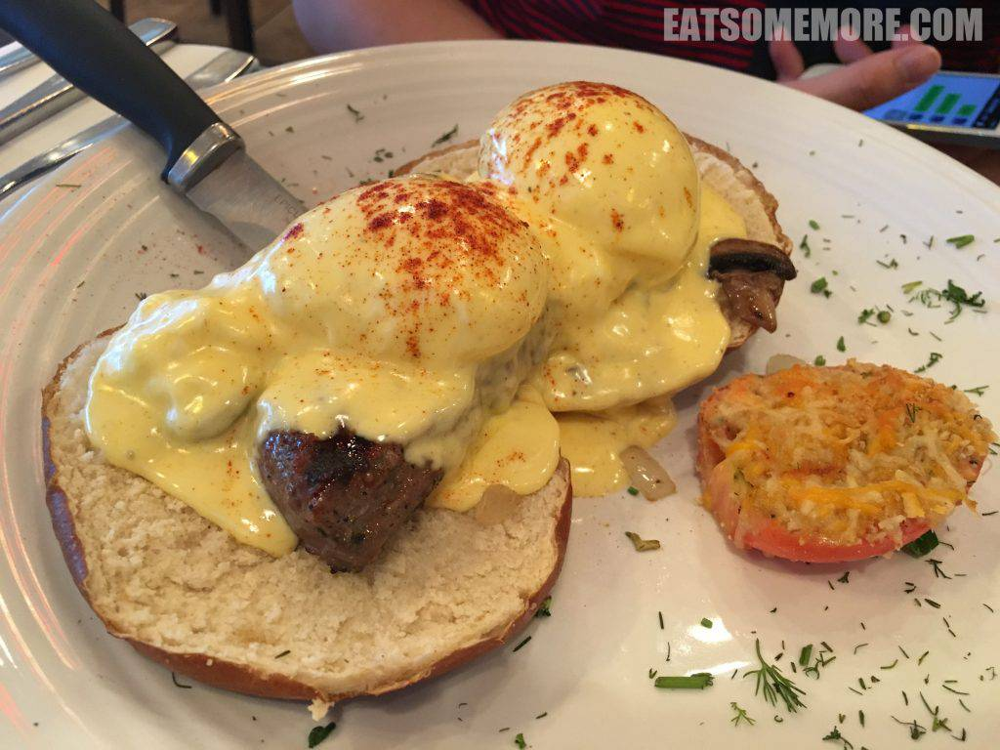
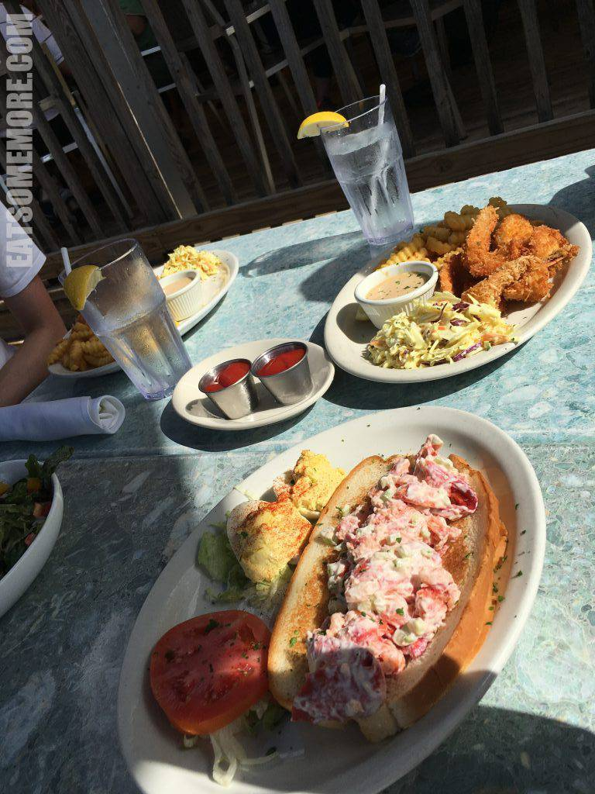

［码新篇的时候，先看看旧文吧］

作为一个杭州长大的姑娘，我的梦想之一就是可以在一个水清沙白、椰林树影的地方去度过一个温暖的冬天。

### 旅程小结

12月24日宿希思罗机场希尔顿 12月25日搭乘英国航空抵达迈阿密，宿迈阿密机场希尔顿 12月26日游览迈阿密，前往西礁岛，宿西礁岛喜来登套房酒店 12月27日游览西礁岛，前往劳德堡，宿劳德堡W酒店 12月28日游览劳德堡，前往奥兰多，宿奥兰多最佳西方度假别墅酒店 12月29日游览迪士尼世界好莱坞梦工厂，宿奥兰多最佳西方度假别墅酒店 12月30日游览迪士尼世界魔幻王国，宿奥兰多最佳西方度假别墅酒店 12月31日游览迪士尼世界EPCOT，宿奥兰多最佳西方度假别墅酒店 1月1日游览迪士尼世界动物王国，奥兰多打折村购物，宿奥兰多最佳西方度假别墅酒店 1月2日游览环球影城佛罗里达影城，宿奥兰多最佳西方度假别墅酒店 1月3日游览环球影城冒险岛，宿奥兰多最佳西方度假别墅酒店 1月4日返回迈阿密，搭乘美航返回伦敦

### 签证信息

我是自己在伦敦美国大使馆办理的美国旅游签证（十年多次）。在这里跟大家分享一下经验。 首先，以下是两个办美签的重要网站。 签证信息及表格：http://london.usembassy.gov/niv/ 预约面签：https://ais.usvisa-info.com/en-gb/niv/information/niv

其次，我准备的材料包括： 1. 护照； 2. 证件照； 3. 银行存款； 4. 在职证明； 5. 工资单； 6. 往返机票； 7. 旅行保险； 8. 酒店订单； 9. 租车订单； 10. 网上提交表格后生成的确认页和预约页。

第三，按时前往美国大使馆交材料并参加面试。到达使馆后的流程大约如下： 1. 在门口排队，给工作人员看预约信； 2. 过安检，尖锐的物品、电子设备、旅行箱都不可以带进大使馆； 3. 到前台领号； 4. 第一次叫号，前去指定窗口核实个人信息并按指纹； 5. 第二次叫号，前去指定窗口进行面试回答问题，得到决定。

最后，如果成功的话，一周左右您就可以按照您选择的方式，收到或者领取您的护照和签证啦。

### 旅程的开始

期待已久前往迈阿密的航班在12月25日，但是圣诞节当日的伦敦是没有交通的，所以我们只好提前一日就住进了希思罗机场旁的希尔顿酒店。以前并没有机会真正去到希思罗附近的Hounslow地区，这次确实走过这里才感受到这里不同于伦敦的一些风貌。

酒店设施都很有水准，边角房比较宽敞，有会客区域，但不是分开的。洗手间功能齐备，浴巾、盥洗用品齐全，部分镜子有除雾功能。

次日早餐后前去机场有National Express运营的巴士，大约半小时一班，圣诞节仍然运行，中间还会从别的几个酒店接一下客人，到达希思罗大约在20分钟左右。希思罗机场3号航站楼头等舱休息室做了圣诞节装饰，可以点餐，有酒精及非酒精类饮料。

### 第一天：迈阿密

美国希尔顿有免费接驳巴士，大约20分钟一班，15分钟左右到达。机场临泻湖，夜景不错。

同样是希尔顿酒店，比希思罗的更宽敞些，其余设施、用品水准都与希思罗希尔顿一致。第二天一早在希尔顿早餐。种类繁多、冷热兼有，推荐现做的omelette，可以选培根、火腿、蘑菇、番茄、菠菜、洋葱、蛋白、芝士等放进蛋卷一起煮。

早餐后从酒店出发，使用uber15美元、半小时左右可到达迈阿密海滩。真正水清沙白，太叫人开心了！在这个十二月里，阳光和煦、风暖沙软，简直乐坏了！

不远处的海湾公园又是另一种风情：高楼大厦、长桥游艇、椰林树影。

### 第二天：西礁岛

西礁岛是美国最南端的岛屿，通过一号公路与大陆相连。从迈阿密前往西礁岛路过的这条公路风景奇特，路的两边都是海！

还能见到废弃的旧桥。

在西礁岛宿喜来登套房酒店，浓浓的殖民地风情，太适合度假的心情旅程啦！酒店提供一小时一班的去旧城的免费小巴，但是跟我们的行程有点出入就没有使用。

房间内部装饰古朴素雅，卧室与会客区域有门隔开，会客间一角是水池、咖啡机和微波炉，卫生间分别和卧室和会客间连通，盥洗用品齐全。唯一不太理想的是内装都有一点老旧了。

从酒店出来过一条街，就到了传说中椰林树影的白沙滩。沙滩上全是安详地晒着太阳的人。这里的沙较迈阿密的更细软，椰林与海滩更接近，游客更少更安静些。总结来说就是一个大写的喜欢！

我们选择了好评如潮的Key Plaza Creperie进行Brunch活动。西礁岛的青柠是很出名的，人称“Key lime”，因此我点了一个青柠可丽饼，果然酸甜口味相得益彰，并有一种怡人的清香。

某些食肉动物看了我点的食物吓死了，还好周末特别菜单里面还有各种肉香四溢的蛋松饼，便立即点了一个肉排蛋松饼压压惊。

美国人做肉排和蛋松饼确实很拿手。鸡蛋煮得程度正好，一划开蛋液全淋在肉排和松饼上，香气扑鼻。肉排点的是medium well，比较适合中国人的口味，搭配蛋上洒的带有香料味的辣粉，实在是太好吃了！

走出饭店，随便就在椰子树下捡了粒大椰子。

饱餐后前往西礁岛旧城。那里是美国南部和南美洲风格的一种混搭。

其中一种最突出的即是海明威风。在旧城有一处海明威故居，海明威住过的小楼和他那六趾喵咪的后代引得大家大排长队。离开那里，也会遇见晒得黝黑留着白色大胡子酷似海明威的老伯骑着电动车，或者是满载着老人的鱼的皮卡。

美国最南端的地标也是有好多人排队拍照。排到队以后的情形是这样的。

为此我特意另外开发了一个景点：美国最南端的房子。我们离开的时候，这里也开始排队拍照。更好笑的是，往前继续走，每半分钟就又有一个最南端的房子。

我们来到了一家古巴餐厅El Siboney，点的食物包括：果酒Sangria、绿豆子汤、黑豆子汤、烤鸡饭、烤猪饭、烤大虾饭。果酒清甜、绿豆汤带着火腿香风味独特、炸香蕉香甜，好评！黑豆子汤太咸、各种肉虽然都很香但都有点老。

还有一件关于西礁岛不得不与大家分享的事就是，这里满街都是大公鸡呢。

### 第三天：劳德堡

依依不舍地离开西礁岛，一路向劳德堡去，途中在迈阿密儿童博物馆附近的Shorty's吃了晚饭。来了一整份烤肋排配薯条、黄油面包和沙拉，软饮料免费续杯。烧烤风味浓郁，肉质酥软，值得一试。

晚十点到达劳德堡W酒店，但是房间却还没有准备好。前台给了我们每人一张饮品劵。

等了大约半小时房间才准备好，行李稍后送来。从房间阳台望出去是一种海上升明月的感觉（如果可以早一点check in，我一定能给大家拍出更美的照片嗒555）。

阳台到了早上是观赏大西洋海上日出的好地方。美中不足躺在躺椅上视线会完全被阳台围栏挡住，所以得站着观看，不过日出是仅在须臾之间。

总的来说除了一点小瑕疵，W酒店还是很让人惊艳的，详细地从头说一说： 1. 自驾的朋友们，酒店只有代客泊车； 2. 酒店配套设施齐备，包括酒廊、半透明底泳池、spa、沙滩椅、阳伞； 3. 房间周正，带阳台，海景； 4. 洗手间干湿分离得非常彻底，马桶间有单独的门，不过整个洗手间来说只有一道帘子； 5. 盥洗用品是Bliss的，是本次旅程当中唯一提供洗面奶的酒店； 6. 淋浴间灯光和吹风机有点诡异，一个时亮时暗，一个时强时弱。

下面是酒店的公共区域。

坐在上面的这个位子可以看到的景观如下。初看没什么特别，不过抬头一看天花板上面正是酒店的露天游泳池，在阳光下折射出活波灵动的光芒。

还可以下下棋。

喝喝水。

酒店和沙滩仅是一街之隔。一样的清水沙滩、一样的椰林树影，沙还是很软就是颜色较南部海滩更深些。

海风改变了椰子树的发型。

走着走着就来到了Coconuts Waterside Grill。室外的座位临湖，可以看见捕鱼鸟、大鱼和游艇。

我们点的食物有龙虾卷、炸大虾、蟹肉饼。每一道海鲜都很新鲜甜美：龙虾肉饱满以美乃滋调味、大虾裹粉下油、蟹肉做成饼烤过搭配沙拉。

美食过后又要出发了，前往奥兰多。这个时候跟大家分享一下美国自驾一定会遇见的一件事，那就是加油。简单地说就是三步：刷卡、按键、加油。当然啦，如果您用的是现金或者是境外信用卡，那就需要去收银台完成付款再出来加油。按照最后加完的金额再进行退补。

 晚餐在Applebees解决。

同样是烧烤店，但是口味较Shorty's更重一些，吃多了有点腻。

 到达最佳西方度假别墅酒店，在前台取得门匙后前往我们的小别墅，两层三室两卫一厅一厨。房子可以接受，却也不是特别理想。 优点： 1. 基础设施齐全，附近有大超市和饭店； 2. 每天有人打扫房间，还算整洁； 3. 停车免费。

缺点： 1. 卫生情况不是太理想，毛巾里有头发，房间地上有类似蟑螂的爬虫，并且酒店说是正常情况； 2. 去迪士尼的巴士一天只有两班往返，并且要去很多其他酒店接客，我们自己去迪士尼只要15分钟，酒店巴士开了1小时。

### 第四天：迪士尼世界好莱坞梦工厂

 迪士尼是一个去过一次就会觉得很奇妙的地方。它有世界上最以假乱真的城堡、数量最多的公主、情商最高的工作人员。我还记得自己第一次去迪士尼的时候多么的不情愿，但是却一去成主顾，还专程来到了迪士尼世界！

 迪士尼少不了的当然还有各类米奇食物啦。火鸡腿有大有小，在好莱坞梦工厂和魔幻王国的比较大，比头还大。

### 第五天：迪士尼世界魔幻王国

次日我们果断放弃了酒店巴士，自驾前往魔幻王国。停完车后可以搭乘轨道交通或者渡轮前往魔幻王国，我们选择了渡轮。渡轮到达时码头的这些小人儿还会奏乐欢迎，太可爱了！

到了园内则可以通过小火车去各个园区，或者步行。

到了夜幕降临，当务之急就是找一个好地方等着看城堡上的烟花啦。一年前在加州，因为大风取消了烟花表演，令我十分惆怅。这次再访迪士尼的很大一部分原因也在于此。

到11点50分，预跨年烟花表演开始。所有的等待都是值得的。我的照片所表现出来的烟花之美仅是九牛一毛，百分不及其一。

## 第六天：迪士尼世界EPCOT

接下来一天是EPCOT。迪士尼世界当中这个园感觉上是设计最科学的，一个项目连着另一个项目，还有最棒最可爱的大白！

因为前一天通宵看烟花，这一天又要跨年，我们玩完几个特别感兴趣的项目后，回酒店午了个睡，才回到园区继续玩耍。特别好玩的项目有Soarin', test track和Spaceship Earth。前两个是比较新的项目。Mission Space也是很热门，分困难模式和简单模式。我们选择的是困难模式，玩的时候挺酷的，玩完了直想吐。给大家推荐两个口味比较清淡的项目，一个是living with the land，另一个是people mover。再看了几个秀后，我们就来到了世界各国展区的日本馆等待跨年烟花。

烟花表演在晚上11点40分开始。我们在明媚的烟花下迎来了新的一年。

## 第七天：迪士尼世界动物王国

2016的第一天，迪士尼世界的最后一天，我们来到了动物王国，真是生机勃勃的一年伊始。通过safari可以比较好的观赏园区的地貌生物。

这树看起来好像是根部长在上面，所以叫做倒栽树。

在倒栽树旁边看见了一头长颈鹿！

后来在一个树林子里面见到了长颈鹿一家人。

水池边群聚着火烈鸟。

当然啦，刺激的项目还是有，例如这个喜马拉雅过山车。

完成了休闲的一天后，我们就向往奥兰多打折村进行了众人期待已久的买买买活动。的确有不少斩获。晚餐是美国传统美食炸鸡Chick Fil-A。根据专业吃炸鸡人士，这家的炸鸡堡比麦当劳好吃。我点的是一个烤鸡沙拉，烤鸡柳不柴，搭配苹果、草莓、蓝莓、麦片和一些绿色蔬菜，还挺新奇好吃。

### 第八天：环球影城佛罗里达影城

新的一年，新的旅程又开始啦。这次咱们转战环球影城啦。

个人觉得环球影城的rides更好玩，很多3D, 4D代入感极强的项目，例如小黄人、辛普森、变形金刚，当然还有哈利波特啦！因为哈利波特园的关系，佛罗里达环球影城处处充满了伦敦的气息，例如下图出现的泰晤士河路灯。

以及以下Piccadilly Circus, King's Cross和Leicester Square同框，并且巴士是三层的奇景。

故事当中的对角巷。在魔杖店购买魔杖后，可以在园区内使用，会有神奇的事发生。

除了玩以外，当然还有有特色的吃喝，最有特色的当然就是黄油啤酒啦！直观感受是卡布奇诺的奶泡堆在了汽水上，搭配起来挺好喝。干杯！

阿甘虾店必须推荐。这家是连锁店，在环球影城门口就有一家。前菜是纯吃虾，虽然是黄油蒜味，但是一点也不会过油，感觉基本只是水煮，非常新鲜、甜、脆，好评！

主菜大虾意面别有一番风味，虾新鲜，怎么都好吃！

另一道主菜主菜是蟹酿虾饭。下面的黄油汁带着虾蟹味拌饭和沾面包都太棒了！

### 第九天：环球影城冒险岛

冒险岛的门口写着：冒险开始了。

其实也不是全都是特别惊悚，还有些适合儿童的项目。冒险岛里面也有哈利波特园。这儿是霍格沃兹。冬天也很温暖的佛罗里达执着地要给自己布置成一个白色的圣诞节，呵呵。一个围城。

开心的是在这寒冷的一天，我们在美国吃到了香辣小龙虾。由于味道太棒，吃起来手太忙，居然没有留影。但是可以分享店名给大家是Hot n Juicy Crawfish。

### 第十天：返程

欢乐的旅程最终还是接近了尾声。临行前一晚在电视上看见大力水手鸡的广告好馋，次日果断在去迈阿密的路上品尝了，果然又脆又嫩又香，体现了炸鸡的终极奥义。

有多少种道别的方式，就有多少种重逢。

