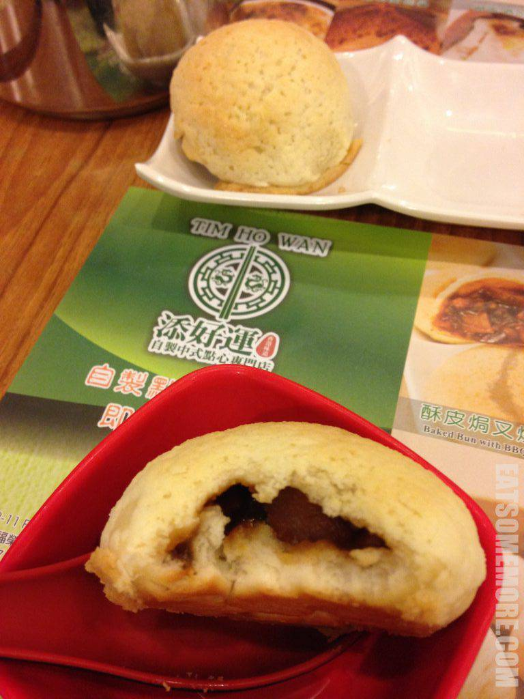

新春佳节跟大家分享一篇么酱在马蜂窝发表过的旧文。

### 缘起

漂泊当中听很多人提起香港，有老外口中的津津乐道，有中餐馆的家乡味，有忿忿也有倾心不已。虽幼时一遇，也盼能再重逢。

2014年圣诞节，因为转机的原因，我得以在香港玩上三天。

### 行程总览

- 12月10日下午抵达香港，宿旺角薈賢居。
- 12月11日从深水埗逛到尖沙咀再到中环，晚上从红磡搭直通车返回广州。
- 12月28日中午抵达红磡，从天星码头搭轮渡到中环，拜访铜锣湾。

### 市井旺角万事足

作为久居英国大农村的群众，一到旺角顿感凌乱——通街的大商场、水果店、服装店、金鱼铺、小吃店，应有尽有。七拐拐八弯弯地来到这一家不起眼也没有招牌的甜品店。店里的陈设极尽古典，桌椅、挂历、电风扇和墙上挂着的手写餐单，无不争相体现着浓郁的香港味。

杨枝甘露里面的芒果很新鲜、柚子不苦，味道是极好的。豆花也是谈笑间灰飞烟灭。

香港的街招铺天盖地，在夜里也是极其灿烂的。

肥姐小食店是一家需要排队的人气小铺。大家都是买了就站在街边开吃。

我们要了招牌三件套，包括墨鱼、鸡胗和猪肠。都是凉的，非常有弹性，口味上是甜鲜的味道。

再走一走就到达了香港越夜越热闹的庙街，慕名而尝了传说中的四季煲仔饭。我们点了白鳝排骨煲仔饭。因为早有听闻香港餐饮当中一菜难求，所以特地另点了腐乳通菜一碟。煲仔饭焦香四溢，但白鳝和排骨并没有特别的出彩。

是夜宿Lodgewood By L'hotel Mongkok Hong Kong香港旺角薈賢居(如心酒店集團管理)。这个酒店我很推荐：地理位置方便、房间干净整洁、服务耐心细致。在香港，对住也是很难要求更多啦。

旅行当中早起必定是为了早餐！金华冰厅的菠萝油真棒！皮脆包软、外热内冷，十分好吃。招牌西多士是两片浸泡了蛋液的多士夹着花生酱在油里炸过，再添一片黄油即可。对于我来说早餐吃这个还是有点油腻。冻奶茶好喝，热鸳鸯口味略重。不过都是很棒的体验呢！

### 深水埗兼容有济

吃完早餐闲逛来到深水埗。TVB里面喜欢大隐隐于市的老大们，就常常是在这果栏里被发现的。亲身来到深水埗，才体会到这里的氛围，陈旧又井然有序。公屋鳞次栉比，街招此起彼伏。

从主耶稣的街招走几步就到了道教仙观。这种时刻总是能让我喜欢上一个城市、一个地方，因为在这里，信什么的人都有，任何信仰和追求都有一席之地，才孕育出更多敢想敢做的人。

这世界上从来没有没来由的爱和恨，就像我也不会没来由地去一个地方。来到深水埗，当然最最重要的就是拜访这一间平价米其林添好运点心专门店。幸好来得早，直接可以进店。到咱们吃完出来的时候，店门口已经排起了长龙啦！

招牌点心脆皮叉烧包。咬下一口不得不说一句，very nice to meet you!

添好运的虾饺是我目前吃过最薄的。虾肉大且弹牙，非常鲜美，太厉害了！

南北杏木瓜雪耳甜汤，略微偏甜，但是感觉真材实料，火候适中。

人生当中最遗憾的莫过于到达了下一个吃饭点却已经饱得什么都吃不下。希望可以有机会再回来美都餐室体验一下。

### 尖沙咀繁华任性

沿着弥敦道一路走来，各类店铺络绎不绝。方寸之地集合了殖民时期的建筑、摩天大楼以及一些创意装置。

对岸便是中环水泥森林了。

码头和渡轮都挺复古。

船内的摆设、标语等等都也复古。最妙的是椅子的靠背可以前后调节方向，想朝哪坐就朝哪坐，而且轻而易举。

人生里有多少事情可以标明去往哪里？至少此刻有种陈旧又踏实的感觉是往中环。

### 中环古典又摩登

从天星小轮上看到的中环。

我认为香港是非常不traveller friendly的城市之一，只因游客无法根据谷歌地图来找到自己的路。香港的交通太发达，除了地面道路，还有地道、天桥，有些甚至层层叠叠。这不，到了码头，我就已经迷失在四通八达的天桥里了。

错过了中环的自动上山扶梯，步行来到大名鼎鼎的兰芳园。恕我不懂欣赏，我觉得这奶茶还不及金华冰厅的好喝。另外采购了一桶咸柠檬，回家后泡水喝喝还挺有滋味。

晚上在盛记大排档吃了晚饭。完全没有想到大排档这样美味！那凉瓜排骨是我人生吃到最好吃的凉瓜排骨！苦瓜还是有一点苦味，但是也很有一番清甜，排骨的肉完全不难咬而且很入味。蒸鱼也是棒！可惜露天大排档入夜光线昏暗，没有留影。

### 铜锣湾商场连商场

有人问我圣诞节离开伦敦会不会遗憾。我觉得圣诞节在香港也很是有气氛，装点都很用心。

这次匆匆到香港，也看了些这里那里，也尝了些这个那个，意犹未尽。盼重逢。
