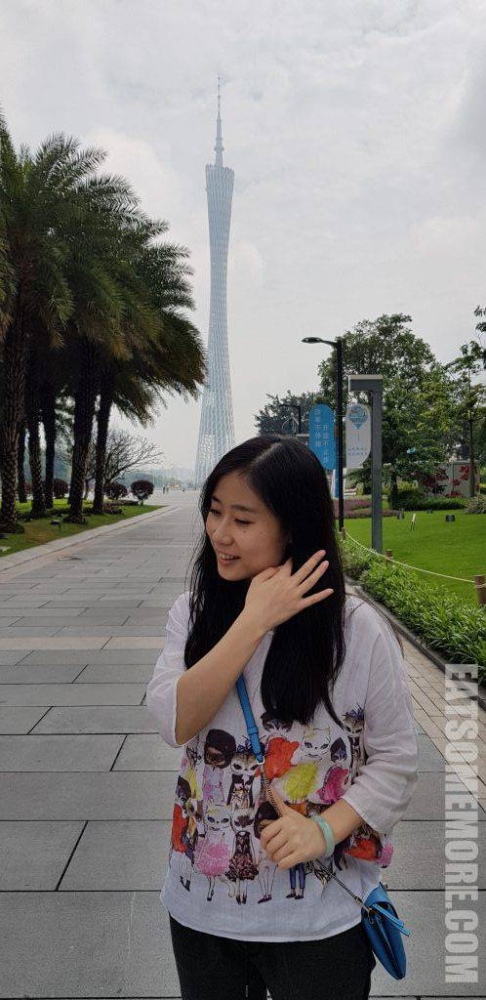
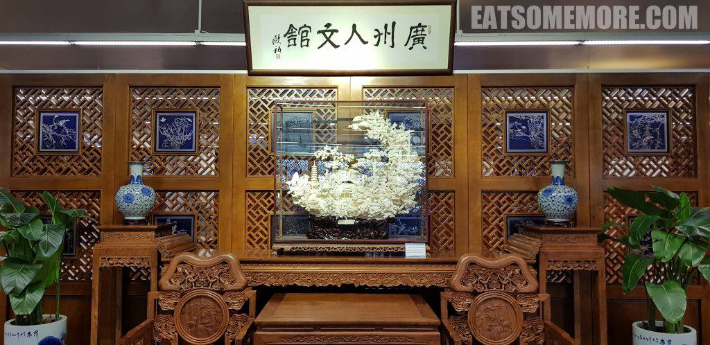
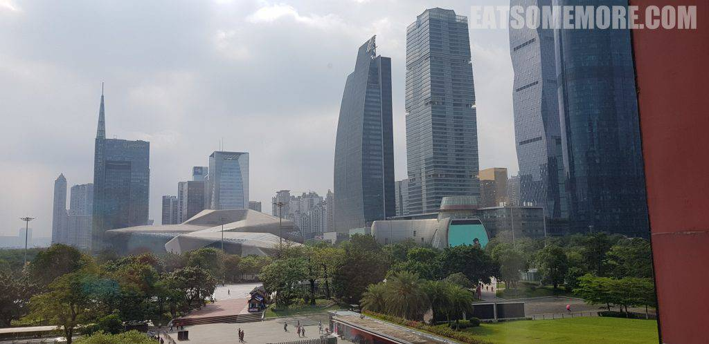

转眼来到在广州的第二天，雨过天气也渐渐转晴，又是继续向美食进发的一天。

## 行程总览

## 愉粤轩

同样是米其林一星的愉粤轩位于天河区四季酒店的七十一层，景观自然不言而喻。酒店贴心地帮我们预定了窗口的位子，让我们在一种一览众楼小的氛围当中用餐，也弥补了七年前雾霾天在广州塔一无所见的遗憾。不过恐高的朋友请谨慎选择。坐下后，服务员送来了热毛巾和菊花罗汉果茶，一饮而下清凉香滑。

有香芋的豉汁蒸排骨才会散发出属于这道广东名点独有的香味。子排新鲜，蒸得弹嫩，肉汁丰富，咸鲜香甜，香芋软糯，一盅转眼消散无影踪。

鲜虾春卷三根搭配蘸料三碟，分别有鱼露、辣酱和酱油。

春卷皮金黄脆薄，虾肉丁鲜甜弹牙。

满满一碗鲍鱼鸡丝生滚粥，米粒完全煮化，充分吸收了原料的咸香，搭配送粥橄榄菜提鲜一流。

白白圆圆的流沙奶黄包外表平平无奇。

内心却是波涛汹涌、油星点点、沙粒细糯、可盐可甜。

才吃了一个流沙包的功夫又来一波点心。

沙爹酱金钱肚毫无异味，蒸得酥软入味、纤毫毕现。

鲍鱼烧卖没有太惊艳，主要是由于小鲍鱼稍微老了一些。

脆皮叉烧包形似香港添好运的叉烧包。

表皮用了稍稍发酵过的面，嚼起来有微甜的味道，叉烧馅更是肥瘦相间咸甜滋味十足。

然而最令人惊喜的是这里的无敌江景洗手间，全长4.3公里的“珠江之贝”猎德大桥尽收眼底。

## 珠江新城

饭后当然是老规矩——消食活动。走在花城广场，有种神似纽约时代广场的感觉，高楼耸立得繁华热闹，好像只消一晃神便会赶不上这时代的脚步。

广州大剧院和它的倒影好像希腊神话当中的纳希瑟斯，忘却时间般地顾影自怜着。

广州图书馆的造型在林立的高楼当中也显得很别致。

引一句东坡先生的诗，正是“横看成岭侧成峰，远近高低各不同”。

窗户上还倒映着“小蛮腰”广州塔。

图书馆顶楼的广州人文馆很有意思。

一派古色古香的味道。

展馆陈列的木雕、套色玻璃和象牙透雕不输广东民间工艺博物馆的展品。

地下室的字画展当中，我特别喜欢两幅。其一意境无双。

其二道理出众。

广东省博物馆虽然展品无甚出众，胜在景观不赖。

值得一提的是馆内有一组鲸鲨装饰，营造了一个浮在空中的海洋世界。

博物馆外的铜塑生动可爱。

## 炳胜品味

博物馆东门的街对面是另一家米其林一星餐厅炳胜品味。这个角度的广州塔看起来有些时髦。

除了粤式点心，广东的老火靓汤也是远近驰名，当然也得试试。粉葛赤小豆煲鲮鱼浓郁鲜香。

西洋菜烧骨汤清甜咸香。

广州“十大名鸡”之一的炳胜招牌限量白切荔枝鸡，据悉是在荔枝林里放养着长大的。鸡肉经过腌渍和按摩后放入盆中隔水蒸制，再在常温下放凉，搭配鸡汁姜葱酱，毫无腥膻、鸡香馥郁、鸡皮爽滑、鸡肉紧实，绝对的吮指美味。

干炒牛河材料新鲜、锅气十足、牛肉香嫩、河粉筋道。

招积冰川茄，做法神似天妇罗，却淋着糖浆。香脆的表皮包裹着软绵多汁的茄子。

乡下猪肉鱼头焖水鬼重的本质是油炸豆腐煲。集山泉、黄豆和蛋清于一体的山水豆腐，下花生油炸得金黄，再浸在水里保持水分，因此得名“水鬼重”，炖煮在猪肉和鱼头作用下浓稠的汤汁里，鲜香不输豚彘，嫩滑远胜鱼头。

又是吃美的一天。
